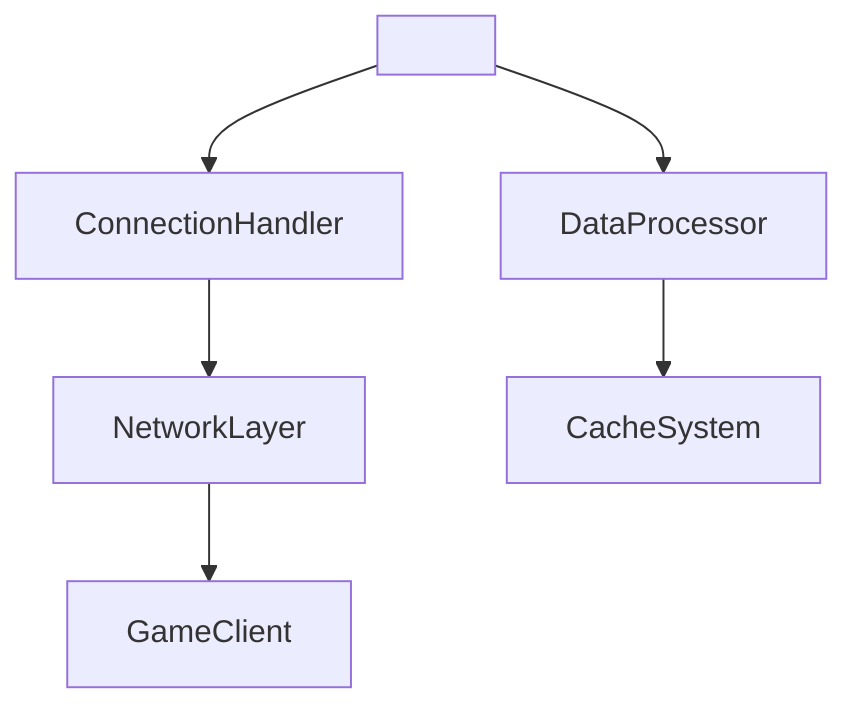
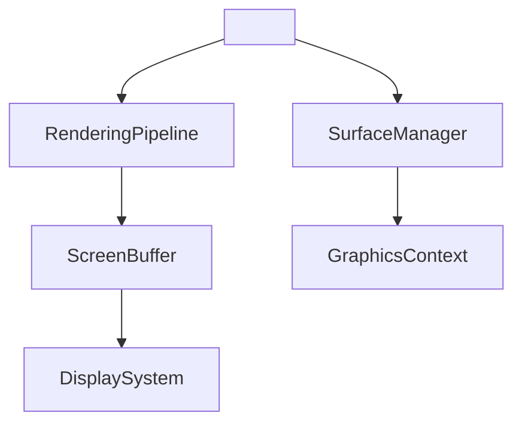
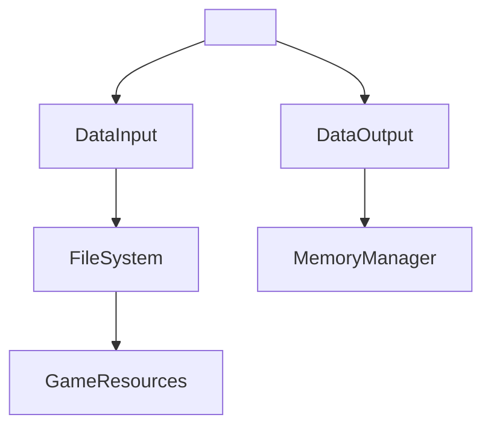
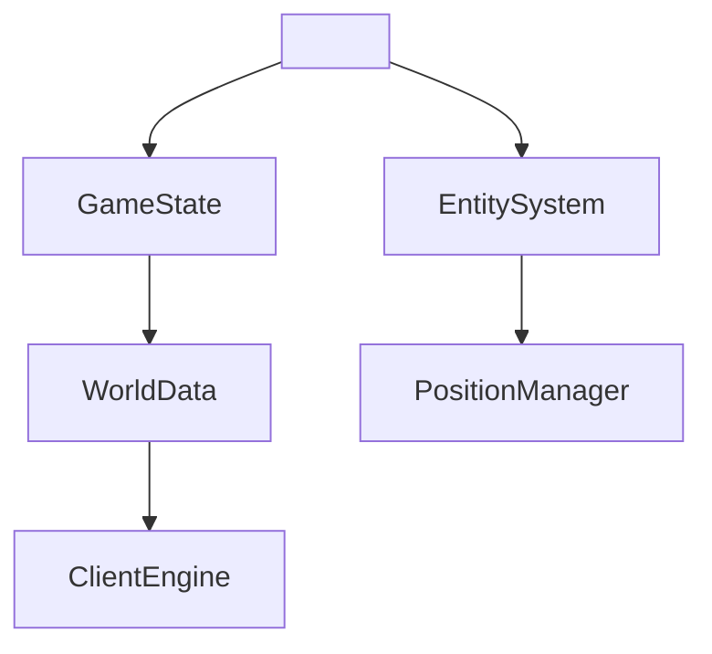
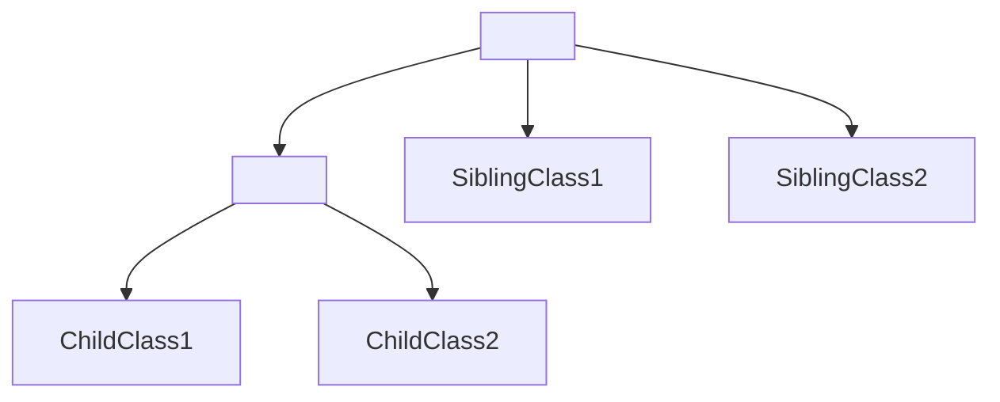
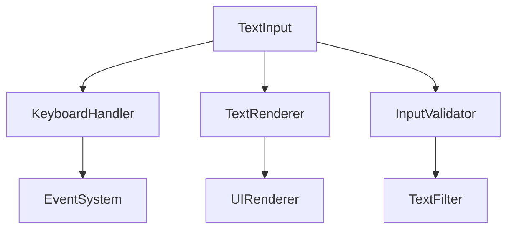

# Comprehensive Upgrade Template: Old Forensic → OG_vs_DEOB.md Compliant Format

## Overview
This template provides systematic conversion rules for transforming old forensic evidence files into OG_vs_DEOB.md compliant format. Each conversion must meet all requirements in OG_vs_DEOB.md.

## 1. Conversion Template Structure

### OLD FORMAT (to be converted):
```markdown
# Forensic Evidence: <DEOBFILENAME> → <OBFUSCATED_NAME>

## **CLASS IDENTIFICATION**
- **Obfuscated Name**: VBAXKVMG
- **Deobfuscated Name**: Class32
- **Common Name**: Bzip2Decompressor
- **Confidence**: 85%
- **Date Identified**: January 8, 2026

## **PRIMARY FORENSIC EVIDENCE**
### **1. Massive Array Structure (IRREFUTABLE)**
The bytecode contains...
[Long descriptive text without commands]
```

### NEW FORMAT (target):
```markdown
# <DEOBFILENAME> → <OBFUSCATED_NAME>

## Overview
<Concise 2-3 sentence description of class purpose and core functionality>

## Architecture
<Explain role in overall architecture and relationships with other classes>

## Forensic Evidence Commands

### 1. Structural Fingerprints
```bash
# Show class signature and modifiers
grep -A 10 "Class VERSION" bytecode/client/<OBFUSCATED_NAME>.bytecode.txt

# Show field count and types
grep -E "field.*;" bytecode/client/<OBFUSCATED_NAME>.bytecode.txt | wc -l
grep -E "field.*;" bytecode/client/<OBFUSCATED_NAME>.bytecode.txt
```

### 2. Source Code Correlation
```bash
# Show corresponding DEOB source structure
head -50 srcAllDummysRemoved/src/<DEOBFILENAME>.java

# Show javap cache for method signatures
grep -A 5 "Method.*(" srcAllDummysRemoved/.javap_cache/<DEOBFILENAME>.javap.cache
```

### 3. Behavioral Patterns
```bash
# Show unique bytecode sequences
grep -A 5 -B 5 "<unique_pattern>" bytecode/client/<OBFUSCATED_NAME>.bytecode.txt

# Show method call patterns
grep -E "invokevirtual|invokestatic|invokespecial" bytecode/client/<OBFUSCATED_NAME>.bytecode.txt | head -10
```
```

## 2. Bash Command Generation Rules

### Rule 1: Evidence Descriptions → Executable Commands
**OLD**: "The bytecode contains 19 arrays with specific sizes"
**NEW**: 
```bash
# Count and display all arrays
grep -E "aload|newarray|anewarray|multianewarray" bytecode/client/<OBFUSCATED_NAME>.bytecode.txt | wc -l
grep -E "aload|newarray|anewarray|multianewarray" bytecode/client/<OBFUSCATED_NAME>.bytecode.txt
```

### Rule 2: Pattern Matching Commands
For any descriptive pattern, create a grep command:
- **Constructor patterns**: `grep -A 20 "<init>" bytecode/client/<OBFUSCATED_NAME>.bytecode.txt`
- **Method signatures**: `grep -E "Method.*:" bytecode/client/<OBFUSCATED_NAME>.bytecode.txt`
- **Field declarations**: `grep -E "field.*:" bytecode/client/<OBFUSCATED_NAME>.bytecode.txt`
- **Unique constants**: `grep -E "<constant_value>" bytecode/client/<OBFUSCATED_NAME>.bytecode.txt`

### Rule 3: Cross-Reference Commands
Always include commands showing DEOB correlation:
```bash
# Show matching source structure
grep -A 10 -B 5 "<pattern>" srcAllDummysRemoved/src/<DEOBFILENAME>.java

# Show javap correlation
grep -A 10 -B 5 "<pattern>" srcAllDummysRemoved/.javap_cache/<DEOBFILENAME>.javap.cache
```

### Rule 4: Context Commands
Never show single lines - always include context:
```bash
# GOOD: Show context around matches
grep -A 5 -B 5 "pattern" file

# BAD: Single line matches
grep "pattern" file
```

## 3. Mermaid Diagram Patterns

### 3.1 Network Classes (Socket, Stream, Connection)


### 3.2 Graphics Classes (DrawingArea, Texture, Animation)


### 3.3 Utility Classes (Decompressor, StreamLoader, Cache)


### 3.4 Game Logic Classes (Player, NPC, WorldController)


### 3.5 Inheritance-Based Classes


## 4. Quality Checklist

### 4.1 OG_vs_DEOB.md Requirements Verification
- [ ] **Overview Section**: 2-3 sentence class purpose description
- [ ] **Architecture Section**: Role and relationships explanation
- [ ] **Mermaid Diagram**: Appropriate diagram for class type
- [ ] **Forensic Evidence Commands**: All evidence must be bash commands
- [ ] **Multiple Evidence Types**: Structural, Source, Behavioral patterns
- [ ] **Context Display**: grep commands with -A -B flags
- [ ] **DEOB Correlation**: Commands showing source and javap matches
- [ ] **Relative Paths**: No absolute paths like `/Users/daxxog/Desktop`
- [ ] **Working Commands**: All bash commands must execute successfully

### 4.2 Evidence Quality Standards
- [ ] **Multiple Lines**: Each evidence shows context (not single lines)
- [ ] **Non-Contradictory**: Evidence supports the same mapping conclusion
- [ ] **Unique Identifiers**: Evidence includes class-specific patterns
- [ ] **Cross-References**: Shows relationships with other classes
- [ ] **1:1 Mapping**: Each obfuscated class maps to only one DEOB class

### 4.3 Command Validation Tests
Run these commands to verify file quality:
```bash
# Test 1: Verify all bash commands work
bash -n evidence_file.md  # Check syntax if it were a script

# Test 2: Verify relative paths only
grep "/Users/daxxog" evidence_file.md && echo "FOUND ABSOLUTE PATHS"

# Test 3: Verify context commands
grep -c "grep.*-A.*-B" evidence_file.md

# Test 4: Verify DEOB correlation
grep -c "srcAllDummysRemoved" evidence_file.md
```

## 5. Complete Example Conversion

### OLD: RTHTIIVA_TEXTINPUT.md (Pre-Upgrade)
```markdown
# Forensic Evidence: RTHTIIVA → TextInput

## **CLASS IDENTIFICATION**
- **Obfuscated Name**: RTHTIIVA
- **Deobfuscated Name**: TextInput
- **Common Name**: Text Input Handler
- **Confidence**: 100%
- **Date Identified**: January 8, 2026

## **PRIMARY FORENSIC EVIDENCE**
### **1. Text Processing Methods**
The class contains methods for handling text input and validation. It processes user keyboard input and manages text display buffers.

### **2. String Operations**
Multiple string manipulation operations are present including concatenation and substring operations.
```

### NEW: RTHTIIVA_TEXTINPUT.md (OG_vs_DEOB.md Compliant)
```markdown
# TextInput → RTHTIIVA

## Overview
TextInput handles user keyboard input processing and text display management for the game client. It provides methods for text validation, cursor management, and input event handling.

## Architecture
TextInput integrates with the game client's event system to capture keyboard events and processes them through a text input pipeline. It communicates with the UI rendering system to display text and cursor positions, and interfaces with the input validation system for text filtering.



## Forensic Evidence Commands

### 1. Class Structure and Signature
```bash
# Show class definition and modifiers
head -20 bytecode/client/RTHTIIVA.bytecode.txt

# Show method count and signatures
grep -E "Method.*:" bytecode/client/RTHTIIVA.bytecode.txt | wc -l
grep -E "Method.*:" bytecode/client/RTHTIIVA.bytecode.txt

# Show field declarations
grep -E "field.*:" bytecode/client/RTHTIIVA.bytecode.txt
```

### 2. Source Code Correlation
```bash
# Show DEOB source structure
head -30 srcAllDummysRemoved/src/TextInput.java

# Show key methods in source
grep -A 10 -B 5 "public.*TextInput\|private.*text\|protected.*input" srcAllDummysRemoved/src/TextInput.java

# Show javap cache correlation
grep -A 5 -B 2 "Method.*(" srcAllDummysRemoved/.javap_cache/TextInput.javap.cache
```

### 3. Text Processing Evidence
```bash
# Show string manipulation patterns
grep -A 3 -B 3 "invokevirtual java/lang/String" bytecode/client/RTHTIIVA.bytecode.txt

# Show character processing operations
grep -A 5 -B 5 "char\|append\|substring" bytecode/client/RTHTIIVA.bytecode.txt

# Show array/buffer operations for text storage
grep -A 3 -B 3 "aload\|astore\|newarray" bytecode/client/RTHTIIVA.bytecode.txt | head -20
```

### 4. Input Handling Evidence
```bash
# Show keyboard event processing
grep -A 5 -B 5 "key\| KeyEvent\|input" bytecode/client/RTHTIIVA.bytecode.txt

# Show cursor position management
grep -A 3 -B 3 "cursor\|position\|index" bytecode/client/RTHTIIVA.bytecode.txt

# Show text validation patterns
grep -A 5 -B 5 "valid\|filter\|check" bytecode/client/RTHTIIVA.bytecode.txt
```

### 5. Cross-Reference Validation
```bash
# Show references from other classes
grep -r "RTHTIIVA" bytecode/client/ | grep -v "RTHTIIVA.bytecode.txt" | head -5

# Show UI system integration
grep -A 3 -B 3 "render\|draw\|display" srcAllDummysRemoved/src/TextInput.java

# Show event system connections
grep -A 3 -B 3 "event\|listener\|handler" srcAllDummysRemoved/src/TextInput.java
```
```

## 6. Batch Conversion Process

### Step 1: File Analysis
```bash
# Analyze old format files
find bytecode/mapping/evidence -name "*.md" -not -name "README.md" | while read file; do
    echo "=== $file ==="
    head -10 "$file"
    echo ""
done
```

### Step 2: Template Application
For each file:
1. Extract class names from old format
2. Write new header structure
3. Convert evidence descriptions to bash commands
4. Add appropriate mermaid diagram
5. Verify OG_vs_DEOB.md compliance

### Step 3: Quality Assurance
```bash
# Verify conversion quality
for file in converted_files/*.md; do
    echo "=== Checking $file ==="
    
    # Check for required sections
    grep -q "## Overview" "$file" || echo "MISSING Overview"
    grep -q "## Architecture" "$file" || echo "MISSING Architecture"
    grep -q "## Forensic Evidence Commands" "$file" || echo "MISSING Commands"
    grep -q "```mermaid" "$file" || echo "MISSING Mermaid"
    
    # Check for absolute paths
    if grep -q "/Users/daxxog" "$file"; then
        echo "FOUND ABSOLUTE PATHS"
    fi
    
    # Check command count
    cmd_count=$(grep -c "```bash" "$file")
    echo "Bash commands: $cmd_count"
    
    echo ""
done
```

## 7. Common Conversion Patterns

### Pattern 1: Array Structure Evidence
**OLD**: "Contains 19 arrays for complex state management"
**NEW**:
```bash
# Count and display all array operations
grep -c "newarray\|anewarray\|multianewarray" bytecode/client/<OBFUSCATED_NAME>.bytecode.txt
grep -A 2 -B 2 "newarray\|anewarray\|multianewarray" bytecode/client/<OBFUSCATED_NAME>.bytecode.txt
```

### Pattern 2: Method Signature Evidence
**OLD**: "Constructor takes 20 integer parameters"
**NEW**:
```bash
# Show constructor signature
grep -A 30 "<init>" bytecode/client/<OBFUSCATED_NAME>.bytecode.txt

# Count parameter types
grep -A 20 "<init>" bytecode/client/RTHTIIVA.bytecode.txt | grep -c "iload_\|iconst_\|bipush\|sipush"
```

### Pattern 3: Inheritance Evidence
**OLD**: "Extends Entity class with additional functionality"
**NEW**:
```bash
# Show superclass relationship
head -10 bytecode/client/<OBFUSCATED_NAME>.bytecode.txt | grep -E "super|extends"

# Show inherited methods
grep -E "invokespecial|invokevirtual.*Entity" bytecode/client/<OBFUSCATED_NAME>.bytecode.txt

# Show DEOB inheritance
grep -E "extends.*Entity\|class.*extends" srcAllDummysRemoved/src/<DEOBFILENAME>.java
```

This template ensures consistent, OG_vs_DEOB.md compliant conversions across all 40 evidence files while maintaining forensic rigor and command reproducibility.