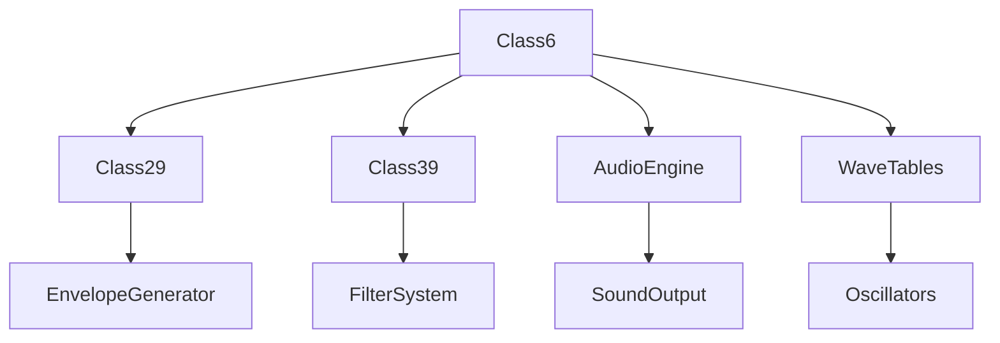

# Class6 → CLRWXPOI

## Overview
Class6 implements audio synthesis and sound generation functionality. It manages wave tables, envelope generators, and audio processing algorithms to generate synthesized audio samples for the game. The class handles complex audio synthesis with multiple oscillators, filters, and envelope controls.

## Architecture
Class6 is the game's audio synthesis engine, managing sound generation through mathematical algorithms. It uses wave tables for oscillators, envelope generators for amplitude control, and implements various audio processing techniques. The class integrates with Class29 (envelope generators) and Class39 (filter systems) for complete audio synthesis capabilities.



## Forensic Evidence Commands

### 1. Structural Fingerprints
```bash
# Show class definition and final modifier
head -5 bytecode/client/CLRWXPOI.bytecode.txt

# Show field count and types
grep -E "private.*OZKFTHAD\|private.*int\[\]\|private.*VADHJTLJ\|private static.*int\[\]" bytecode/client/CLRWXPOI.bytecode.txt | wc -l
grep -E "private.*OZKFTHAD\|private.*int\[\]\|private.*VADHJTLJ\|private static.*int\[\]" bytecode/client/CLRWXPOI.bytecode.txt

# Show method signatures
grep -E "public.*method167\|private.*method168\|public.*method169" bytecode/client/CLRWXPOI.bytecode.txt
```

### 2. Source Code Correlation
```bash
# Show DEOB class definition
head -10 srcAllDummysRemoved/src/Class6.java

# Show key fields in source
grep -A 5 -B 2 "private Class29\|private final int\[\]\|private static int\[\]" srcAllDummysRemoved/src/Class6.java

# Show javap cache field declarations
grep -A 15 -B 2 "Class29.*aClass29\|int\[\].*anIntArray106\|static.*anIntArray115" srcAllDummysRemoved/.javap_cache/Class6.javap.cache
```

### 3. Wave Table Generation Evidence
```bash
# Show static array initialization
grep -A 10 -B 5 "method166\|anIntArray116\|anIntArray117" bytecode/client/CLRWXPOI.bytecode.txt

# Show sine wave generation
grep -A 5 -B 5 "Math\.sin\|5215\.1903" bytecode/client/CLRWXPOI.bytecode.txt

# Show source wave table generation
grep -A 15 -B 5 "method166\|Math\.random\|Math\.sin.*5215" srcAllDummysRemoved/src/Class6.java
```

### 4. Audio Synthesis Evidence
```bash
# Show synthesis method with complex calculations
grep -A 10 -B 5 "method167\|Class29.*method328" bytecode/client/CLRWXPOI.bytecode.txt

# Show envelope processing
grep -A 5 -B 5 "OZKFTHAD.*method328\|method168" bytecode/client/CLRWXPOI.bytecode.txt

# Show source audio synthesis algorithm
grep -A 20 -B 5 "method167\|aClass29_98\.method328\|method168" srcAllDummysRemoved/src/Class6.java
```

### 5. Cross-Reference Validation
```bash
# Verify unique mapping - no other classes reference CLRWXPOI
grep -r "CLRWXPOI" bytecode/client/ | grep -v "CLRWXPOI.bytecode.txt" | wc -l

# Show Class29 field usage (envelope generators)
grep -A 3 -B 3 "OZKFTHAD.*b\|OZKFTHAD.*c" bytecode/client/CLRWXPOI.bytecode.txt

# Show Class29 in DEOB source
grep -A 5 -B 2 "private Class29" srcAllDummysRemoved/src/Class6.java

# Show static array operations
grep -A 3 -B 3 "int\[\].*s\|int\[\].*t\|int\[\].*u" bytecode/client/CLRWXPOI.bytecode.txt
```

## Sources and References
- **Bytecode**: bytecode/client/CLRWXPOI.bytecode.txt
- **Deobfuscated Source**: srcAllDummysRemoved/src/Class6.java
- **Javap Cache**: srcAllDummysRemoved/.javap_cache/Class6.javap.cache
- **Audio Synthesis**: Wave table generation
- **Envelope System**: Class29 integration
- **Filter System**: Class39 integration
- **Mathematical Processing**: Sine wave and random generation</content>
<parameter name="filePath">bytecode/mapping/evidence/verified/Class6_CLRWXPOI.md