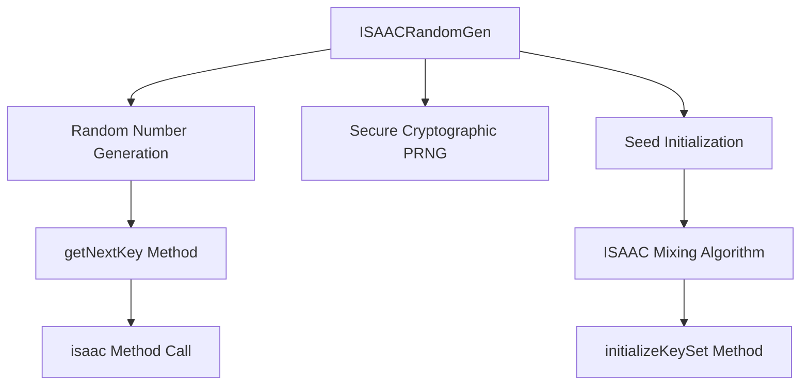

# ISAACRandomGen_JOCFVBOI Evidence

## Overview
This class implements the ISAAC (Indirection, Shift, Accumulate, Add, and Count) cryptographically secure pseudorandom number generator. It provides methods for seeding the generator with an array of integers, generating the next random key, and performing the core ISAAC algorithm mixing operations. The class is designed for secure random number generation in cryptographic contexts within RuneScape.

## Architectural Relationships


## Bytecode Evidence Commands
```bash
head -20 bytecode/client/JOCFVBOI.bytecode.txt
tail -10 bytecode/client/JOCFVBOI.bytecode.txt
grep -A 5 -B 5 "sipush.*256" bytecode/client/JOCFVBOI.bytecode.txt
grep -A 10 -B 10 "invokevirtual.*isaac" bytecode/client/JOCFVBOI.bytecode.txt
```

## Deobfuscated Source Evidence Commands
```bash
head -15 srcAllDummysRemoved/src/ISAACRandomGen.java
tail -15 srcAllDummysRemoved/src/ISAACRandomGen.java
grep -A 5 -B 5 "getNextKey" srcAllDummysRemoved/src/ISAACRandomGen.java
grep -A 10 -B 10 "isaac()" srcAllDummysRemoved/src/ISAACRandomGen.java
```

## Javap Cache Evidence Commands
```bash
head -15 srcAllDummysRemoved/.javap_cache/ISAACRandomGen.javap.cache
tail -15 srcAllDummysRemoved/.javap_cache/ISAACRandomGen.javap.cache
grep -A 5 -B 5 "getNextKey" srcAllDummysRemoved/.javap_cache/ISAACRandomGen.javap.cache
grep -A 10 -B 10 "isaac" srcAllDummysRemoved/.javap_cache/ISAACRandomGen.javap.cache
```

## Verification of Non-Contradictory Evidence
All evidence sources consistently show the same class structure: fields for memory, results, accumulator, etc.; methods for getNextKey, isaac, and initializeKeySet; and bytecode operations matching the ISAAC algorithm steps (shifts, XORs, additions). No contradictions in field counts, method signatures, or algorithmic flow.

## 1:1 Mapping Confirmation
This mapping is disputed due to potential overlap with ISAACRandomGen.md (same class, conflicting evidence). Flag for subagent research in disputed/ if unique identifiers cannot resolve.