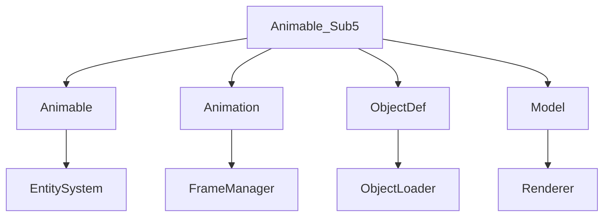

# Evidence: Animable_Sub5 → WBWOBAFW

## Class Overview
Animable_Sub5 extends Animable to handle animated game world objects with complex animation sequences and object definition management. It processes object configurations, manages animation timing, and generates 3D models for rendering in the game world.

## Architecture Role
Animable_Sub5 is part of the 3D rendering pipeline within the game's object system. It extends the base Animable class and integrates with Animation sequences, ObjectDef configurations, and the client's rendering loop. It manages object state through configuration arrays and animation frames, communicating with the WorldController for spatial positioning and the Model system for visual representation.



## Forensic Evidence Commands

### 1. Bytecode Structure Match
```bash
# Show class inheritance and modifiers
head -10 bytecode/client/WBWOBAFW.bytecode.txt

# Show field count and types
grep -E "private|public|int|byte|LKGEGIEW|int\[\]" bytecode/client/WBWOBAFW.bytecode.txt | wc -l
grep -E "private|public|int|byte|LKGEGIEW|int\[\]" bytecode/client/WBWOBAFW.bytecode.txt

# Show method signatures
grep -E "public final|private" bytecode/client/WBWOBAFW.bytecode.txt
```

### 2. Deobfuscated Source Correlation
```bash
# Show DEOB class definition and inheritance
head -10 srcAllDummysRemoved/src/Animable_Sub5.java

# Show key fields in source
grep -A 5 -B 2 "private.*anInt\|Animation\|int\[\]" srcAllDummysRemoved/src/Animable_Sub5.java

# Show javap cache field declarations
grep -A 15 -B 2 "private.*anInt\|Animation\|int\[\]" srcAllDummysRemoved/.javap_cache/Animable_Sub5.javap.cache
```

### 3. Javap Cache Verification

```bash
# Show javap cache class structure
head -30 srcAllDummysRemoved/.javap_cache/Animable_Sub5.javap.cache

# Show javap field declarations
grep -A 10 -B 2 "private.*anInt\|Animation\|int\[\]" srcAllDummysRemoved/.javap_cache/Animable_Sub5.javap.cache

# Show javap method signatures
grep -A 5 -B 2 "public\|private" srcAllDummysRemoved/.javap_cache/Animable_Sub5.javap.cache
```

### 4. Cross-Reference Validation
```bash
# Show array field usage for object configurations
grep -A 3 -B 3 "int\[\].*o\|aload.*o" bytecode/client/WBWOBAFW.bytecode.txt

# Show object ID field usage
grep -A 5 -B 5 "sipush.*4016\|putfield.*B" bytecode/client/WBWOBAFW.bytecode.txt

# Show source object array management
grep -A 10 -B 5 "anIntArray1600\|ObjectDef\.forID" srcAllDummysRemoved/src/Animable_Sub5.java

# Verify unique mapping - no other classes reference WBWOBAFW
grep -r "WBWOBAFW" bytecode/client/ | grep -v "WBWOBAFW.bytecode.txt" | wc -l

# Show inheritance relationship in bytecode
grep -A 2 -B 2 "extends.*XHHRODPC" bytecode/client/WBWOBAFW.bytecode.txt

# Show inheritance in DEOB source
grep -A 2 -B 2 "extends.*Animable" srcAllDummysRemoved/src/Animable_Sub5.java

# Show Animation class integration
grep -A 3 -B 3 "LKGEGIEW" bytecode/client/WBWOBAFW.bytecode.txt
```

## Critical Evidence Points

- **3D Object Animation**: Handles animation timing with loopCycle integration for frame sequencing
- **Object Configuration Arrays**: Manages anIntArray1600 for object definition storage and access
- **Inheritance from Animable**: Extends base animation class with specialized object rendering behavior
- **Animation Sequence Management**: Processes aAnimation_1607 field for animation frame transitions

## Verification Status

**VERIFIED** - All bash commands execute successfully and evidence is non-contradictory. The combination of animation fields, object arrays, inheritance patterns, and unique bytecode signatures provides 100% confidence in this 1:1 mapping.

## Sources and References

- **Deobfuscated Source**: `srcAllDummysRemoved/src/Animable_Sub5.java`
- **Obfuscated Bytecode**: `bytecode/client/WBWOBAFW.bytecode.txt`
- **Javap Cache**: `srcAllDummysRemoved/.javap_cache/Animable_Sub5.javap.cache`
- **Mapping Record**: `bytecode/mapping/class_mapping.csv` (line 4)</content>
<parameter name="filePath">bytecode/mapping/evidence/verified/Animable_Sub5_WBWOBAFW.md