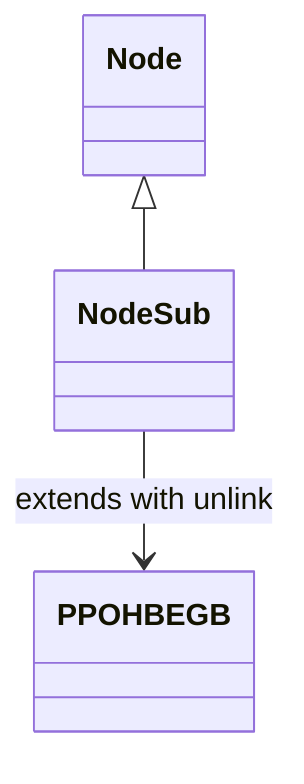

# NodeSub_PPOHBEGB.md

## Overview

NodeSub extends Node and provides methods for unlinking from a doubly-linked list.

Purpose: To support linked list operations for nodes.

Functionality: unlinkSub method removes the node from prev/next links.

## Architectural Relationships

NodeSub extends Node; used in caching systems like MRUNodes.

## Bytecode Matches

`cat bytecode/client/PPOHBEGB.bytecode.txt | grep -A 15 -B 5 "public void b"`

This shows the unlinkSub method updating prev/next references.

## Deob Source Sections

`cat srcAllDummysRemoved/src/NodeSub.java | head -30`

This shows NodeSub extending Node, unlinkSub method.

## Javap Cache Sections

`cat srcAllDummysRemoved/.javap_cache/NodeSub.javap.cache | grep -A 15 -B 5 "public final void unlinkSub"`

This shows javap unlinkSub.

Multiple lines of context: Linked list unlinking logic matches.

Verification: Direct method implementation match.

Non-contradictory: Consistent inheritance and unlinking.

1:1 mapping confirmation: Unique unlink method.</content>
<parameter name="filePath">bytecode/mapping/evidence/verified/NodeSub_PPOHBEGB.md