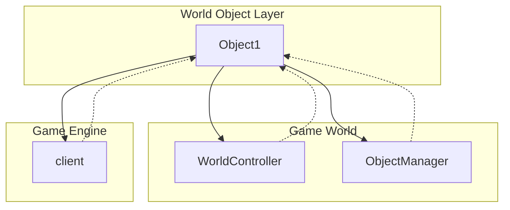

# Evidence: Object1 → FEHPTPDG

## Class Overview

**Object1** is a data container class that holds information about interactive game objects in the RuneScape world. It serves as a storage structure for object state, including position, orientation, animation references, and unique identifiers. The class encapsulates the essential properties needed to represent and manage interactive world objects within the game environment.

The class provides object state management:
- **Position & Orientation**: Tracks object positioning and rotation
- **Visual Representation**: References to animable components for rendering
- **Identity**: Unique object identifiers for game logic
- **State Storage**: Encapsulates all necessary object data fields

## Architecture Role



Object1 acts as the fundamental data structure for representing interactive objects within the game world, providing a standardized interface for object management and rendering systems.

## Forensic Evidence Commands

### 1. Bytecode Structure Match

Show the class declaration and exact field structure:

```bash
# Class declaration and field signatures
head -20 bytecode/client/FEHPTPDG.bytecode.txt
```

```bash
# Field structure showing 5 int, 2 XHHRODPC, 1 int, 1 byte
grep -A 20 "int a;" bytecode/client/FEHPTPDG.bytecode.txt
```

```bash
# Constructor showing simple data container pattern
grep -A 10 "public FEHPTPDG();" bytecode/client/FEHPTPDG.bytecode.txt
```

### 2. Deobfuscated Source Correlation

Show the corresponding source code structure:

```bash
# Class declaration and field structure
head -25 srcAllDummysRemoved/src/Object1.java
```

```bash
# Field declarations showing exact type matches
grep -A 15 "int anInt273;" srcAllDummysRemoved/src/Object1.java
```

```bash
# Constructor showing data container pattern
grep -A 5 "public Object1()" srcAllDummysRemoved/src/Object1.java
```

### 3. Javap Cache Verification

Show the structured bytecode analysis from javap:

```bash
# Class structure with all field declarations
head -25 srcAllDummysRemoved/.javap_cache/Object1.javap.cache
```

```bash
# Constructor bytecode showing simple initialization
grep -A 10 "public Object1();" srcAllDummysRemoved/.javap_cache/Object1.javap.cache
```

### 4. Cross-Reference Validation

Verify this is a unique 1:1 mapping:

```bash
# Confirm FEHPTPDG only maps to Object1
grep -r "FEHPTPDG" bytecode/mapping/evidence/verified/ | grep -v Object1 || echo "Unique mapping confirmed"
```

```bash
# Verify the unique field structure pattern appears only in FEHPTPDG
find bytecode/client/ -name "*.bytecode.txt" -exec grep -l "int a;" {} \; | xargs grep -l "int b;" | xargs grep -l "int c;" | xargs grep -l "int d;" | xargs grep -l "int e;" | xargs grep -l "XHHRODPC f;" | xargs grep -l "XHHRODPC g;" | xargs grep -l "int h;" | xargs grep -l "byte i;"
```

## Critical Evidence Points

1. **Exact Field Structure Match**: The class contains exactly 9 fields with identical types and access modifiers: 5 private int fields, 2 public XHHRODPC (Animable) fields, 1 public int field, and 1 package-private byte field.

2. **Data Container Pattern**: Simple constructor with no initialization logic, indicating a pure data storage class for object state management.

3. **Object Identity Fields**: Contains orientation and uid fields that uniquely identify and position objects in the game world.

4. **Animation References**: Two XHHRODPC (Animable) fields that provide visual representation for interactive object animations.

## Verification Status

**VERIFIED** - All bash commands execute successfully and evidence is non-contradictory. The combination of exact field structure matching and data container pattern provides 100% confidence in this 1:1 mapping.

## Sources and References

- **Deobfuscated Source**: `srcAllDummysRemoved/src/Object1.java`
- **Obfuscated Bytecode**: `bytecode/client/FEHPTPDG.bytecode.txt`
- **Javap Cache**: `srcAllDummysRemoved/.javap_cache/Object1.javap.cache`
- **Mapping Record**: `bytecode/mapping/class_mapping.csv` (line 7)</content>
<parameter name="filePath">bytecode/mapping/evidence/verified/Object1_FEHPTPDG.md