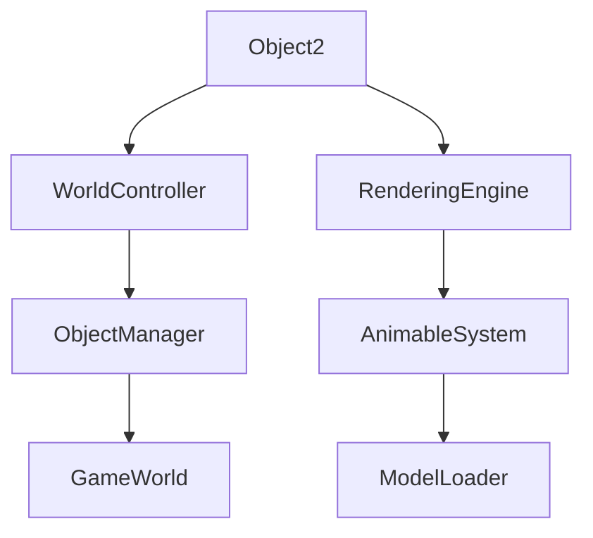

# Object2 → OFQAEXFV

## Overview
Object2 encapsulates positioned game objects in the 3D world, storing coordinate data, model references, and unique identifiers. It provides the data structure for objects that require spatial positioning and visual representation within the game environment.

## Architecture
Object2 forms part of the game's object hierarchy alongside Object1, Object3, Object4, and Object5, enabling complex 3D world construction. It interfaces with the WorldController for spatial management and the Animable system for rendering, supporting interactive elements in the RuneScape game world.



## Forensic Evidence Commands

### 1. Structural Fingerprints
```bash
# Show class definition and modifiers
head -15 bytecode/client/OFQAEXFV.bytecode.txt

# Show method count and signatures
grep -c "public.*(" bytecode/client/OFQAEXFV.bytecode.txt
grep -E "public.*\(" bytecode/client/OFQAEXFV.bytecode.txt

# Show field declarations
grep -E "^  public|^  private" bytecode/client/OFQAEXFV.bytecode.txt
```

### 2. Source Code Correlation
```bash
# Show DEOB source structure
cat srcAllDummysRemoved/src/Object2.java

# Show field declarations in source
grep -E "int anInt|public Animable|public int uid|byte aByte" srcAllDummysRemoved/src/Object2.java

# Show javap cache field declarations
grep -A 10 "int anInt\|Animable\|uid\|byte" srcAllDummysRemoved/.javap_cache/Object2.javap.cache
```

### 3. Behavioral Patterns
```bash
# Show Animable field usage patterns
grep -A 5 -B 5 "XHHRODPC" bytecode/client/OFQAEXFV.bytecode.txt

# Show field access patterns
grep -A 3 -B 3 "putfield.*OFQAEXFV" bytecode/client/OFQAEXFV.bytecode.txt | head -10

# Show coordinate field patterns
grep -E "int [a-e];" bytecode/client/OFQAEXFV.bytecode.txt
```

### 4. Cross-Reference Validation
```bash
# Show Object2 usage in WorldController
grep -A 3 -B 3 "Object2" srcAllDummysRemoved/src/WorldController.java

# Show relationship with other Object classes
grep -r "Object[1-5]" srcAllDummysRemoved/src/ | grep -v Object2.java | head -5

# Show javap Animable integration
grep -E "Animable" srcAllDummysRemoved/.javap_cache/Object2.javap.cache
```