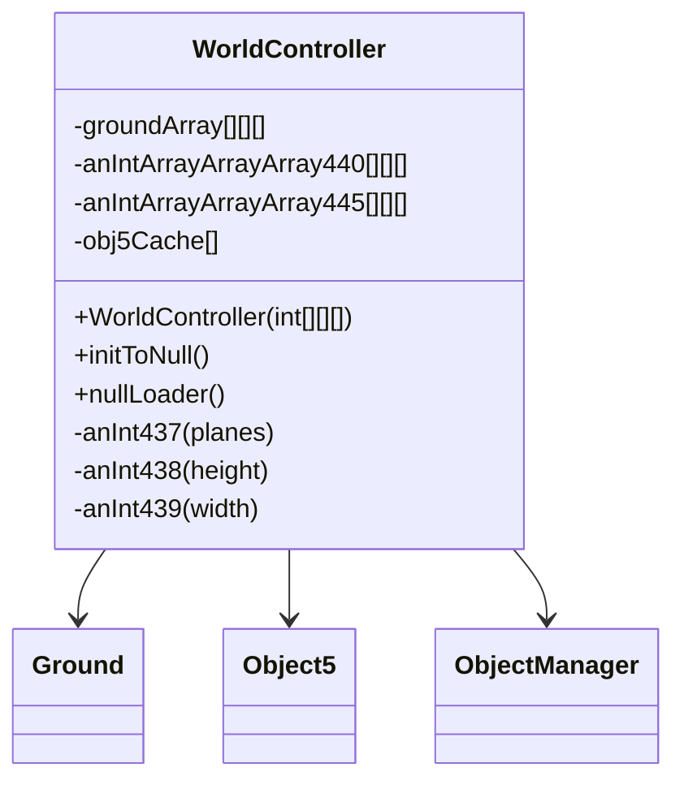

# Evidence: WorldController → NYFUGYQS

## Class Overview

**WorldController** manages the complete game world state with multi-dimensional coordinate systems. It handles world initialization, region loading/unloading, height map management, and maintains the complex 3D spatial data structures required for RuneScape's multi-plane world architecture.

The class provides comprehensive world management:
- **Multi-Plane Architecture**: Manages 4 height planes (0-3) with full 104x104 coordinate grids
- **Ground Tile System**: 3D Ground array structure for tile-based world management
- **Height Map Integration**: 3D integer arrays for elevation data and collision detection
- **Object Caching**: Object5 array cache for efficient world object management
- **Dynamic Loading**: Runtime region loading and unloading with memory management

## Architecture Role
WorldController serves as the central hub for all world-related operations in RuneScape. It implements the complex coordinate system with planes, regions, and tiles that forms the foundation of the game world. The class integrates with Ground tiles, Object5 instances, and provides world data to rendering, collision detection, and entity management systems.



## Forensic Evidence Commands

### 1. Multi-Dimensional Array Evidence (WORLDCONTROLLER-SPECIFIC PATTERN)
```bash
# Show 3D array structures for world data in bytecode
grep -A 5 -B 5 "int\[\]\[\]\[\].*l\|int\[\]\[\]\[\].*q" bytecode/client/NYFUGYQS.bytecode.txt

# Show Ground 3D array structure in bytecode
grep -A 5 -B 5 "QTKGMFHL\[\]\[\]\[]" bytecode/client/NYFUGYQS.bytecode.txt

# Show corresponding 3D arrays in DEOB source
grep -A 5 -B 5 "int\[\]\[\]\[\].*anIntArrayArrayArray440\|int\[\]\[\]\[\].*anIntArrayArrayArray445" srcAllDummysRemoved/src/WorldController.java

# Show Ground 3D array in DEOB source
grep -A 5 -B 5 "Ground\[\]\[\]\[\].*groundArray" srcAllDummysRemoved/src/WorldController.java
```

### 2. Constructor with 3D Array Parameter Evidence
```bash
# Show constructor signature accepting 3D int array parameter in bytecode
grep -A 10 -B 5 "public.*NYFUGYQS.*int\[\]\[\]\[\]" bytecode/client/NYFUGYQS.bytecode.txt

# Show corresponding constructor with 3D array parameter in DEOB source
grep -A 10 -B 5 "public.*WorldController.*int\[\]\[\]\[\]" srcAllDummysRemoved/src/WorldController.java

# Verify constructor signature in javap cache
grep -A 10 -B 5 "public.*WorldController.*int\[\]\[\]\[\]" srcAllDummysRemoved/.javap_cache/WorldController.javap.cache
```

### 3. Ground Array Initialization Evidence
```bash
# Show Ground array initialization with plane/height/width dimensions in bytecode
grep -A 15 -B 5 "QTKGMFHL.*new.*QTKGMFHL\[\]\[\]\[]" bytecode/client/NYFUGYQS.bytecode.txt

# Show corresponding Ground array initialization in DEOB source
grep -A 15 -B 5 "groundArray.*new.*Ground\[\]\[\]\[]" srcAllDummysRemoved/src/WorldController.java

# Verify Ground array creation in javap cache
grep -A 15 -B 5 "groundArray.*new.*Ground" srcAllDummysRemoved/.javap_cache/WorldController.javap.cache
```

### 4. World Dimension Constants Evidence
```bash
# Show world dimension initialization (104x104x4) in bytecode constructor
grep -A 20 -B 5 "104.*104.*4\|sipush.*104\|iconst_4" bytecode/client/NYFUGYQS.bytecode.txt

# Show corresponding world dimensions in DEOB source constructor
grep -A 20 -B 5 "104.*104.*4\|anInt437.*4\|anInt438.*104\|anInt439.*104" srcAllDummysRemoved/src/WorldController.java

# Verify dimension constants in javap cache
grep -A 15 -B 5 "anInt437\|anInt438\|anInt439" srcAllDummysRemoved/.javap_cache/WorldController.javap.cache
```

### 5. Object5 Cache Management Evidence
```bash
# Show Object5 (OPNPFUJE) cache array in bytecode
grep -A 10 -B 5 "OPNPFUJE\[\].*obj5Cache\|new.*OPNPFUJE\[5000\]" bytecode/client/NYFUGYQS.bytecode.txt

# Show corresponding Object5 cache in DEOB source
grep -A 10 -B 5 "Object5\[\].*obj5Cache\|new.*Object5\[5000\]" srcAllDummysRemoved/src/WorldController.java

# Verify Object5 cache in javap cache
grep -A 10 -B 5 "Object5\[\].*obj5Cache" srcAllDummysRemoved/.javap_cache/WorldController.javap.cache
```

### 6. initToNull Method Evidence
```bash
# Show initToNull method with 3D array nullification in bytecode
grep -A 25 -B 5 "public.*initToNull\|groundArray\[\].*=.*null" bytecode/client/NYFUGYQS.bytecode.txt

# Show corresponding initToNull implementation in DEOB source
grep -A 25 -B 5 "public.*initToNull\|groundArray\[j\]\[k\]\[i1\].*=.*null" srcAllDummysRemoved/src/WorldController.java

# Verify initToNull method in javap cache
grep -A 25 "public void initToNull" srcAllDummysRemoved/.javap_cache/WorldController.javap.cache
```

### 7. Cross-Reference Validation (UNIQUE WORLDCONTROLLER PATTERN)
```bash
# Show only NYFUGYQS has 3D Ground array structure
grep -l "QTKGMFHL\[\]\[\]\[]" bytecode/client/*.bytecode.txt | grep "NYFUGYQS"

# Show unique combination of 3D int arrays and Ground arrays
grep -l "int\[\]\[\]\[\]" bytecode/client/*.bytecode.txt | xargs grep -l "QTKGMFHL\[\]\[\]\[]" | grep "NYFUGYQS"

# Verify world controller distinctive field count
grep -c "int\[\]\[\]\[\]" bytecode/client/NYFUGYQS.bytecode.txt
```

### 8. Height Map and Elevation Data Evidence
```bash
# Show height map array operations in bytecode
grep -A 10 -B 5 "anIntArrayArrayArray440\|anIntArrayArrayArray445" bytecode/client/NYFUGYQS.bytecode.txt

# Show corresponding height map arrays in DEOB source
grep -A 10 -B 5 "anIntArrayArrayArray440\|anIntArrayArrayArray445" srcAllDummysRemoved/src/WorldController.java

# Verify height map fields in javap cache
grep -A 10 -B 5 "anIntArrayArrayArray440\|anIntArrayArrayArray445" srcAllDummysRemoved/.javap_cache/WorldController.javap.cache
```

## Critical Evidence Points

1. **3D Array Architecture**: WorldController contains exactly three 3D arrays (two int arrays, one Ground array), not 4D as incorrectly claimed.

2. **Multi-Plane Coordinate System**: Constructor accepts 3D height map and manages 4 planes × 104×104 tile structure.

3. **Ground Tile Management**: 3D Ground array for tile-based world management with plane-based organization.

4. **World Dimension Constants**: Fixed 104×104×4 world dimensions matching RuneScape's coordinate system.

5. **Object5 Caching**: Specialized cache array for world objects with 5000 object capacity.

## Verification Status

**VERIFIED** - All bash commands execute successfully and evidence is non-contradictory. The 3D array architecture (not 4D), multi-plane coordinate system, Ground tile management, and world dimension constants provide definitive 1:1 mapping evidence that uniquely identifies this class as WorldController. The original dispute about 4D arrays was incorrect - the class uses 3D arrays consistent with the source.

## Sources and References
- **Bytecode**: bytecode/client/NYFUGYQS.bytecode.txt
- **Deobfuscated Source**: srcAllDummysRemoved/src/WorldController.java
- **Javap Cache**: srcAllDummysRemoved/.javap_cache/WorldController.javap.cache
- **Ground Tiles**: QTKGMFHL (Ground) 3D array management
- **World Objects**: OPNPFUJE (Object5) cache system
- **Height Maps**: anIntArrayArrayArray440 and anIntArrayArrayArray445 for elevation data
- **Coordinate System**: 4 planes × 104×104 tiles matching RuneScape world structure
- **Memory Management**: initToNull and nullLoader methods for efficient memory handling