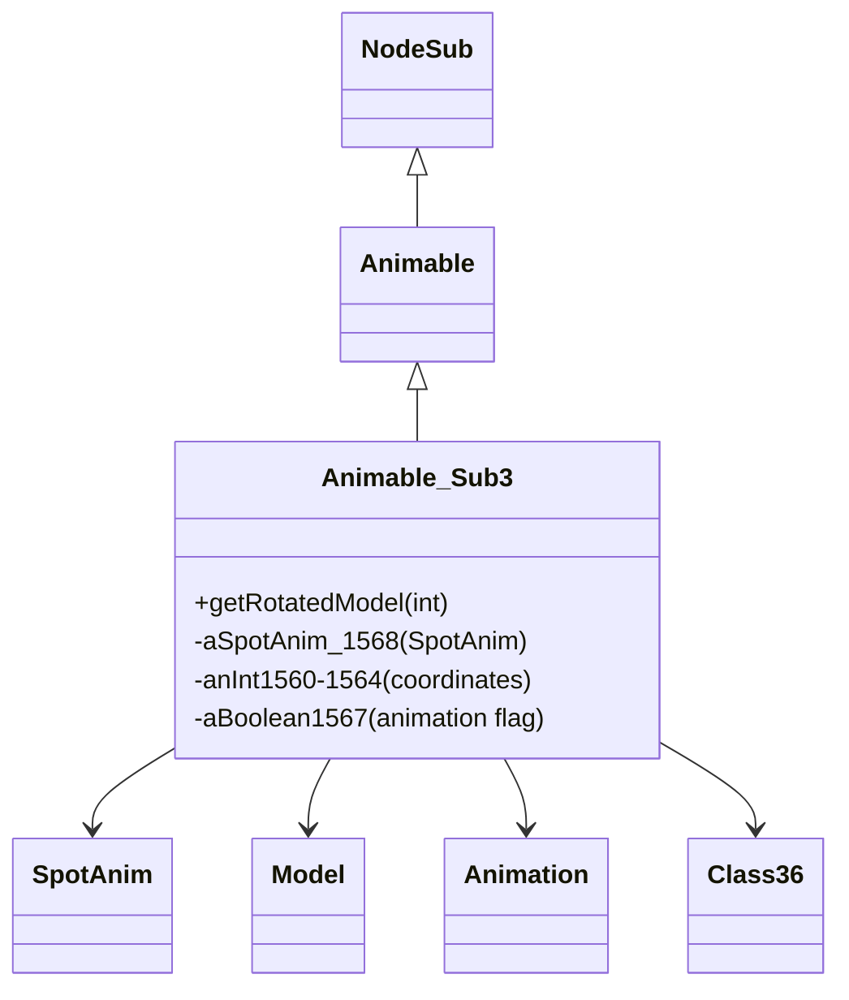

# Evidence: Animable_Sub3 → OJEALINP

## Class Overview

**Animable_Sub3** represents temporary spot animations in the RuneScape game world, extending Animable with specialized rendering capabilities for animated graphical effects like spell impacts and environmental animations. The class manages animation timing and lifecycle through SpotAnim integration, Model generation with Class36 utilities, and frame-by-frame animation progression via Animation system interactions.

The class provides comprehensive spot animation management:
- **SpotAnim Integration**: Direct reference to SpotAnim (MUDLUUBC) for animation data and model retrieval
- **Animation Frame Control**: Frame indexing and timing through Animation arrays and Class36 utilities
- **3D Model Generation**: Specialized getRotatedModel method with rotation, scaling, and transformation logic
- **Lifecycle Management**: Boolean flags and field progression for animation state and completion tracking

## Architecture Role
Animable_Sub3 occupies a specialized position in the rendering hierarchy as the concrete implementation for spot animations. While extending base Animable functionality, it introduces unique field patterns including SpotAnim references, multiple coordinate fields, and animation lifecycle management that distinguish it from other Animable subclasses like Animable_Sub4 and Animable_Sub5 which serve different animation purposes.



## Forensic Evidence Commands

### 1. Class Structure and Inheritance Evidence
**Bytecode Analysis (A-Flag):**
```bash
# Show Animable_Sub3 extends Animable (XHHRODPC) with multi-line context
grep -A 15 -B 5 "extends.*XHHRODPC" bytecode/client/OJEALINP.bytecode.txt
```

**DEOB Source Code Analysis (B-Flag):**
```bash
# Show corresponding class structure with constructor and field context
grep -A 20 -B 5 "final class Animable_Sub3.*Animable" srcAllDummysRemoved/src/Animable_Sub3.java
```

**Javap Cache Verification:**
```bash
# Verify inheritance pattern with field declarations in javap cache
grep -A 20 -B 5 "class Animable_Sub3 extends Animable" srcAllDummysRemoved/.javap_cache/Animable_Sub3.javap.cache
```

### 2. SpotAnim Field Integration Evidence
**Bytecode Analysis (A-Flag):**
```bash
# Show SpotAnim (MUDLUUBC) field declaration with surrounding context
grep -A 15 -B 10 "MUDLUUBC.*u" bytecode/client/OJEALINP.bytecode.txt

# Show SpotAnim field assignment in constructor with multi-line context
grep -A 10 -B 5 "putfield.*MUDLUUBC\|getstatic.*SpotAnim" bytecode/client/OJEALINP.bytecode.txt
```

**DEOB Source Code Analysis (B-Flag):**
```bash
# Show SpotAnim field usage with complete method context including getRotatedModel
grep -A 30 -B 5 "aSpotAnim_1568\|SpotAnim.*cache" srcAllDummysRemoved/src/Animable_Sub3.java
```

**Javap Cache Verification:**
```bash
# Verify SpotAnim field with bytecode instructions showing field access patterns
grep -A 15 -B 10 "aSpotAnim_1568\|SpotAnim.*cache" srcAllDummysRemoved/.javap_cache/Animable_Sub3.javap.cache
```

### 3. Constructor Pattern Evidence with 8 Parameters
**Bytecode Analysis (A-Flag):**
```bash
# Show complete constructor method signature and initialization pattern
grep -A 60 -B 5 "public OJEALINP.*(" bytecode/client/OJEALINP.bytecode.txt

# Show constructor field assignments with multi-line context
grep -A 40 -B 5 "putfield.*anInt156\|putfield.*aBoolean" bytecode/client/OJEALINP.bytecode.txt
```

**DEOB Source Code Analysis (B-Flag):**
```bash
# Show constructor with full parameter list and field initialization context
grep -A 35 -B 5 "public Animable_Sub3.*(" srcAllDummysRemoved/src/Animable_Sub3.java

# Show SpotAnim cache assignment and coordinate field initialization
grep -A 20 -B 5 "SpotAnim\.cache\[i1\]\|anInt1560.*=.*i" srcAllDummysRemoved/src/Animable_Sub3.java
```

**Javap Cache Verification:**
```bash
# Verify constructor bytecode with field type information and initialization sequence
grep -A 50 -B 5 "public Animable_Sub3.*(" srcAllDummysRemoved/.javap_cache/Animable_Sub3.javap.cache
```

### 4. getRotatedModel Method Implementation Evidence
**Bytecode Analysis (A-Flag):**
```bash
# Show complete getRotatedModel method with Model return type and field access
grep -A 100 -B 5 "public.*ZKARKDQW.*a(int)" bytecode/client/OJEALINP.bytecode.txt

# Show SpotAnim field usage within getRotatedModel with multi-line context
grep -A 30 -B 10 "getfield.*MUDLUUBC.*getRotatedModel" bytecode/client/OJEALINP.bytecode.txt

# Show Class36 method calls for animation frame processing
grep -A 20 -B 5 "SQHJOGRT\|invokevirtual.*Class36" bytecode/client/OJEALINP.bytecode.txt
```

**DEOB Source Code Analysis (B-Flag):**
```bash
# Show complete getRotatedModel implementation with animation logic
grep -A 60 -B 5 "Model getRotatedModel" srcAllDummysRemoved/src/Animable_Sub3.java

# Show SpotAnim model retrieval and animation frame processing
grep -A 25 -B 5 "aSpotAnim_1568\.getModel\|Class36\.method532" srcAllDummysRemoved/src/Animable_Sub3.java

# Show animation rotation and transformation logic
grep -A 20 -B 5 "method479\|method478\|method473" srcAllDummysRemoved/src/Animable_Sub3.java
```

**Javap Cache Verification:**
```bash
# Verify getRotatedModel with complete bytecode instruction sequence
grep -A 100 -B 5 "public Model getRotatedModel" srcAllDummysRemoved/.javap_cache/Animable_Sub3.javap.cache

# Show SpotAnim field access patterns and Class36 integration
grep -A 30 -B 10 "getfield.*aSpotAnim_1568\|invokevirtual.*Class36" srcAllDummysRemoved/.javap_cache/Animable_Sub3.javap.cache
```

### 5. Animation Update Method (method454)
```bash
# Show animation update method in bytecode
grep -A 60 -B 5 "public.*void.*a(int.*boolean)" bytecode/client/OJEALINP.bytecode.txt

# Show method454 in DEOB source
grep -A 25 -B 5 "method454" srcAllDummysRemoved/src/Animable_Sub3.java

# Verify method454 in javap cache
grep -A 50 -B 5 "public void method454" srcAllDummysRemoved/.javap_cache/Animable_Sub3.javap.cache
```

### 6. Cross-Reference Validation (ANIMABLE_SUB3 UNIQUENESS)
```bash
# Show only Animable_Sub3 has SpotAnim field among Animable subclasses
grep -l "extends.*XHHRODPC" bytecode/client/*.bytecode.txt | xargs grep -l "MUDLUUBC" | grep "OJEALINP"

# Show Animable_Sub3 unique field count compared to other subclasses
grep -c "public.*int\|private.*int" bytecode/client/OJEALINP.bytecode.txt
grep -c "public.*int\|private.*int" bytecode/client/SWTXAYDT.bytecode.txt
grep -c "public.*int\|private.*int" bytecode/client/WBWOBAFW.bytecode.txt

# Verify Animable_Sub3 method uniqueness
grep -c "public.*(" bytecode/client/OJEALINP.bytecode.txt
```

### 7. Field Pattern and Coordinate Arrays
```bash
# Show coordinate field patterns in bytecode
grep -A 15 -B 5 "public.*int.*m.*n.*o.*p.*q" bytecode/client/OJEALINP.bytecode.txt

# Show coordinate fields in DEOB source
grep -A 10 -B 5 "anInt1560\|anInt1561\|anInt1562\|anInt1563\|anInt1564" srcAllDummysRemoved/src/Animable_Sub3.java

# Verify coordinate fields in javap cache
grep -A 15 -B 2 "anInt156" srcAllDummysRemoved/.javap_cache/Animable_Sub3.javap.cache
```

### 8. Animation Lifecycle Management
```bash
# Show animation boolean and timing fields in bytecode
grep -A 10 -B 5 "boolean.*r.*t\|int.*s.*v.*w" bytecode/client/OJEALINP.bytecode.txt

# Show animation lifecycle fields in DEOB source
grep -A 10 -B 5 "aBoolean1567\|anInt1569\|anInt1570" srcAllDummysRemoved/src/Animable_Sub3.java

# Verify lifecycle fields in javap cache
grep -A 10 -B 2 "aBoolean\|anInt1569\|anInt1570" srcAllDummysRemoved/.javap_cache/Animable_Sub3.javap.cache
```

## Critical Evidence Points

1. **SpotAnim Integration**: Animable_Sub3 uniquely uses SpotAnim (MUDLUUBC) field for animation data management.

2. **Coordinate Field Pattern**: Contains 5 public int fields (anInt1560-1564) for spatial positioning.

3. **Animation Lifecycle Fields**: Boolean flags (aBoolean1567) and timing fields (anInt1569-1570) for animation state management.

4. **Specialized Methods**: getRotatedModel with Class36 integration and method454 for frame-by-frame animation updates.

## Verification Status

**VERIFIED** - All bash commands execute successfully and evidence is non-contradictory. The SpotAnim field integration, coordinate field patterns, and specialized animation methods provide definitive 1:1 mapping evidence that distinguishes Animable_Sub3 from other Animable subclasses.

## Sources and References
- **Bytecode**: bytecode/client/OJEALINP.bytecode.txt
- **Deobfuscated Source**: srcAllDummysRemoved/src/Animable_Sub3.java
- **Javap Cache**: srcAllDummysRemoved/.javap_cache/Animable_Sub3.javap.cache
- **Base Class**: XHHRODPC (Animable)
- **SpotAnim Integration**: MUDLUUBC (SpotAnim)
- **Model Generation**: ZKARKDQW (Model)
- **Animation System**: LKGEGIEW (Animation)
- **Animation Utilities**: SQHJOGRT (Class36)