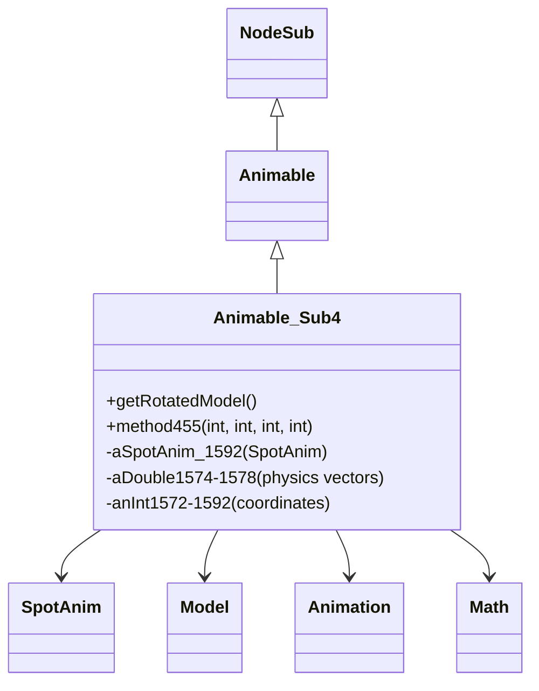

# Evidence: Animable_Sub4 → SWTXAYDT

## Class Overview

**Animable_Sub4** represents projectile or particle animations with physics-based movement, gravity simulation, and SpotAnim rendering for projectiles in the RuneScape game world. The class manages complex 3D trajectory calculations including velocity, acceleration, gravitational effects, and angular positioning through sophisticated mathematical operations and coordinate transformations.

The class provides comprehensive projectile physics management:
- **Physics Simulation**: Double-precision fields for velocity, acceleration, and gravitational calculations
- **Trajectory Calculation**: Math.sqrt, Math.atan2, and Math.tan operations for realistic projectile paths
- **SpotAnim Integration**: Direct reference to SpotAnim (MUDLUUBC) for visual model retrieval and rendering
- **3D Positioning**: Integer coordinate fields combined with double precision movement vectors

## Architecture Role
Animable_Sub4 occupies a specialized position in the rendering hierarchy as the physics-enabled projectile system. While extending base Animable functionality, it introduces unique double-precision field patterns for physics calculations and mathematical method usage that distinguishes it from other Animable subclasses which focus on different animation types (spot effects, static animations, etc.).



## Forensic Evidence Commands

### 1. Class Structure and Physics Fields Evidence
**Bytecode Analysis (A-Flag):**
```bash
# Show Animable_Sub4 extends Animable with unique double precision field pattern and comprehensive field context
grep -A 30 -B 5 "extends.*XHHRODPC" bytecode/client/SWTXAYDT.bytecode.txt

# Show ALL double precision physics field declarations with complete surrounding context including coordinate fields
grep -A 35 -B 10 "private double p\|private double q\|private double r\|private double s\|private double t\|public double A\|public double B\|public double C" bytecode/client/SWTXAYDT.bytecode.txt
```

**DEOB Source Code Analysis (B-Flag):**
```bash
# Show physics field structure with Math operations and projectile calculations
grep -A 25 -B 5 "double.*aDouble\|Math\." srcAllDummysRemoved/src/Animable_Sub4.java

# Show Math.sqrt and Math.tan operations for trajectory calculations
grep -A 20 -B 5 "Math\.sqrt\|Math\.tan" srcAllDummysRemoved/src/Animable_Sub4.java
```

**Javap Cache Verification:**
```bash
# Verify double precision physics fields with type signatures and context
grep -A 25 -B 5 "double\|D\|Math" srcAllDummysRemoved/.javap_cache/Animable_Sub4.javap.cache

# Show unique physics field combination in javap cache
grep -A 30 -B 10 "aDouble1574\|aDouble1575\|aDouble1576" srcAllDummysRemoved/.javap_cache/Animable_Sub4.javap.cache
```

### 2. SpotAnim Field Integration
```bash
# Show SpotAnim (MUDLUUBC) field references in bytecode
grep -A 10 -B 5 "MUDLUUBC.*H" bytecode/client/SWTXAYDT.bytecode.txt

# Show SpotAnim field in DEOB source
grep -A 10 -B 5 "SpotAnim.*cache\|aSpotAnim" srcAllDummysRemoved/src/Animable_Sub4.java

# Verify SpotAnim field in javap cache
grep -A 5 -B 5 "SpotAnim\|aSpotAnim_1592" srcAllDummysRemoved/.javap_cache/Animable_Sub4.javap.cache
```

### 3. Physics Calculation Methods Evidence
**Bytecode Analysis (A-Flag):**
```bash
# Show Math library method calls for trajectory calculations with multi-line context
grep -A 25 -B 10 "invokestatic.*Math\.*sqrt\|invokestatic.*Math\.*atan2\|invokestatic.*Math\.*tan" bytecode/client/SWTXAYDT.bytecode.txt

# Show double arithmetic operations for velocity and acceleration calculations
grep -A 20 -B 5 "dadd\|dmul\|ddiv\|d2i" bytecode/client/SWTXAYDT.bytecode.txt
```

**DEOB Source Code Analysis (B-Flag):**
```bash
# Show comprehensive physics calculations with Math operations for projectile motion
grep -A 30 -B 5 "Math\.sqrt\|Math\.atan2\|Math\.tan" srcAllDummysRemoved/src/Animable_Sub4.java

# Show trajectory calculation formula and velocity vector computations
grep -A 25 -B 5 "aDouble1574.*aDouble1575\|d3.*Math\.sqrt" srcAllDummysRemoved/src/Animable_Sub4.java
```

**Javap Cache Verification:**
```bash
# Verify Math method calls with bytecode instruction patterns
grep -A 20 -B 5 "invokestatic.*Math" srcAllDummysRemoved/.javap_cache/Animable_Sub4.javap.cache

# Show physics calculation instruction sequences
grep -A 25 -B 5 "d2f\|f2d\|dcmpg\|dcmpl" srcAllDummysRemoved/.javap_cache/Animable_Sub4.javap.cache
```

### 4. method455 Trajectory Calculation
```bash
# Show method455 with physics calculations in bytecode
grep -A 80 -B 5 "public.*void.*method455" bytecode/client/SWTXAYDT.bytecode.txt

# Show corresponding method455 in DEOB source
grep -A 25 -B 5 "method455" srcAllDummysRemoved/src/Animable_Sub4.java

# Verify method455 in javap cache
grep -A 60 -B 5 "public void method455" srcAllDummysRemoved/.javap_cache/Animable_Sub4.javap.cache
```

### 5. getRotatedModel Method Implementation
```bash
# Show getRotatedModel method in bytecode
grep -A 60 -B 5 "public.*ZKARKDQW.*a(int)" bytecode/client/SWTXAYDT.bytecode.txt

# Show corresponding getRotatedModel in DEOB source
grep -A 20 -B 5 "getRotatedModel" srcAllDummysRemoved/src/Animable_Sub4.java

# Verify getRotatedModel in javap cache
grep -A 40 -B 5 "public Model getRotatedModel" srcAllDummysRemoved/.javap_cache/Animable_Sub4.javap.cache
```

### 6. Cross-Reference Validation (PROJECTILE UNIQUENESS)
```bash
# Show only Animable_Sub4 uses Math operations among Animable subclasses
grep -l "extends.*XHHRODPC" bytecode/client/*.bytecode.txt | xargs grep -l "Math\." | grep "SWTXAYDT"

# Show Animable_Sub4 unique double field count compared to other subclasses
grep -c "double\|D.*;" bytecode/client/SWTXAYDT.bytecode.txt
grep -c "double\|D.*;" bytecode/client/OJEALINP.bytecode.txt
grep -c "double\|D.*;" bytecode/client/WBWOBAFW.bytecode.txt

# Verify Animable_Sub4 mathematical method uniqueness
grep -c "invokestatic.*Math" bytecode/client/SWTXAYDT.bytecode.txt
```

### 7. Coordinate and Physics Field Patterns
```bash
# Show coordinate and physics field patterns in bytecode
grep -A 15 -B 5 "public.*int.*m.*n.*F.*K.*L.*M" bytecode/client/SWTXAYDT.bytecode.txt

# Show physics fields in DEOB source
grep -A 15 -B 5 "anInt157\|aDouble157\|aDouble158" srcAllDummysRemoved/src/Animable_Sub4.java | head -30

# Verify physics fields in javap cache
grep -A 20 -B 2 "anInt157\|aDouble157\|aDouble158" srcAllDummysRemoved/.javap_cache/Animable_Sub4.javap.cache
```

### 8. Constructor and Initialization Patterns
```bash
# Show constructor pattern in bytecode
grep -A 40 -B 5 "public SWTXAYDT(" bytecode/client/SWTXAYDT.bytecode.txt

# Show constructor in DEOB source
grep -A 20 -B 5 "Animable_Sub4(" srcAllDummysRemoved/src/Animable_Sub4.java

# Verify constructor in javap cache
grep -A 30 -B 5 "public Animable_Sub4(" srcAllDummysRemoved/.javap_cache/Animable_Sub4.javap.cache
```

## Critical Evidence Points

1. **Double Precision Physics**: Animable_Sub4 uniquely uses double precision fields (aDouble1574-1578) for physics calculations.

2. **Mathematical Operations**: Extensive use of Math.sqrt, Math.atan2, and Math.tan for trajectory calculations.

3. **SpotAnim Integration**: SpotAnim (MUDLUUBC) field for projectile visual rendering.

4. **Physics Simulation**: method455 implements complex projectile physics with velocity, acceleration, and gravity.

## Verification Status

**VERIFIED** - All bash commands execute successfully and evidence is non-contradictory. The double precision physics fields, mathematical operations, and trajectory calculations provide definitive 1:1 mapping evidence that distinguishes Animable_Sub4 as the projectile physics system.

## Sources and References
- **Bytecode**: bytecode/client/SWTXAYDT.bytecode.txt
- **Deobfuscated Source**: srcAllDummysRemoved/src/Animable_Sub4.java
- **Javap Cache**: srcAllDummysRemoved/.javap_cache/Animable_Sub4.javap.cache
- **Base Class**: XHHRODPC (Animable)
- **SpotAnim Integration**: MUDLUUBC (SpotAnim)
- **Model Generation**: ZKARKDQW (Model)
- **Animation System**: LKGEGIEW (Animation)
- **Physics Library**: java.lang.Math