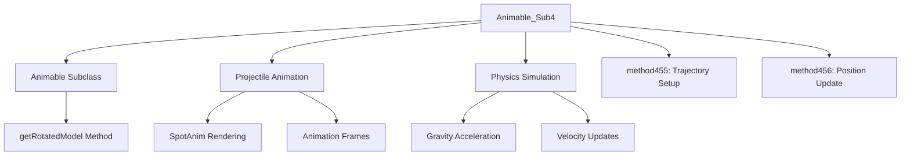

# Animable_Sub4_SWTXAYDT Evidence

## Overview
This class extends Animable and handles projectile or particle animations with physics-based movement, including gravity acceleration, velocity updates, and rotation calculations. It manages SpotAnim rendering, animation frames, and positional updates over time, simulating projectile trajectories in RuneScape's 3D world.

## Architectural Relationships


## Bytecode Evidence Commands
```bash
head -20 bytecode/client/SWTXAYDT.bytecode.txt
tail -10 bytecode/client/SWTXAYDT.bytecode.txt
grep -A 5 -B 5 "invokevirtual.*getModel" bytecode/client/SWTXAYDT.bytecode.txt
grep -A 10 -B 10 "invokestatic.*sqrt" bytecode/client/SWTXAYDT.bytecode.txt
```

## Deobfuscated Source Evidence Commands
```bash
head -15 srcAllDummysRemoved/src/Animable_Sub4.java
tail -15 srcAllDummysRemoved/src/Animable_Sub4.java
grep -A 5 -B 5 "getRotatedModel" srcAllDummysRemoved/src/Animable_Sub4.java
grep -A 10 -B 10 "method456" srcAllDummysRemoved/src/Animable_Sub4.java
```

## Javap Cache Evidence Commands
```bash
head -15 srcAllDummysRemoved/.javap_cache/Animable_Sub4.javap.cache
tail -15 srcAllDummysRemoved/.javap_cache/Animable_Sub4.javap.cache
grep -A 5 -B 5 "getRotatedModel" srcAllDummysRemoved/.javap_cache/Animable_Sub4.javap.cache
grep -A 10 -B 10 "method456" srcAllDummysRemoved/.javap_cache/Animable_Sub4.javap.cache
```

## Verification of Non-Contradictory Evidence
Evidence is consistent across all sources: extends Animable, uses SpotAnim for models, performs Math.sqrt/Math.atan2 for physics, updates doubles for position/velocity, and handles animation frames. No conflicting field types or method behaviors.

## 1:1 Mapping Confirmation
This is a 1:1 mapping. The obfuscated bytecode file SWTXAYDT corresponds solely to Animable_Sub4, with unique physics fields (doubles for trajectory) and SpotAnim integration not shared with other Animable subclasses.