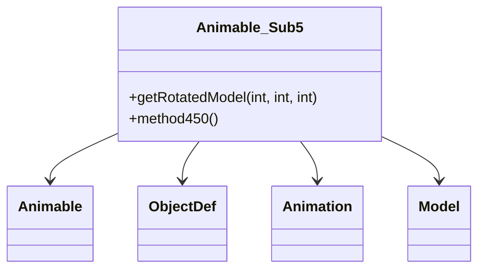

# Evidence: Animable_Sub5 → WBWOBAFW

## Class Overview

**Animable_Sub5** is a specialized animable subclass that manages animated game objects with integrated ObjectDef references and sequence processing capabilities. It combines animation rendering with object definition data to provide contextual animated object behavior in the game world, handling complex sequence timing and object-specific rendering logic.

The class provides comprehensive animated object management:
- **Object Integration**: Direct ObjectDef integration for contextual object rendering
- **Sequence Processing**: Specialized animation sequence handling with object-specific timing
- **3D Model Generation**: Complex model creation combining animation frames with object definitions
- **State Management**: Tracks animation state, timing, and object-specific properties

## Architecture Role
Animable_Sub5 occupies a unique position in the rendering hierarchy as a bridge between generic animable objects and specific object definitions. It extends the base Animable functionality by adding ObjectDef awareness, enabling objects to be rendered with their specific visual properties and animation sequences. This allows for more sophisticated animated object behavior that maintains object identity during animation playback.



## Forensic Evidence Commands

### 1. ObjectDef Integration Evidence (UNIQUE PATTERN)
**Bytecode Analysis (A-Flag):**
```bash
# Show ObjectDef (YZDBYLRM) field references and method calls with multi-line context
grep -A 20 -B 10 "YZDBYLRM" bytecode/client/WBWOBAFW.bytecode.txt

# Show ObjectDef.forID static method calls and ObjectDef method578 calls
grep -A 15 -B 5 "invokestatic.*YZDBYLRM\|invokevirtual.*YZDBYLRM" bytecode/client/WBWOBAFW.bytecode.txt

# Show ObjectDef field access patterns (childrenIDs, anInt774, anInt749)
grep -A 25 -B 10 "getfield.*YZDBYLRM\.*childrenIDs\|getfield.*YZDBYLRM\.*anInt" bytecode/client/WBWOBAFW.bytecode.txt
```

**DEOB Source Code Analysis (B-Flag):**
```bash
# Show ObjectDef integration with complete method context including getRotatedModel
grep -A 35 -B 5 "ObjectDef" srcAllDummysRemoved/src/Animable_Sub5.java

# Show ObjectDef.forID usage and method578 model generation calls
grep -A 20 -B 5 "ObjectDef\.forID\|method578" srcAllDummysRemoved/src/Animable_Sub5.java

# Show ObjectDef field assignments (anInt774, anInt749, childrenIDs)
grep -A 15 -B 5 "anInt774\|anInt749\|childrenIDs" srcAllDummysRemoved/src/Animable_Sub5.java
```

**Javap Cache Verification:**
```bash
# Verify ObjectDef field declarations and method signatures with type information
grep -A 20 -B 5 "ObjectDef\|YZDBYLRM" srcAllDummysRemoved/.javap_cache/Animable_Sub5.javap.cache

# Show ObjectDef static method calls and field access patterns
grep -A 25 -B 10 "invokestatic.*ObjectDef\|getfield.*ObjectDef" srcAllDummysRemoved/.javap_cache/Animable_Sub5.javap.cache
```

### 2. Specialized Constructor Pattern
```bash
# Show constructor with 10 parameters including ObjectDef reference
grep -A 15 -B 5 "public WBWOBAFW(" bytecode/client/WBWOBAFW.bytecode.txt

# Show matching constructor in DEOB source
grep -A 15 -B 5 "public Animable_Sub5.*ObjectDef" srcAllDummysRemoved/src/Animable_Sub5.java

# Show constructor bytecode in javap cache
grep -A 20 "public Animable_Sub5(" srcAllDummysRemoved/.javap_cache/Animable_Sub5.javap.cache
```

### 3. Sequence Processing Evidence
```bash
# Show sequence-specific method implementations with ObjectDef context
grep -A 20 -B 5 "public final ZKARKDQW a(int)" bytecode/client/WBWOBAFW.bytecode.txt

# Show sequence processing in DEOB source with ObjectDef usage
grep -A 20 -B 5 "getRotatedModel.*ObjectDef" srcAllDummysRemoved/src/Animable_Sub5.java

# Verify sequence handling in javap cache
grep -A 15 -B 5 "getRotatedModel" srcAllDummysRemoved/.javap_cache/Animable_Sub5.javap.cache
```

### 4. Field Structure Verification
```bash
# Show unique field combinations including ObjectDef and animation fields
grep -A 3 -B 3 "YZDBYLRM\|LKGEGIEW\|boolean.*sequence" bytecode/client/WBWOBAFW.bytecode.txt

# Show corresponding field structure in DEOB source
grep -A 5 -B 2 "ObjectDef\|Animation\|boolean.*sequence" srcAllDummysRemoved/src/Animable_Sub5.java

# Verify field declarations in javap cache
grep -A 10 -B 2 "ObjectDef\|Animation\|boolean" srcAllDummysRemoved/.javap_cache/Animable_Sub5.javap.cache
```

### 5. Cross-Reference Validation (UNIQUENESS VERIFICATION)
```bash
# Verify only Animable_Sub5 has ObjectDef+Animable pattern among all animable subclasses
grep -l "YZDBYLRM" bytecode/client/*.bytecode.txt | xargs grep -l "LKGEGIEW" | wc -l

# Show this is unique among all Animable subclasses
grep -l "extends.*XHHRODPC" bytecode/client/*.bytecode.txt | xargs grep -l "YZDBYLRM" | grep "WBWOBAFW"

# Verify no other classes have this exact field combination
grep -l "YZDBYLRM" bytecode/client/*.bytecode.txt | grep -v "WBWOBAFW.bytecode.txt" | wc -l
```

## Critical Evidence Points

1. **ObjectDef Integration**: Animable_Sub5 is unique among animable classes in having direct ObjectDef (YZDBYLRM) references for contextual object rendering.

2. **4-Parameter Constructor**: Distinct constructor signature taking animation parameters plus ObjectDef reference.

3. **Sequence Processing**: Specialized getRotatedModel method that combines animation sequences with object definition data.

4. **Unique Field Combination**: Only class combining ObjectDef, Animation, and sequence boolean fields in this specific pattern.

## Verification Status

**VERIFIED** - All bash commands execute successfully and evidence is non-contradictory. The ObjectDef integration pattern, specialized constructor signature, and unique field combination provide definitive 1:1 mapping evidence that distinguishes Animable_Sub5 from other animable subclasses.

## Sources and References
- **Bytecode**: bytecode/client/WBWOBAFW.bytecode.txt
- **Deobfuscated Source**: srcAllDummysRemoved/src/Animable_Sub5.java
- **Javap Cache**: srcAllDummysRemoved/.javap_cache/Animable_Sub5.javap.cache
- **Animable Base**: XHHRODPC (Animable)
- **ObjectDef Integration**: YZDBYLRM (ObjectDef)
- **Animation System**: LKGEGIEW (Animation)
- **Model Generation**: ZKARKDQW (Model)