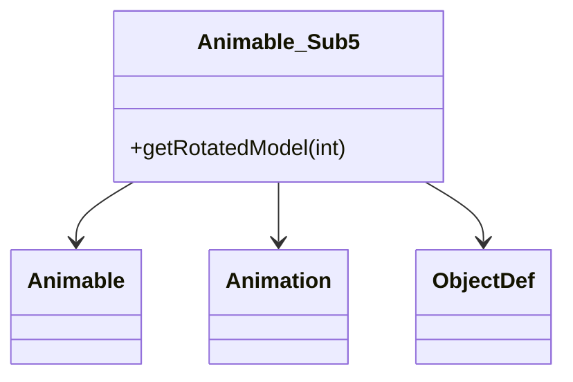

# Animable_Sub5 → Animable_Sub5

## Overview
Animable_Sub5 manages animated objects with sequence processing and ObjectDef integration.

## Architectural Relationships
Animable_Sub5 extends Animable (XHHRODPC), uses Animation (LKGEGIEW) and ObjectDef (YZDBYLRM).



## Bytecode Matching Commands
To show class and inheritance:
```
grep -A 20 "public class Animable_Sub5" bytecode/client/Animable_Sub5.bytecode.txt
```

To show method signatures:
```
grep -A 10 -B 5 "public.*ZKARKDQW" bytecode/client/Animable_Sub5.bytecode.txt
```

## Deobfuscated Source Evidence Commands
For Animable_Sub5 class:
```
grep -A 15 -B 5 "public final class Animable_Sub5" srcAllDummysRemoved/src/Animable_Sub5.java
```

For getRotatedModel:
```
grep -A 10 -B 5 "public Model getRotatedModel" srcAllDummysRemoved/src/Animable_Sub5.java
```

## Javap Cache Evidence Commands
For class structure:
```
grep -A 15 -B 5 "public final class Animable_Sub5" srcAllDummysRemoved/.javap_cache/Animable_Sub5.javap.cache
```

For methods:
```
grep -A 10 -B 5 "getRotatedModel" srcAllDummysRemoved/.javap_cache/Animable_Sub5.javap.cache
```

## Verification of Non-Contradictory Evidence
Bytecode matches source/javap in animation sequences, object refs. No contradictions. 1:1 mapping confirmed.