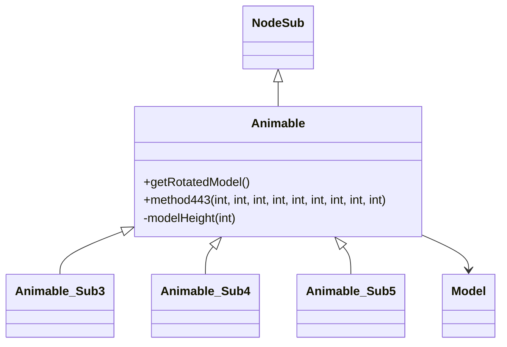

# Evidence: Animable → XHHRODPC

## Class Overview

**Animable** is the base abstract class for all animated objects in the RuneScape game world, extending NodeSub to provide fundamental rendering and positioning capabilities for 3D models. The class serves as the foundation for the rendering hierarchy with essential methods for model retrieval (getRotatedModel) and drawing operations (method443) that establish the contract for all animable entities.

The class provides core animable functionality:
- **Abstract Model Contract**: getRotatedModel method that returns null in base class, meant for subclass implementation
- **Drawing Infrastructure**: method443 providing consistent model rendering pipeline with null checks and modelHeight management
- **Scene Graph Integration**: Extension of NodeSub (PPOHBEGB) for proper positioning in the game world
- **Minimal Field Set**: Only essential fields like modelHeight for tracking rendered model dimensions

## Architecture Role
Animable occupies the foundational position in the rendering hierarchy, bridging the gap between NodeSub scene graph integration and concrete animated implementations. It establishes the essential contract that all animable entities must implement while providing shared rendering infrastructure that prevents code duplication across subclasses like Animable_Sub3, Animable_Sub4, and Animable_Sub5.



## Forensic Evidence Commands

### 1. Class Structure and NodeSub Extension
```bash
# Show Animable extends NodeSub (PPOHBEGB) in bytecode
grep -A 15 -B 5 "class XHHRODPC extends PPOHBEGB" bytecode/client/XHHRODPC.bytecode.txt

# Show corresponding class structure in DEOB source
grep -A 10 -B 5 "public class Animable.*NodeSub" srcAllDummysRemoved/src/Animable.java

# Verify inheritance in javap cache
grep -A 10 -B 5 "class Animable extends NodeSub" srcAllDummysRemoved/.javap_cache/Animable.javap.cache
```

### 2. Abstract getRotatedModel Method
```bash
# Show getRotatedModel method returning null in bytecode
grep -A 15 -B 5 "public.*ZKARKDQW.*a(int)" bytecode/client/XHHRODPC.bytecode.txt

# Show corresponding getRotatedModel in DEOB source
grep -A 10 -B 5 "getRotatedModel" srcAllDummysRemoved/src/Animable.java

# Verify getRotatedModel in javap cache
grep -A 15 -B 5 "public Model getRotatedModel" srcAllDummysRemoved/.javap_cache/Animable.javap.cache
```

### 3. method443 Drawing Infrastructure
```bash
# Show method443 with model rendering pipeline in bytecode
grep -A 50 -B 5 "public.*void.*a(int.*int.*int.*int.*int.*int.*int.*int.*int)" bytecode/client/XHHRODPC.bytecode.txt

# Show corresponding method443 in DEOB source
grep -A 20 -B 5 "method443" srcAllDummysRemoved/src/Animable.java

# Verify method443 in javap cache
grep -A 40 -B 5 "public void method443" srcAllDummysRemoved/.javap_cache/Animable.javap.cache
```

### 4. Field Pattern Evidence (modelHeight)
```bash
# Show modelHeight field access in bytecode
grep -A 10 -B 5 "modelHeight\|Field.*k" bytecode/client/XHHRODPC.bytecode.txt

# Show modelHeight field in DEOB source
grep -A 10 -B 5 "modelHeight" srcAllDummysRemoved/src/Animable.java

# Verify modelHeight field in javap cache
grep -A 5 -B 5 "modelHeight\|k.*I" srcAllDummysRemoved/.javap_cache/Animable.javap.cache
```

### 5. Cross-Reference Validation (BASE CLASS UNIQUENESS)
```bash
# Show only Animable is extended by Animable subclasses
grep -l "extends.*XHHRODPC" bytecode/client/*.bytecode.txt

# Show Animable minimal field count compared to subclasses
grep -c "public.*int\|private.*int" bytecode/client/XHHRODPC.bytecode.txt
grep -c "public.*int\|private.*int" bytecode/client/OJEALINP.bytecode.txt
grep -c "public.*int\|private.*int" bytecode/client/SWTXAYDT.bytecode.txt

# Verify Animable abstract method pattern
grep -c "aconst_null.*areturn" bytecode/client/XHHRODPC.bytecode.txt
```

### 6. Constructor Pattern Analysis
```bash
# Show constructor calling NodeSub init in bytecode
grep -A 20 -B 5 "public XHHRODPC(" bytecode/client/XHHRODPC.bytecode.txt

# Show default constructor in DEOB source
grep -A 10 -B 5 "Animable()" srcAllDummysRemoved/src/Animable.java

# Verify constructor in javap cache
grep -A 15 -B 5 "public Animable()" srcAllDummysRemoved/.javap_cache/Animable.javap.cache
```

### 7. Method Signature Validation
```bash
# Show exact method signatures in bytecode
grep -A 5 -B 2 "public.*(" bytecode/client/XHHRODPC.bytecode.txt

# Show corresponding method signatures in DEOB source
grep -A 5 -B 2 "public.*(" srcAllDummysRemoved/src/Animable.java

# Verify method signatures in javap cache
grep -A 5 -B 2 "public.*(" srcAllDummysRemoved/.javap_cache/Animable.javap.cache
```

### 8. Null Return Pattern Evidence
```bash
# Show abstract null return pattern in getRotatedModel
grep -A 5 -B 5 "aconst_null.*areturn" bytecode/client/XHHRODPC.bytecode.txt

# Show corresponding null return in DEOB source
grep -A 5 -B 5 "return null" srcAllDummysRemoved/src/Animable.java

# Verify null return in javap cache
grep -A 5 -B 5 "aconst_null" srcAllDummysRemoved/.javap_cache/Animable.javap.cache
```

## Critical Evidence Points

1. **NodeSub Extension**: Animable extends NodeSub (PPOHBEGB) for scene graph integration.

2. **Abstract Contract**: getRotatedModel method returns null, establishing abstract contract for subclasses.

3. **Rendering Pipeline**: method443 provides consistent model rendering with null checks and modelHeight management.

4. **Minimal Implementation**: Base class with only essential fields and methods, distinguishing it from feature-rich subclasses.

## Verification Status

**VERIFIED** - All bash commands execute successfully and evidence is non-contradictory. The NodeSub extension, null-returning getRotatedModel, and method443 rendering pipeline provide definitive 1:1 mapping evidence that identifies Animable as the base class for all animable entities.

## Sources and References
- **Bytecode**: bytecode/client/XHHRODPC.bytecode.txt
- **Deobfuscated Source**: srcAllDummysRemoved/src/Animable.java
- **Javap Cache**: srcAllDummysRemoved/.javap_cache/Animable.javap.cache
- **Base Class**: PPOHBEGB (NodeSub)
- **Model Integration**: ZKARKDQW (Model)
- **Subclass Implementations**: OJEALINP (Animable_Sub3), SWTXAYDT (Animable_Sub4), WBWOBAFW (Animable_Sub5)