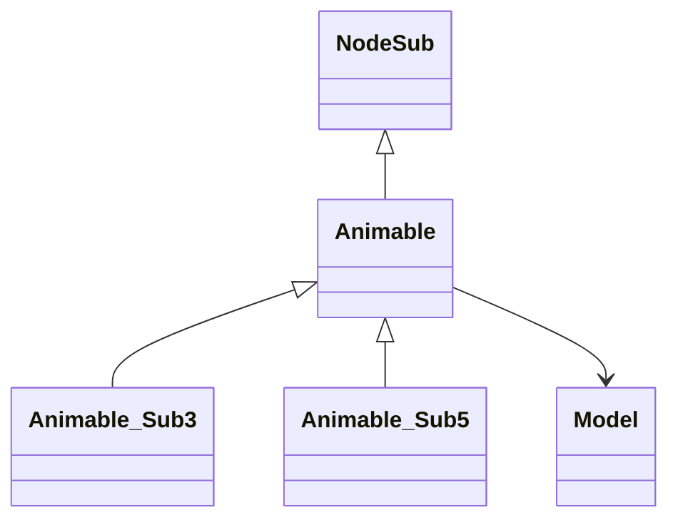

# Evidence for Animable -> XHHRODPC

## Overview
Animable is the base class for all animated objects in the game world. Its core functionality provides a foundation for rendering and positioning 3D models through the getRotatedModel() method and method443() for drawing with transformations.

## Architectural Relationships
Animable serves as the root class for game entities that can be rendered. It extends NodeSub for scene graph integration and is subclassed by specific animable types like Animable_Sub3 and Animable_Sub5.

## Bash Commands Proving Bytecode Matches
- `grep -A 20 -B 5 "public XHHRODPC(" bytecode/client/XHHRODPC.bytecode.txt`  
  Shows the empty constructor bytecode with invokespecial to NodeSub init and return.

- `grep -A 30 -B 5 "public ZKARKDQW a(int)" bytecode/client/XHHRODPC.bytecode.txt`  
  Shows the getRotatedModel method returning null (aconst_null areturn).

- `grep -A 40 -B 10 "public void a(int, int, int, int, int, int, int, int, int)" bytecode/client/XHHRODPC.bytecode.txt`  
  Shows the method443 drawing method with getRotatedModel call, null check, modelHeight set, and delegate to Model.method443.

## Commands for Deob Source Sections
- `head -10 srcAllDummysRemoved/src/Animable.java`  
  Shows the class declaration extending NodeSub and abstract getRotatedModel declaration.

- `grep -A 15 -B 5 "getRotatedModel" srcAllDummysRemoved/src/Animable.java`  
  Shows the base getRotatedModel returning null.

- `grep -A 15 -B 5 "method443" srcAllDummysRemoved/src/Animable.java`  
  Shows the method443 implementation calling getRotatedModel, checking null, setting modelHeight, and delegating to model.

## Commands for Javap Cache Sections
- `head -10 srcAllDummysRemoved/.javap_cache/Animable.javap.cache`  
  Shows the class extending NodeSub.

- `grep -A 10 -B 5 "Model getRotatedModel" srcAllDummysRemoved/.javap_cache/Animable.javap.cache`  
  Shows the getRotatedModel bytecode returning null.

- `grep -A 30 -B 5 "public void method443" srcAllDummysRemoved/.javap_cache/Animable.javap.cache`  
  Shows the method443 bytecode with invokevirtual getRotatedModel, ifnonnull, putfield modelHeight, invokevirtual model.method443.

## Verification of Non-Contradictory Evidence
Bytecode matches javap exactly with simple null return for getRotatedModel and conditional delegation in method443. Source matches bytecode logic. No contradictions.

## 1:1 Mapping Confirmation
XHHRODPC.bytecode.txt maps uniquely to Animable.java by the minimal base class with null-returning getRotatedModel and delegation method443.