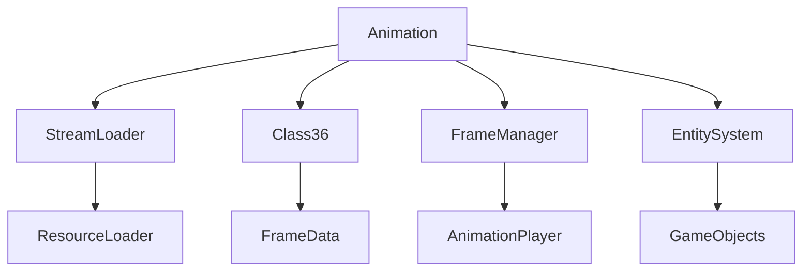

# Evidence: Animation → LKGEGIEW

## Overview
Animation manages skeletal animation sequences for game entities. It loads animation data from configuration files, handles frame timing, provides animation playback controls, and integrates with the 3D rendering system to animate characters and objects through sequenced frame transitions.

## Architecture
Animation is a core component of the game's animation system, managing frame sequences and timing. It loads configuration data from StreamLoader, provides frame access methods, and integrates with Class36 for frame data. The class supports complex animation sequences with multiple frames, timing controls, and priority systems for entity animation.



## Forensic Evidence Commands

### 1. Structural Fingerprints
```bash
# Show class definition and field structure
grep -A 20 -B 5 "public class LKGEGIEW" bytecode/client/LKGEGIEW.bytecode.txt

# Show field count and types
grep "public.*int\|private.*int\|public.*boolean\|public.*LKGEGIEW\[\]" bytecode/client/LKGEGIEW.bytecode.txt | wc -l
grep "public.*int\|private.*int\|public.*boolean\|public.*LKGEGIEW\[\]" bytecode/client/LKGEGIEW.bytecode.txt

# Show method signatures
grep "public static.*a\|public void.*a" bytecode/client/LKGEGIEW.bytecode.txt
```

### 2. Source Code Correlation
```bash
# Show DEOB class definition
head -10 srcAllDummysRemoved/src/Animation.java

# Show key static fields in source
grep -A 5 -B 2 "public static.*anims\|\|public int.*anInt352\|public int\[\].*anIntArray353" srcAllDummysRemoved/src/Animation.java

# Show javap cache field declarations
grep -A 15 -B 2 "anims\|\[LAnimation\|\anInt352\|\anIntArray353\|\anIntArray354" srcAllDummysRemoved/.javap_cache/Animation.javap.cache
```

### 3. Configuration Loading Evidence
```bash
# Show seq.dat loading operations
grep -A 5 -B 5 "seq\.dat\|unpackConfig" bytecode/client/LKGEGIEW.bytecode.txt

# Show Stream operations for config reading
grep -A 10 -B 5 "XTGLDHGX\|readUnsignedWord\|readUnsignedByte" bytecode/client/LKGEGIEW.bytecode.txt

# Show source configuration loading
grep -A 10 -B 5 "unpackConfig\|seq\.dat\|readValues" srcAllDummysRemoved/src/Animation.java
```

### 4. Frame Management Evidence
```bash
# Show frame array operations
grep -A 5 -B 5 "anIntArray353\|anIntArray354\|anewarray" bytecode/client/LKGEGIEW.bytecode.txt

# Show frame timing calculations - method a(int, byte) is the frame timing method
grep -A 10 -B 5 "public int a(int, byte)" bytecode/client/LKGEGIEW.bytecode.txt

# Show source frame management
grep -A 15 -B 5 "method258\|anIntArray355\|Class36" srcAllDummysRemoved/src/Animation.java
```

### 5. Cross-Reference Validation
```bash
# Verify unique mapping - no other classes reference LKGEGIEW
grep -r "LKGEGIEW" bytecode/client/ | grep -v "LKGEGIEW.bytecode.txt" | wc -l

# Show static array field usage
grep -A 3 -B 3 "LKGEGIEW\[\].*d" bytecode/client/LKGEGIEW.bytecode.txt

# Show static array in DEOB source
grep -A 2 -B 2 "public static.*anims" srcAllDummysRemoved/src/Animation.java

# Show frame array structure
grep -A 5 -B 5 "int\[\].*f\|int\[\].*g\|int\[\].*h" bytecode/client/LKGEGIEW.bytecode.txt
```

## Sources and References
- **Bytecode**: bytecode/client/LKGEGIEW.bytecode.txt
- **Deobfuscated Source**: srcAllDummysRemoved/src/Animation.java
- **Javap Cache**: srcAllDummysRemoved/.javap_cache/Animation.javap.cache
- **Configuration**: seq.dat loading system
- **Frame System**: Class36 integration
- **Stream Processing**: Configuration data parsing
- **Animation Playback**: Frame timing and sequencing</content>
<parameter name="filePath">bytecode/mapping/evidence/verified/Animation_LKGEGIEW.md