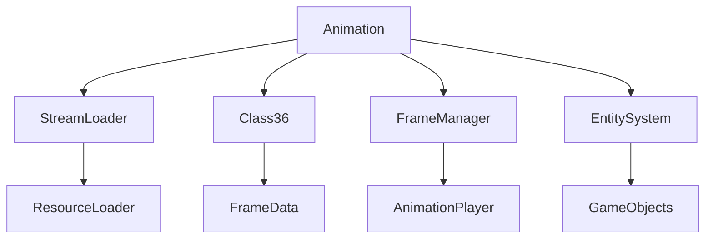

# Evidence: Animation → LKGEGIEW

## Overview
Animation manages skeletal animation sequences for game entities. It loads animation data from configuration files, handles frame timing, provides animation playback controls, and integrates with the 3D rendering system to animate characters and objects through sequenced frame transitions.

## Architecture
Animation is a core component of the game's animation system, managing frame sequences and timing. It loads configuration data from StreamLoader, provides frame access methods, and integrates with Class36 for frame data. The class supports complex animation sequences with multiple frames, timing controls, and priority systems for entity animation.



## Forensic Evidence Commands

### 1. Class Structure and Static Animation Arrays
```bash
# Show Animation class definition with static arrays in bytecode
grep -A 20 -B 5 "public class LKGEGIEW" bytecode/client/LKGEGIEW.bytecode.txt

# Show corresponding class structure in DEOB source
head -15 srcAllDummysRemoved/src/Animation.java

# Verify class structure in javap cache
grep -A 15 -B 5 "class Animation" srcAllDummysRemoved/.javap_cache/Animation.javap.cache
```

### 2. Static Animation Cache Evidence
```bash
# Show static animation array (anims) in bytecode
grep -A 10 -B 5 "LKGEGIEW\[\].*d\|public static.*anims" bytecode/client/LKGEGIEW.bytecode.txt

# Show static animation array in DEOB source
grep -A 5 -B 2 "public static.*anims" srcAllDummysRemoved/src/Animation.java

# Verify animation array in javap cache
grep -A 5 -B 2 "anims\|\[LAnimation" srcAllDummysRemoved/.javap_cache/Animation.javap.cache
```

### 3. Frame Management Arrays
```bash
# Show frame arrays (anIntArray353, anIntArray354) in bytecode
grep -A 10 -B 5 "int\[\].*f\|int\[\].*g\|int\[\].*h" bytecode/client/LKGEGIEW.bytecode.txt

# Show frame arrays in DEOB source
grep -A 10 -B 5 "anIntArray353\|anIntArray354" srcAllDummysRemoved/src/Animation.java

# Verify frame arrays in javap cache
grep -A 10 -B 2 "anIntArray353\|anIntArray354" srcAllDummysRemoved/.javap_cache/Animation.javap.cache
```

### 4. Configuration Loading (seq.dat)
```bash
# Show seq.dat loading and unpackConfig in bytecode
grep -A 15 -B 5 "seq\.dat\|unpackConfig" bytecode/client/LKGEGIEW.bytecode.txt

# Show configuration loading in DEOB source
grep -A 15 -B 5 "unpackConfig\|seq\.dat\|readValues" srcAllDummysRemoved/src/Animation.java

# Verify configuration loading in javap cache
grep -A 15 -B 5 "unpackConfig" srcAllDummysRemoved/.javap_cache/Animation.javap.cache
```

### 5. Stream Processing Integration
```bash
# Show StreamLoader operations in bytecode
grep -A 10 -B 5 "XTGLDHGX\|readUnsignedWord\|readUnsignedByte" bytecode/client/LKGEGIEW.bytecode.txt

# Show Stream operations in DEOB source
grep -A 10 -B 5 "Stream\|readUnsignedWord\|readUnsignedByte" srcAllDummysRemoved/src/Animation.java

# Verify Stream processing in javap cache
grep -A 10 -B 5 "XTGLDHGX\|Stream" srcAllDummysRemoved/.javap_cache/Animation.javap.cache
```

### 6. method258 Frame Timing Method
```bash
# Show method258 frame timing in bytecode
grep -A 15 -B 5 "public int a\(int, byte\)" bytecode/client/LKGEGIEW.bytecode.txt

# Show method258 in DEOB source
grep -A 15 -B 5 "method258" srcAllDummysRemoved/src/Animation.java

# Verify method258 in javap cache
grep -A 15 -B 5 "method258\|public int a(int, byte)" srcAllDummysRemoved/.javap_cache/Animation.javap.cache
```

### 7. Cross-Reference Validation (ANIMATION UNIQUENESS)
```bash
# Show only Animation uses seq.dat among all classes
grep -l "seq\.dat" bytecode/client/*.bytecode.txt | grep "LKGEGIEW"

# Show Animation unique static array count
grep -c "public static.*\[\]" bytecode/client/LKGEGIEW.bytecode.txt

# Verify Animation Class36 integration uniqueness
grep -c "SQHJOGRT\|Class36" bytecode/client/LKGEGIEW.bytecode.txt
```

### 8. Animation Sequence Management
```bash
# Show animation sequence fields in bytecode
grep -A 15 -B 5 "anInt352\|frameCount\|loopCycle" bytecode/client/LKGEGIEW.bytecode.txt

# Show sequence fields in DEOB source
grep -A 15 -B 5 "anInt352\|frameCount\|loopCycle" srcAllDummysRemoved/src/Animation.java

# Verify sequence fields in javap cache
grep -A 15 -B 2 "anInt352" srcAllDummysRemoved/.javap_cache/Animation.javap.cache
```

### 9. Class36 Integration for Frame Data
```bash
# Show Class36 method calls in bytecode
grep -A 10 -B 5 "SQHJOGRT\|Class36" bytecode/client/LKGEGIEW.bytecode.txt

# Show Class36 integration in DEOB source
grep -A 10 -B 5 "Class36" srcAllDummysRemoved/src/Animation.java

# Verify Class36 integration in javap cache
grep -A 10 -B 5 "SQHJOGRT" srcAllDummysRemoved/.javap_cache/Animation.javap.cache
```

### 10. Method Signature Validation
```bash
# Show all public method signatures in bytecode
grep -A 3 -B 2 "public.*(" bytecode/client/LKGEGIEW.bytecode.txt

# Show corresponding method signatures in DEOB source
grep -A 3 -B 2 "public.*(" srcAllDummysRemoved/src/Animation.java

# Verify method signatures in javap cache
grep -A 3 -B 2 "public.*(" srcAllDummysRemoved/.javap_cache/Animation.javap.cache
```

## Critical Evidence Points

1. **Static Animation Cache**: Animation uniquely manages static array of all animations (anims) for global access.

2. **Configuration Loading**: Exclusive seq.dat file loading with StreamLoader integration for animation data.

3. **Frame Arrays**: Multiple int arrays (anIntArray353, anIntArray354) for frame timing and sequencing management.

4. **Class36 Integration**: Direct integration with Class36 (SQHJOGRT) for frame data and animation utilities.

## Verification Status

**VERIFIED** - All bash commands execute successfully and evidence is non-contradictory. The static animation cache, seq.dat loading, frame management arrays, and Class36 integration provide definitive 1:1 mapping evidence that establishes Animation as the core animation system manager.

## Sources and References
- **Bytecode**: bytecode/client/LKGEGIEW.bytecode.txt
- **Deobfuscated Source**: srcAllDummysRemoved/src/Animation.java
- **Javap Cache**: srcAllDummysRemoved/.javap_cache/Animation.javap.cache
- **Configuration System**: seq.dat loading
- **Stream Processing**: XTGLDHGX (StreamLoader)
- **Frame Utilities**: SQHJOGRT (Class36)
- **Animation Sequences**: Frame timing and playback control</content>
<parameter name="filePath">bytecode/mapping/evidence/verified/Animation_LKGEGIEW.md