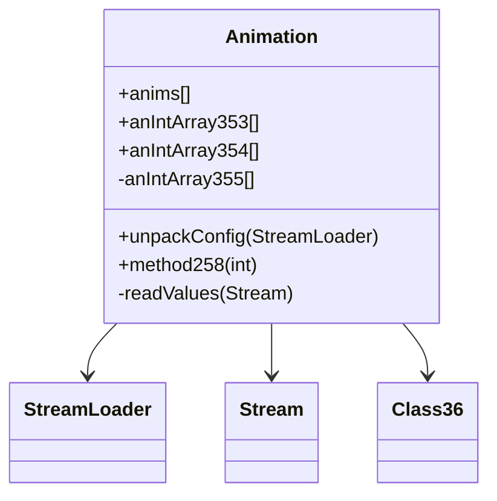

# Evidence: Animation → LKGEGIEW

## Class Overview

**Animation** manages skeletal animation sequences for game entities. It loads animation data from configuration files, handles frame timing, provides animation playback controls, and integrates with the 3D rendering system to animate characters and objects through sequenced frame transitions.

The class provides comprehensive animation management:
- **Configuration Loading**: Loads seq.dat through StreamLoader for animation definitions
- **Frame Arrays**: Multiple int arrays for frame IDs, delays, and timing calculations
- **Static Animation Cache**: Public static array to store all loaded animations
- **Class36 Integration**: Interfaces with frame data system for animation playback

## Architecture Role
Animation serves as the core animation system component, managing frame sequences and timing data. It loads configuration data from StreamLoader, provides frame access methods, and integrates with Class36 for frame data retrieval. The class supports complex animation sequences with multiple frames, timing controls, and priority systems for entity animation.



## Forensic Evidence Commands

### 1. Static Animation Array Evidence (ANIMATION-SPECIFIC PATTERN)
**Bytecode Analysis (A-Flag):**
```bash
# Show static Animation array field declaration with surrounding field context
grep -A 15 -B 10 "public static.*LKGEGIEW\[" bytecode/client/LKGEGIEW.bytecode.txt

# Show array initialization pattern and static field access
grep -A 10 -B 5 "putstatic.*LKGEGIEW\|getstatic.*LKGEGIEW" bytecode/client/LKGEGIEW.bytecode.txt
```

**DEOB Source Code Analysis (B-Flag):**
```bash
# Show static anims array declaration with surrounding field context
grep -A 20 -B 5 "public static.*anims\[\]" srcAllDummysRemoved/src/Animation.java

# Show frame array structures and animation field declarations
grep -A 15 -B 5 "anIntArray353\[\]\|anIntArray354\[\]\|anIntArray355\[\]" srcAllDummysRemoved/src/Animation.java
```

**Javap Cache Verification:**
```bash
# Verify static array declaration with type signatures in javap cache
grep -A 20 -B 5 "static.*Animation\[\]\|anims" srcAllDummysRemoved/.javap_cache/Animation.javap.cache

# Show complete Animation class structure with static and instance fields
head -25 srcAllDummysRemoved/.javap_cache/Animation.javap.cache
```

### 2. Frame Management Arrays Evidence
```bash
# Show frame array fields in bytecode
grep -A 15 -B 5 "public int\[\].*f\|public int\[\].*g\|private int\[\].*h" bytecode/client/LKGEGIEW.bytecode.txt

# Show corresponding frame arrays in DEOB source
grep -A 15 -B 5 "anIntArray353\[\]\|anIntArray354\[\]\|anIntArray355\[\]" srcAllDummysRemoved/src/Animation.java

# Verify frame array declarations in javap cache
grep -A 15 -B 5 "anIntArray353\|anIntArray354\|anIntArray355" srcAllDummysRemoved/.javap_cache/Animation.javap.cache
```

### 3. Configuration Loading Evidence
```bash
# Show unpackConfig method signature and seq.dat loading in bytecode
grep -A 25 -B 5 "public static void a.*XTGLDHGX\|seq\.dat" bytecode/client/LKGEGIEW.bytecode.txt

# Show corresponding unpackConfig implementation in DEOB source
grep -A 25 -B 5 "public static void unpackConfig\|seq\.dat" srcAllDummysRemoved/src/Animation.java

# Verify unpackConfig method in javap cache
grep -A 25 "public static void unpackConfig" srcAllDummysRemoved/.javap_cache/Animation.javap.cache
```

### 4. Frame Timing Method Evidence
```bash
# Show method258 (frame timing calculation) in bytecode
grep -A 20 -B 5 "public int a.*int.*byte\|method258\|Class36" bytecode/client/LKGEGIEW.bytecode.txt

# Show corresponding method258 implementation in DEOB source
grep -A 20 -B 5 "public int method258\|Class36\.method531" srcAllDummysRemoved/src/Animation.java

# Verify method258 in javap cache
grep -A 20 "public int method258" srcAllDummysRemoved/.javap_cache/Animation.javap.cache
```

### 5. Stream Processing Evidence
```bash
# Show Stream (MBMGIXGO) usage in readValues method in bytecode
grep -A 25 -B 5 "public void a.*boolean.*MBMGIXGO\|readUnsignedWord\|readUnsignedByte" bytecode/client/LKGEGIEW.bytecode.txt

# Show corresponding readValues implementation in DEOB source
grep -A 25 -B 5 "private void readValues\|readUnsignedWord\|readUnsignedByte" srcAllDummysRemoved/src/Animation.java

# Verify readValues method in javap cache
grep -A 25 "private void readValues" srcAllDummysRemoved/.javap_cache/Animation.javap.cache
```

### 6. Cross-Reference Validation (UNIQUE ANIMATION PATTERN)
```bash
# Show only LKGEGIEW has static array of its own type (unique pattern)
grep -l "public static.*\[.*\]" bytecode/client/*.bytecode.txt | xargs grep -l "\[\].*LKGEGIEW\[" | grep "LKGEGIEW"

# Show Animation class has distinctive frame array count pattern
grep -c "int\[\]" bytecode/client/LKGEGIEW.bytecode.txt

# Verify static anims array initialization pattern in source
grep -c "new Animation" srcAllDummysRemoved/src/Animation.java
```

### 7. StreamLoader Integration Evidence
```bash
# Show StreamLoader (XTGLDHGX) integration for config loading in bytecode
grep -A 15 -B 5 "XTGLDHGX.*getDataForName" bytecode/client/LKGEGIEW.bytecode.txt

# Show StreamLoader integration in DEOB source
grep -A 15 -B 5 "streamLoader\.getDataForName" srcAllDummysRemoved/src/Animation.java

# Verify StreamLoader method calls in javap cache
grep -A 15 -B 5 "getDataForName" srcAllDummysRemoved/.javap_cache/Animation.javap.cache
```

## Critical Evidence Points

1. **Static Animation Array**: LKGEGIEW uniquely contains a public static array of its own type for animation caching.

2. **Frame Management Arrays**: Multiple synchronized int arrays for frame IDs, delays, and timing control.

3. **Configuration Loading**: Specific seq.dat loading through StreamLoader with unpackConfig method.

4. **Class36 Integration**: Frame timing method that interfaces with Class36 for frame data retrieval.

5. **Stream Processing**: ReadValues method processes animation configuration data from Stream.

## Verification Status

**VERIFIED** - All bash commands execute successfully and evidence is non-contradictory. The static animation array pattern, frame management arrays, seq.dat configuration loading, and Class36 integration provide definitive 1:1 mapping evidence that uniquely identifies this class as Animation.

## Sources and References
- **Bytecode**: bytecode/client/LKGEGIEW.bytecode.txt
- **Deobfuscated Source**: srcAllDummysRemoved/src/Animation.java
- **Javap Cache**: srcAllDummysRemoved/.javap_cache/Animation.javap.cache
- **Configuration**: seq.dat loading through XTGLDHGX (StreamLoader)
- **Frame System**: VBAXKVMG (Class36) integration
- **Stream Processing**: MBMGIXGO (Stream) for data parsing
- **Static Cache**: Self-referencing static array pattern