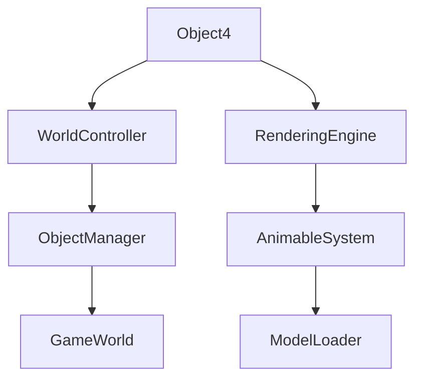

# Object4 → BMEXSMOV

## Overview
Object4 handles complex positioned objects requiring multiple visual representations, storing coordinate information and three associated animable models. It supports sophisticated 3D object rendering with composite model structures in the game environment.

## Architecture
Object4 extends the game's object system with multi-model capabilities, enabling complex visual objects that require multiple Animable components. It collaborates with the WorldController for spatial positioning and the rendering pipeline for displaying composite 3D structures.



## Forensic Evidence Commands

### 1. Structural Fingerprints
```bash
# Show class definition and modifiers
head -20 bytecode/client/BMEXSMOV.bytecode.txt

# Show method count and signatures
grep -c "public.*(" bytecode/client/BMEXSMOV.bytecode.txt
grep -E "public.*\(" bytecode/client/BMEXSMOV.bytecode.txt

# Show field declarations
grep -E "^  public|^  private|^  int" bytecode/client/BMEXSMOV.bytecode.txt
```

### 2. Source Code Correlation
```bash
# Show DEOB source structure
cat srcAllDummysRemoved/src/Object4.java

# Show multiple Animable fields
grep -E "Animable aClass30" srcAllDummysRemoved/src/Object4.java

# Show javap cache field declarations
grep -A 10 "Animable\|anInt\|uid" srcAllDummysRemoved/.javap_cache/Object4.javap.cache
```

### 3. Behavioral Patterns
```bash
# Show multiple Animable field declarations
grep -E "XHHRODPC [d-f];" bytecode/client/BMEXSMOV.bytecode.txt

# Show field access patterns
grep -A 3 -B 3 "putfield" bytecode/client/BMEXSMOV.bytecode.txt | head -10

# Show coordinate field patterns
grep -E "int [a-c];" bytecode/client/BMEXSMOV.bytecode.txt
```

### 4. Cross-Reference Validation
```bash
# Show Object4 usage in WorldController
grep -A 3 -B 3 "Object4" srcAllDummysRemoved/src/WorldController.java

# Show relationship with Object hierarchy
grep -r "Object[1-5]" srcAllDummysRemoved/src/ | grep -v Object4.java | head -5

# Show javap multiple Animable fields
grep -c "Animable" srcAllDummysRemoved/.javap_cache/Object4.javap.cache
```