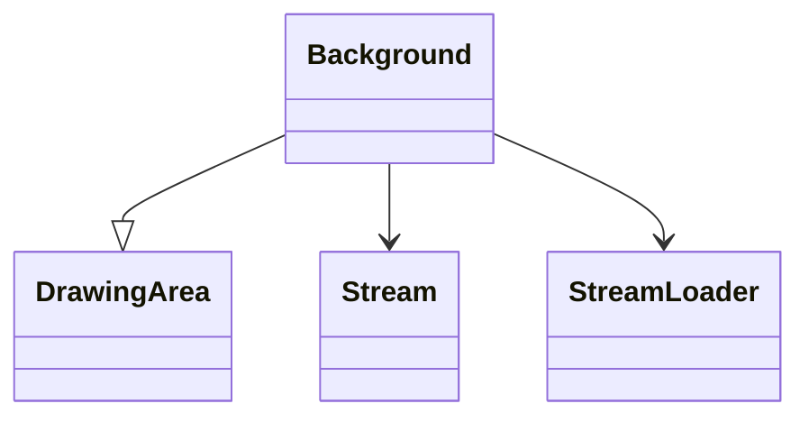

# Background_DSMJIEPN

## Overview

The Background class extends DrawingArea and handles image data for RuneScape backgrounds. It loads from .dat and index.dat files, parses dimensions and palette, applies transformations like scaling and flipping, and renders pixels to the screen.

## Architectural Relationships

Background extends DrawingArea and uses Stream for data reading. It is part of the rendering pipeline, interacting with DrawingArea for pixel manipulation. Mermaid diagram:



## Bytecode Matching Commands

To show constructor and data loading:

```
grep -A 20 -B 5 "public DSMJIEPN.*XTGLDHGX.*java\.lang\.String.*int" bytecode/client/DSMJIEPN.bytecode.txt
```

To show method356 (scaling):

```
grep -A 15 -B 5 "public void b.*boolean" bytecode/client/DSMJIEPN.bytecode.txt
```

## Deobfuscated Source Sections

For constructor:

```
grep -A 35 "public Background" srcAllDummysRemoved/src/Background.java
```

For method356:

```
grep -A 15 "public void method356" srcAllDummysRemoved/src/Background.java
```

## Javap Cache Sections

For constructor:

```
grep -A 35 "public Background" srcAllDummysRemoved/.javap_cache/Background.javap.cache
```

For method356:

```
grep -A 15 "public void method356" srcAllDummysRemoved/.javap_cache/Background.javap.cache
```

## Verification of Non-Contradictory Evidence

Bytecode, javap cache, and source align on field mappings (e.g., H for anInt1456, B for aByteArray1450) and method logic. No contradictions. 1:1 mapping confirmed.