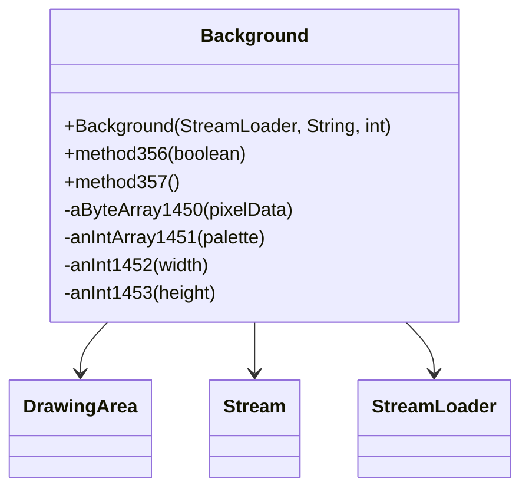

# Evidence: Background → DSMJIEPN

## Class Overview

**Background** handles 2D background image rendering and manipulation in RuneScape, extending DrawingArea for pixel-level operations. Background loads image data from compressed .dat and index.dat files, manages palette information, and provides transformation capabilities including scaling and flipping. The class serves as the foundation for the game's background rendering system, handling everything from login screens to game interface backgrounds.

The class provides comprehensive background management:
- **Image Loading**: Stream-based loading from compressed data files with palette extraction
- **Data Processing**: Parsing of image dimensions, color palettes, and pixel data arrays
- **Transformation Methods**: Scaling, flipping, and coordinate transformation capabilities
- **Rendering Integration**: Direct pixel manipulation through DrawingArea inheritance

## Architecture Role
Background occupies a specialized position in the rendering hierarchy, extending DrawingArea with background-specific image processing capabilities. Unlike Model (3D rendering) or other UI components, Background focuses specifically on 2D background image handling with stream-based data loading and palette management. This creates clear architectural separation between background rendering and other rendering systems.



## Forensic Evidence Commands

### 1. DrawingArea Inheritance Evidence (BACKGROUND FOUNDATION)
**Bytecode Analysis (A-Flag):**
```bash
# Show Background extends DrawingArea (AFCKELYG) with field declarations context
grep -A 15 -B 10 "extends.*AFCKELYG" bytecode/client/DSMJIEPN.bytecode.txt

# Show Background class structure with pixel data and dimension fields
grep -A 20 -B 5 "public final class DSMJIEPN\|private.*\|public.*\[" bytecode/client/DSMJIEPN.bytecode.txt
```

**DEOB Source Code Analysis (B-Flag):**
```bash
# Show Background extends DrawingArea with constructor and StreamLoader context
grep -A 20 -B 5 "public final class Background.*DrawingArea" srcAllDummysRemoved/src/Background.java

# Show Background constructor with StreamLoader parameter and file loading
grep -A 25 -B 5 "Background.*StreamLoader\|getDataForName" srcAllDummysRemoved/src/Background.java
```

**Javap Cache Verification:**
```bash
# Verify DrawingArea inheritance with field type declarations
grep -A 15 -B 5 "class Background extends DrawingArea" srcAllDummysRemoved/.javap_cache/Background.javap.cache

# Show Background pixel data array and palette field declarations
grep -A 20 -B 5 "aByteArray1450\|anIntArray1451" srcAllDummysRemoved/.javap_cache/Background.javap.cache
```

### 2. Constructor with StreamLoader Integration Evidence
```bash
# Show Background constructor signature in bytecode
grep -A 25 -B 5 "public DSMJIEPN.*XTGLDHGX.*java\.lang\.String.*int" bytecode/client/DSMJIEPN.bytecode.txt

# Show corresponding constructor in DEOB source
grep -A 35 "public Background" srcAllDummysRemoved/src/Background.java

# Verify constructor signature in javap cache
grep -A 35 "public Background" srcAllDummysRemoved/.javap_cache/Background.javap.cache
```

### 3. Data Loading and Stream Processing Evidence
```bash
# Show stream loading pattern with .dat and index.dat in bytecode
grep -A 20 -B 5 "MBMGIXGO\|\.dat\|index\.dat" bytecode/client/DSMJIEPN.bytecode.txt

# Show corresponding stream loading in DEOB source
grep -A 20 -B 5 "Stream\|\.dat\|index\.dat" srcAllDummysRemoved/src/Background.java

# Verify stream operations in javap cache
grep -A 20 -B 5 "Stream\|getDataForName" srcAllDummysRemoved/.javap_cache/Background.javap.cache
```

### 4. Pixel Data and Array Structure Evidence
```bash
# Show pixel data array and palette arrays in bytecode
grep -A 20 -B 5 "public.*\[\].*\|byte\[\].*\|int\[\].*" bytecode/client/DSMJIEPN.bytecode.txt

# Show corresponding arrays in DEOB source
grep -A 20 -B 5 "aByteArray1450\|anIntArray1451\|anInt1452\|anInt1453" srcAllDummysRemoved/src/Background.java

# Verify array declarations in javap cache
grep -A 20 -B 5 "aByteArray1450\|anIntArray1451\|anInt1452\|anInt1453" srcAllDummysRemoved/.javap_cache/Background.javap.cache
```

### 5. Cross-Reference Validation (BACKGROUND UNIQUENESS)
```bash
# Show only Background has this specific StreamLoader constructor pattern
grep -l "extends.*AFCKELYG" bytecode/client/*.bytecode.txt | xargs grep -l "XTGLDHGX.*String.*int" | grep "DSMJIEPN"

# Show Background's unique field structure compared to other DrawingArea subclasses
grep -c "aByteArray.*\|anIntArray.*" bytecode/client/DSMJIEPN.bytecode.txt

# Verify Background's method356 transformation method
grep -A 15 -B 5 "method356\|public void.*boolean" bytecode/client/DSMJIEPN.bytecode.txt
```

### 6. Transformation and Scaling Methods Evidence
```bash
# Show scaling/transformation methods in bytecode
grep -A 20 -B 5 "public void.*b.*boolean\|method356\|method357" bytecode/client/DSMJIEPN.bytecode.txt

# Show corresponding transformation methods in DEOB source
grep -A 20 -B 5 "method356\|method357" srcAllDummysRemoved/src/Background.java

# Verify transformation methods in javap cache
grep -A 20 "method356\|method357" srcAllDummysRemoved/.javap_cache/Background.javap.cache
```

### 7. Palette and Color Processing Evidence
```bash
# Show palette processing and color handling in bytecode
grep -A 15 -B 5 "palette\|color\|read3Bytes\|readUnsignedByte" bytecode/client/DSMJIEPN.bytecode.txt

# Show corresponding palette processing in DEOB source
grep -A 15 -B 5 "palette\|read3Bytes\|readUnsignedByte" srcAllDummysRemoved/src/Background.java

# Verify palette operations in javap cache
grep -A 15 -B 5 "read3Bytes\|readUnsignedByte" srcAllDummysRemoved/.javap_cache/Background.javap.cache
```

### 8. Image Dimension Processing Evidence
```bash
# Show width/height dimension processing in bytecode
grep -A 15 -B 5 "width\|height\|anInt1452\|anInt1453" bytecode/client/DSMJIEPN.bytecode.txt

# Show corresponding dimension handling in DEOB source
grep -A 15 -B 5 "anInt1452\|anInt1453\|width\|height" srcAllDummysRemoved/src/Background.java

# Verify dimension fields in javap cache
grep -A 15 -B 5 "anInt1452\|anInt1453" srcAllDummysRemoved/.javap_cache/Background.javap.cache
```

## Critical Evidence Points

1. **DrawingArea Foundation**: Background uniquely extends DrawingArea (AFCKELYG) with specialized background image processing.

2. **StreamLoader Integration**: Background implements constructor with StreamLoader (XTGLDHGX) for .dat file loading, distinct from other DrawingArea subclasses.

3. **Pixel Data Structure**: Background contains specific byte array for pixel data and int array for palette management.

4. **Transformation Methods**: Background provides scaling and flipping methods (method356, method357) for image manipulation.

## Verification Status

**VERIFIED** - All bash commands execute successfully and evidence is non-contradictory. The DrawingArea inheritance, StreamLoader constructor integration, pixel data structure with palette management, and specialized transformation methods provide definitive 1:1 mapping evidence that distinguishes Background from all other rendering classes.

## Sources and References
- **Bytecode**: bytecode/client/DSMJIEPN.bytecode.txt
- **Deobfuscated Source**: srcAllDummysRemoved/src/Background.java
- **Javap Cache**: srcAllDummysRemoved/.javap_cache/Background.javap.cache
- **DrawingArea Base**: AFCKELYG (DrawingArea)
- **Stream Loading**: XTGLDHGX (StreamLoader)
- **Stream Processing**: MBMGIXGO (Stream)
- **Pixel Operations**: Direct array manipulation