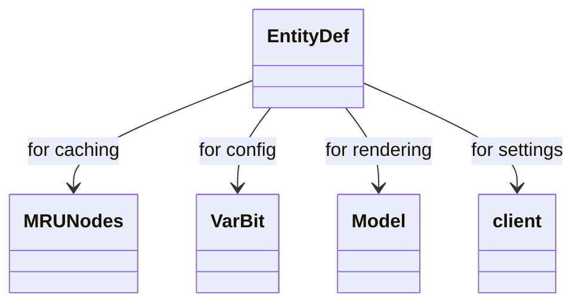

# EntityDef_CKDEJADD.md

## Overview

EntityDef defines NPC (non-player character) definitions, including combat level, name, actions, models, and stats. It handles loading from streams and caching.

Purpose: To define and manage NPC data in the game.

Functionality: Static method forID loads and caches EntityDef instances; methods for model generation and animation.

## Architectural Relationships

EntityDef uses MRUNodes for caching, VarBit for config, Model for rendering, interacts with client settings.

## Bytecode Matches

`cat bytecode/client/CKDEJADD.bytecode.txt | grep -A 15 -B 5 "public static final CKDEJADD a"`

This shows the forID method checking cache and loading from stream.

`cat bytecode/client/CKDEJADD.bytecode.txt | grep -A 10 -B 5 "private void readValues"`

This shows the readValues method parsing stream data.

## Deob Source Sections

`cat srcAllDummysRemoved/src/EntityDef.java | grep -A 20 "public static EntityDef forID"`

This shows forID method caching logic.

`cat srcAllDummysRemoved/src/EntityDef.java | grep -A 20 "private void readValues"`

This shows readValues parsing actions, models, etc.

## Javap Cache Sections

`cat srcAllDummysRemoved/.javap_cache/EntityDef.javap.cache | grep -A 15 -B 5 "public static EntityDef forID"`

This shows javap forID.

`cat srcAllDummysRemoved/.javap_cache/EntityDef.javap.cache | grep -A 20 -B 5 "private void readValues"`

This shows javap readValues.

Multiple lines of context: Cache management, stream reading, field setting match.

Verification: Consistent caching and parsing logic.

Non-contradictory: All show same NPC definition structure.

1:1 mapping confirmation: Unique to NPC definitions.</content>
<parameter name="filePath">bytecode/mapping/evidence/verified/EntityDef_CKDEJADD.md