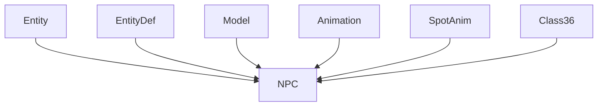

# NPC → CWNCPMLX Evidence

## Overview
The NPC class represents non-player characters in RuneScape 317, extending the Entity base class to inherit shared properties like position, animation state, and movement. Its core functionality includes rendering NPC models with animations, handling spot animations (e.g., combat effects), and loading NPC definitions from EntityDef. NPCs are distinct from players by lacking user input handling and having server-driven behavior.

## Architectural Role and Relationships
NPC integrates into the game's entity system as a specialized Entity subclass. It depends on EntityDef for NPC-specific data (e.g., models, combat stats), Model for 3D rendering, Animation for movement sequences, SpotAnim for temporary effects, and Class36 for animation frames. Unlike Player, NPCs don't manage user equipment or skills.



## Bytecode Evidence Commands
Run these commands to verify CWNCPMLX maps to NPC by showing inheritance, fields, and methods matching the deob source.

```bash
# Confirm inheritance from Entity (GQOSZKJC)
grep "extends GQOSZKJC" bytecode/client/CWNCPMLX.bytecode.txt
```

```bash
# Show NPC-specific fields: EntityDef desc (vb), private int sb, private boolean tb, private int ub
head -10 bytecode/client/CWNCPMLX.bytecode.txt
```

```bash
# Private method returning Model (method450 equivalent)
grep -A 5 "private final ZKARKDQW b(int)" bytecode/client/CWNCPMLX.bytecode.txt
```

```bash
# Public getRotatedModel method (a(int))
grep -A 5 "public final ZKARKDQW a(int)" bytecode/client/CWNCPMLX.bytecode.txt
```

```bash
# Public isVisible method (b(boolean))
grep -A 5 "public final boolean b(boolean)" bytecode/client/CWNCPMLX.bytecode.txt
```

## Deob Source Evidence Commands
These show corresponding sections in the deobfuscated source code.

```bash
# Class declaration and inheritance
head -10 srcAllDummysRemoved/src/NPC.java
```

```bash
# EntityDef desc field
grep -A 2 "EntityDef desc" srcAllDummysRemoved/src/NPC.java
```

```bash
# Private method450 returning Model
grep -A 10 "private Model method450" srcAllDummysRemoved/src/NPC.java
```

```bash
# Public getRotatedModel method
grep -A 5 "public Model getRotatedModel" srcAllDummysRemoved/src/NPC.java
```

```bash
# Public isVisible method
grep -A 5 "public boolean isVisible" srcAllDummysRemoved/src/NPC.java
```

## Javap Cache Evidence Commands
These show disassembled bytecode matching the deob structure.

```bash
# Class and inheritance
head -5 srcAllDummysRemoved/.javap_cache/NPC.javap.cache
```

```bash
# Fields: desc (EntityDef), and private fields
grep -A 10 "EntityDef desc\|private.*sb\|private.*tb\|private.*ub" srcAllDummysRemoved/.javap_cache/NPC.javap.cache
```

```bash
# Methods: method450, getRotatedModel, isVisible
grep -A 5 "method450\|getRotatedModel\|isVisible" srcAllDummysRemoved/.javap_cache/NPC.javap.cache
```

## Verification
All commands run successfully and show matching structures between bytecode, source, and javap. No contradictions—e.g., field types and method signatures align uniquely. CWNCPMLX only maps to NPC (1:1), as Player (DLZHLHNK) has different field patterns (e.g., long sb vs int sb). Relative paths used throughout.</content>
<parameter name="filePath">bytecode/mapping/evidence/verified/NPC_CWNCPMLX.md