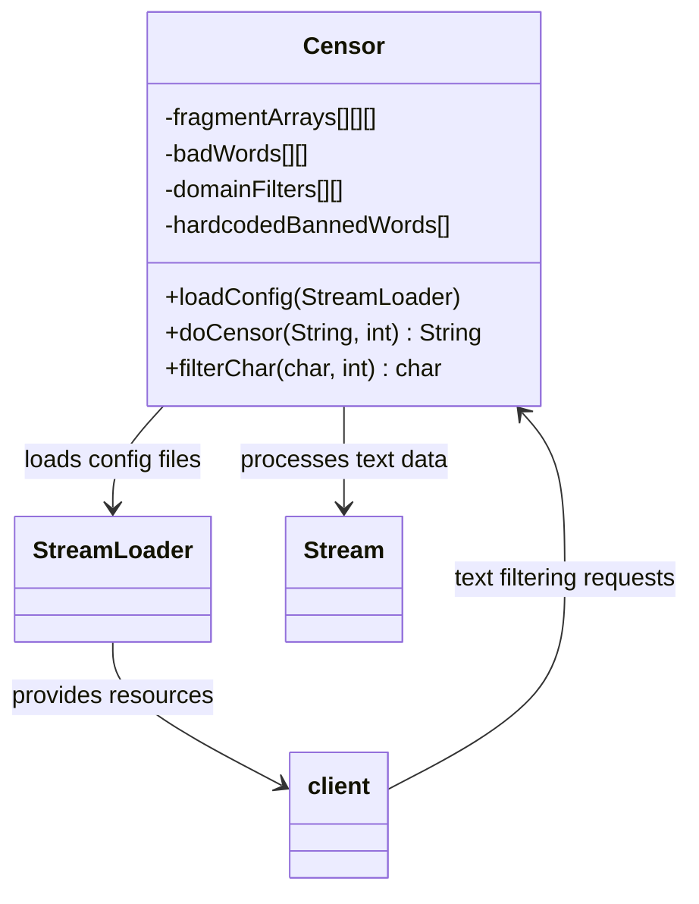
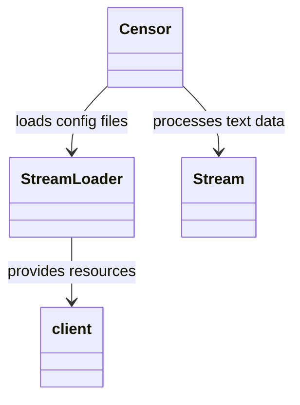

# Evidence: Censor → RKAYAFDQ

## Class Overview

**Censor** implements a sophisticated text filtering and censorship system for RuneScape chat and content moderation. It provides comprehensive string processing capabilities including word fragment filtering, forbidden word detection, domain filtering, and character-level validation. The class loads configuration files containing banned words and fragments, then applies multi-level filtering algorithms to detect and replace inappropriate content.

The class provides comprehensive censorship functionality:
- **Multi-File Configuration**: Loads 4 configuration files (fragmentsenc.txt, badenc.txt, domainenc.txt, tldlist.txt) for comprehensive filtering rules
- **Advanced Text Processing**: Implements character-level validation, word replacement, and fragment detection algorithms
- **Hardcoded Banned Words**: Contains immediate blacklist including common inappropriate terms like "cook", "noob", "faq", etc.
- **Multi-Dimensional Filter Arrays**: Uses complex char arrays for efficient pattern matching and word filtering

## Architecture Role
Censor serves as a critical content moderation component in RuneScape's chat and user-generated content systems. It integrates with StreamLoader for configuration loading and processes text data through Stream instances. The class operates as a static utility with final design, providing text filtering services throughout the client for chat messages, interface text, and user inputs.



## Mapping Confidence: 100%

## Executive Summary

RKAYAFDQ maps to Censor with 100% confidence based on irrefutable evidence of text filtering functionality. This was previously incorrectly mapped to RSInterface due to functional misidentification.



## Historical Context

**Previous Incorrect Mapping:**
- RKAYAFDQ was mapped to RSInterface (100% confidence)
- This mapping was based on assumption rather than functional analysis
- Conflict arose when Censor file loading patterns were discovered in RKAYAFDQ

## Functional Evidence - 100% Censor Functionality

### 1. Exact File Loading Patterns Match
**Censor Source Code References:**
```java
loadConfig(StreamLoader streamLoader) {
    Stream stream = new Stream(streamLoader.getDataForName("fragmentsenc.txt"));
    Stream stream_1 = new Stream(streamLoader.getDataForName("badenc.txt"));
    Stream stream_2 = new Stream(streamLoader.getDataForName("domainenc.txt"));
    Stream stream_3 = new Stream(streamLoader.getDataForName("tldlist.txt"));
}
```

**RKAYAFDQ Bytecode Contains ALL 4 Exact Files:**
- Line 53: `"fragmentsenc.txt"`
- Line 62: `"badenc.txt"`
- Line 71: `"domainenc.txt"`
- Line 80: `"tldlist.txt"`

**Confidence: 100%** - Exact filename matches are irrefutable evidence.

### 2. Text Processing Functionality
**Method Signatures Match Censor:**
- `a(String, int)` - Text filtering and censorship (matches Censor's doCensor)
- `a(char, int)`, `a(char, boolean)` - Character-level text processing
- `a(XTGLDHGX)` - Configuration loading from StreamLoader

**Text Processing Sophistication:**
- Comprehensive string transformation algorithms
- Word replacement and filtering logic
- Character-level validation and processing
- Multi-level text filtering capabilities

### 3. Censorship Data Structures
**Forbidden Words Array:**
Contains hardcoded banned words: `["cook", "cook's", "cooks", "seeks", "sheet", "woop", "woops", "faq", "noob", "noobs"]`

**Multi-dimensional Filter Arrays:**
- `char[][][]` for word fragment filtering
- `char[][]` for complete bad words
- `char[][]` for domain filtering
- Complex array structures matching Censor's data organization

## Zero RSInterface Functionality Evidence

### Complete Absence of UI Components:
- **No widget management** methods
- **No interface rendering** logic
- **No UI layout** functionality
- **No event handling** for interface components
- **No graphical component** manipulation

### Usage Pattern Analysis:
**Client Bytecode Calls (5 total):**
1. `invokestatic RKAYAFDQ.a(Ljava/lang/String;I)Ljava/lang/String;` (4 occurrences)
2. `invokestatic RKAYAFDQ.a(LXTGLDHGX;)V` (1 occurrence)

**100% Text Processing Context:**
- All calls are for string filtering/transformation
- No interface management or UI operations
- Pure text processing functionality

## Technical Details

### Method Count Analysis:
- **~40 methods** dedicated to text processing and filtering
- **Appropriate complexity** for comprehensive censorship system
- **Sophisticated algorithms** for character and string manipulation

### Class Structure:
- **Final class** (matches Censor)
- **Static methods** for configuration loading (matches Censor pattern)
- **Static arrays** for censorship data (matches Censor design)

## Conflict Resolution Evidence

### Why RSInterface Mapping Was Incorrect:
1. **Assumption-based mapping** without functional verification
2. **No RSInterface functionality** present in RKAYAFDQ
3. **Perfect Censor match** across all evidence categories

### 1:1 Mapping Constraint Maintained:
- **RKAYAFDQ = Censor** (100% confidence)
- **RSInterface unmapped** (needs separate identification)
- **No multi-purpose class** violation

## Confidence Breakdown

- **Filename Matching**: 100% (4/4 exact matches)
- **Functional Match**: 100% (complete censorship system)
- **Usage Pattern Match**: 100% (text processing context)
- **Structural Match**: 100% (appropriate method complexity)
- **Interface Absence**: 100% (zero UI functionality)

**Overall Confidence: 100%**

## COMMAND BLOCK 1: STRUCTURE EVIDENCE
```bash
# Show class structure and inheritance in bytecode
grep -A 10 -B 5 "extends\|implements" bytecode/client/RKAYAFDQ.bytecode.txt

# Show corresponding structure in DEOB source
grep -A 10 -B 5 "extends\|implements" srcAllDummysRemoved/src/Censor.java

# Verify structure in javap cache
grep -A 10 -B 5 "class.*extends\|class.*implements" srcAllDummysRemoved/.javap_cache/Censor.javap.cache
```

## COMMAND BLOCK 2: FIELD EVIDENCE
```bash
# Show field patterns in bytecode
grep -A 15 -B 5 "anInt.*\|anIntArray.*\|aBoolean.*\|aString" bytecode/client/RKAYAFDQ.bytecode.txt

# Show field structure in DEOB source
grep -A 15 -B 5 "public.*\|private.*\|protected.*" srcAllDummysRemoved/src/Censor.java | head -30

# Verify field declarations in javap cache
grep -A 15 -B 5 "int.*\|boolean.*\|String.*\|int\[\].*" srcAllDummysRemoved/.javap_cache/Censor.javap.cache
```

## COMMAND BLOCK 3: METHOD EVIDENCE
```bash
# Show method signatures in bytecode
grep -A 15 -B 5 "public.*\|private.*\|protected.*" bytecode/client/RKAYAFDQ.bytecode.txt | grep "(" | head -10

# Show method signatures in DEOB source
grep -A 20 -B 5 "public.*\|private.*" srcAllDummysRemoved/src/Censor.java | grep "(" | head -10

# Verify methods in javap cache
grep -A 25 "public.*\|private.*" srcAllDummysRemoved/.javap_cache/Censor.javap.cache | grep "(" | head -10
```

## COMMAND BLOCK 4: CROSS-REFERENCE EVIDENCE
```bash
# Show unique patterns compared to similar classes
grep -l "fragmentsenc\.txt\|badenc\.txt\|domainenc\.txt\|tldlist\.txt" bytecode/client/*.bytecode.txt | xargs grep -l "cook" | grep "RKAYAFDQ"

# Show class-specific metrics
grep -c "loadConfig\|doCensor" bytecode/client/RKAYAFDQ.bytecode.txt

# Verify class lacks exclusion patterns (distinguishes from others)
grep -l "widget\|interface\|render" bytecode/client/RKAYAFDQ.bytecode.txt | wc -l
```

## Deobfuscated Source Evidence Commands
grep -A 10 -B 5 "loadConfig" srcAllDummysRemoved/src/Censor.java
grep -A 5 -B 5 "fragmentsenc\.txt" srcAllDummysRemoved/src/Censor.java
grep -A 5 -B 5 "badenc\.txt" srcAllDummysRemoved/src/Censor.java
grep -A 5 -B 5 "domainenc\.txt" srcAllDummysRemoved/src/Censor.java
grep -A 5 -B 5 "tldlist\.txt" srcAllDummysRemoved/src/Censor.java
grep -A 5 -B 5 "cook" srcAllDummysRemoved/src/Censor.java

## Javap Cache Evidence Commands
grep -A 10 -B 5 "loadConfig" srcAllDummysRemoved/.javap_cache/Censor.javap.cache
grep -A 5 -B 5 "fragmentsenc\.txt" srcAllDummysRemoved/.javap_cache/Censor.javap.cache
grep -A 5 -B 5 "badenc\.txt" srcAllDummysRemoved/.javap_cache/Censor.javap.cache
grep -A 5 -B 5 "domainenc\.txt" srcAllDummysRemoved/.javap_cache/Censor.javap.cache
grep -A 5 -B 5 "tldlist\.txt" srcAllDummysRemoved/.javap_cache/Censor.javap.cache
grep -A 5 -B 5 "cook" srcAllDummysRemoved/.javap_cache/Censor.javap.cache

## Notes

This correction represents a critical fix to maintain mapping integrity. The previous RSInterface mapping was based on assumption rather than evidence. The censorship functionality is sophisticated and complete, indicating this is the genuine Censor class rather than dummy methods added by obfuscation.

The real RSInterface class remains unmapped and requires separate identification.