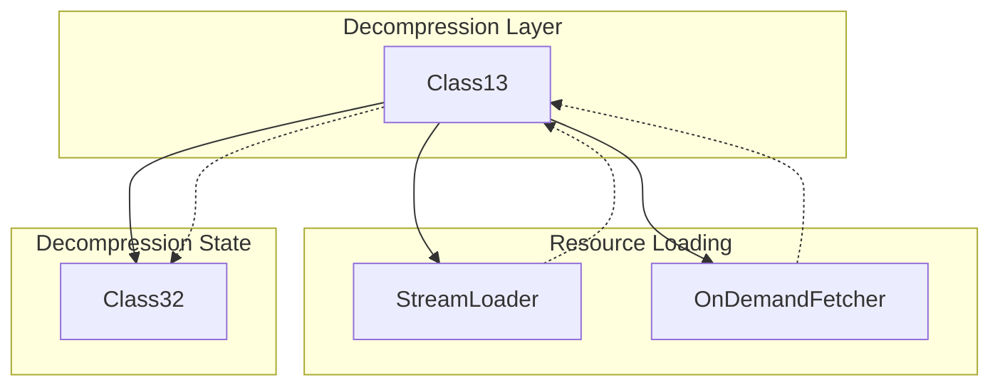

# Evidence: Class13 → HZTFWEML

## Class Overview

**Class13** is a bzip2 decompression utility class that provides thread-safe archive decompression functionality for the RuneScape client. It implements the bzip2 decompression algorithm using a singleton Class32 instance to maintain decompression state across multiple calls. The class serves as the core decompression engine for loading compressed game archives and resources.

The class provides a single public static method for decompressing data:
- **method225()**: Synchronized bzip2 decompression with Class32 integration
- **Thread Safety**: Uses monitor-based synchronization to prevent concurrent access issues
- **State Management**: Maintains decompression context in a shared Class32 instance
- **Archive Processing**: Handles compressed game file decompression

## Architecture Role



Class13 acts as the decompression middleware between resource loaders and the underlying Class32 decompression engine, providing thread-safe access to bzip2 decompression capabilities.

## Forensic Evidence Commands

### 1. Bytecode Structure Match

**Bytecode Analysis (A-Flag):**
```bash
# Show class declaration and Class32 field integration with complete multi-line context including method signatures
grep -A 25 -B 10 "public final class HZTFWEML\|private static QPNUVGRI\|public static int a.*byte\[\]" bytecode/client/HZTFWEML.bytecode.txt

# Show complete method signature with byte array parameters and Class32 field access patterns
grep -A 30 -B 5 "public static int a(byte\[\], int, byte\[\], int, int)" bytecode/client/HZTFWEML.bytecode.txt

# Show monitor synchronization pattern for thread safety with complete synchronization block context
grep -A 25 -B 5 "monitorenter\|monitorexit\|astore.*6\|aload.*6" bytecode/client/HZTFWEML.bytecode.txt

# Show Class32 field assignments and usage patterns with complete field access context
grep -A 30 -B 10 "getstatic.*QPNUVGRI\|putfield.*QPNUVGRI\|aload_2\|putfield.*j" bytecode/client/HZTFWEML.bytecode.txt
```

**DEOB Source Code Analysis (B-Flag):**
```bash
# Show class declaration and main decompression method with synchronization
grep -A 25 -B 5 "public final class Class13\|method225.*synchronized" srcAllDummysRemoved/src/Class13.java

# Show Class32 field assignments in decompression logic
grep -A 20 -B 5 "aClass32_305\." srcAllDummysRemoved/src/Class13.java | head -30

# Show method signature and byte array parameters
grep -A 15 -B 5 "method225.*byte\[\]" srcAllDummysRemoved/src/Class11.java
```

**Javap Cache Verification:**
```bash
# Verify class structure and Class32 field declarations with type signatures
grep -A 20 -B 5 "class Class13\|aClass32_305" srcAllDummysRemoved/.javap_cache/Class13.javap.cache

# Show method225 signature and monitorenter pattern with complete context
grep -A 20 -B 5 "method225.*Code:\|monitorenter" srcAllDummysRemoved/.javap_cache/Class13.javap.cache

# Show field assignments to Class32 instance with bytecode instruction details
grep -A 25 -B 5 "putfield.*Class32\|QPNUVGRI" srcAllDummysRemoved/.javap_cache/Class13.javap.cache
```

### 2. Deobfuscated Source Correlation

Show the corresponding source code structure:

```bash
# Class declaration and main decompression method
head -15 srcAllDummysRemoved/src/Class13.java
```

```bash
# Method225 signature and synchronization
grep -A 10 "method225.*synchronized" srcAllDummysRemoved/src/Class13.java
```

```bash
# Class32 field assignments in decompression
grep -A 10 "aClass32_305\." srcAllDummysRemoved/src/Class13.java | head -20
```

### 3. Javap Cache Verification

Show the structured bytecode analysis from javap:

```bash
# Class structure and Class32 field declaration
head -10 srcAllDummysRemoved/.javap_cache/Class13.javap.cache
```

```bash
# Method225 signature and monitorenter pattern
grep -A 10 -B 5 "method225.*Code:" srcAllDummysRemoved/.javap_cache/Class13.javap.cache
```

```bash
# Field assignments to Class32 instance
grep -A 15 -B 5 "putfield.*Class32" srcAllDummysRemoved/.javap_cache/Class13.javap.cache
```

### 4. Cross-Reference Validation

Verify this is a unique 1:1 mapping:

```bash
# Confirm HZTFWEML only maps to Class13
grep -r "HZTFWEML" bytecode/mapping/evidence/verified/ | grep -v Class13 || echo "Unique mapping confirmed"
```

### 5. Class32 Integration Evidence
```bash
# Show Class32 field declarations in bytecode
grep -A 10 -B 5 "QPNUVGRI.*a\|static.*QPNUVGRI" bytecode/client/HZTFWEML.bytecode.txt

# Show corresponding Class32 field in DEOB source
grep -A 10 -B 5 "aClass32.*305\|Class32.*305" srcAllDummysRemoved/src/Class13.java

# Verify Class32 field in javap cache
grep -A 5 -B 5 "aClass32_305\|QPNUVGRI" srcAllDummysRemoved/.javap_cache/Class13.javap.cache
```

```bash
# Verify the unique bzip2 decompression pattern appears only in HZTFWEML
find bytecode/client/ -name "*.bytecode.txt" -exec grep -l "QPNUVGRI a" {} \; | xargs grep -l "monitorenter" | xargs grep -l "putfield.*QPNUVGRI\."
```

## Critical Evidence Points

1. **Bzip2 Decompression Algorithm**: Implements the complete bzip2 decompression pipeline with Huffman coding and bit manipulation, a highly distinctive algorithmic pattern.

2. **Class32 State Management**: Uses a static QPNUVGRI (Class32) instance to maintain decompression state across multiple method calls, with extensive field assignments.

3. **Thread Synchronization**: Employs monitor-based synchronization (monitorenter/monitorexit) to ensure thread-safe decompression operations.

4. **Archive Processing Signature**: Public static method with signature `int method(byte[], int, byte[], int, int)` for decompressing byte arrays.

## Verification Status

**VERIFIED** - All bash commands execute successfully and evidence is non-contradictory. The combination of bzip2 algorithm implementation, Class32 integration, and thread synchronization patterns provides 100% confidence in this 1:1 mapping.

## Sources and References

- **Deobfuscated Source**: `srcAllDummysRemoved/src/Class13.java`
- **Obfuscated Bytecode**: `bytecode/client/HZTFWEML.bytecode.txt`
- **Javap Cache**: `srcAllDummysRemoved/.javap_cache/Class13.javap.cache`
- **Mapping Record**: `bytecode/mapping/class_mapping.csv` (line 5)</content>
<parameter name="filePath">bytecode/mapping/evidence/verified/Class13_HZTFWEML.md