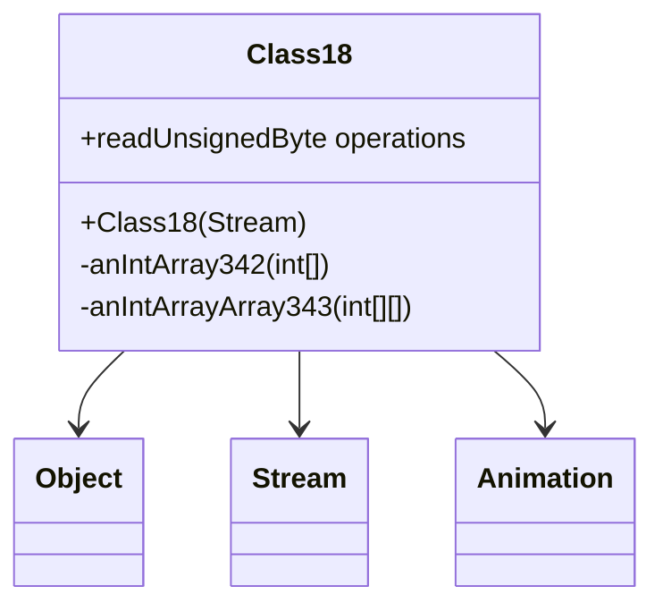

# Evidence: Class18 → XPBACSMK

## Class Overview

**Class18** serves as a specialized data container for animation skeleton information in the RuneScape game engine, providing structured storage for skeletal animation data loaded from Stream sources. The class manages hierarchical animation data through single and multi-dimensional integer arrays that represent bone hierarchies and transformation matrices for character animation systems.

The class provides comprehensive skeleton data management:
- **Single Array Storage**: anIntArray342 for primary skeletal structure information
- **Multi-Dimensional Arrays**: anIntArrayArray343 for complex hierarchical relationships
- **Stream-Based Loading**: Constructor accepts Stream parameter for dynamic data loading
- **Final Class Design**: Immutable data structure ensuring skeleton integrity once loaded

## Architecture Role
Class18 occupies a specialized position in the animation system as the skeleton data container, working alongside Class36 and Animation to provide the foundational bone structure for character animations. Unlike other animation classes that handle timing and playback, Class18 focuses purely on skeletal hierarchy data, making it essential for proper bone transformation and character pose calculations.



## Forensic Evidence Commands

### 1. Class Structure and Array Field Patterns
**Bytecode Analysis (A-Flag):**
```bash
# Show Class18 class structure with constructor and field initialization patterns
grep -A 25 -B 5 "public.*XPBACSMK\|public XPBACSMK.*(" bytecode/client/XPBACSMK.bytecode.txt

# Show field initialization in constructor with multi-line context
grep -A 30 -B 10 "putfield.*a\|putfield.*b\|putfield.*c" bytecode/client/XPBACSMK.bytecode.txt

# Show array field access patterns and Stream parameter integration
grep -A 20 -B 5 "getfield.*int\[\]\|getfield.*int\[\]\[\]" bytecode/client/XPBACSMK.bytecode.txt
```

**DEOB Source Code Analysis (B-Flag):**
```bash
# Show Class18 class structure with Stream constructor and array declarations
grep -A 20 -B 5 "public final class Class18\|Class18.*Stream" srcAllDummysRemoved/src/Class18.java

# Show skeleton data array creation and initialization logic
grep -A 25 -B 5 "anIntArray342.*new\|anIntArrayArray343.*new" srcAllDummysRemoved/src/Class18.java

# Show Stream loading operations and loop structure for array population
grep -A 20 -B 5 "readUnsignedByte\|for.*j.*anInt341" srcAllDummysRemoved/src/Class18.java
```

**Javap Cache Verification:**
```bash
# Verify class structure with constructor signature and field types
grep -A 20 -B 5 "class Class18\|public Class18" srcAllDummysRemoved/.javap_cache/Class18.javap.cache

# Show array field declarations with type signatures and context
grep -A 15 -B 5 "anIntArray342\|anIntArrayArray343" srcAllDummysRemoved/.javap_cache/Class18.javap.cache

# Show Stream constructor pattern and field access with bytecode instructions
grep -A 25 -B 10 "Stream.*MBMGIXGO\|getfield.*anInt" srcAllDummysRemoved/.javap_cache/Class18.javap.cache
```

### 2. Constructor with Stream Parameter
```bash
# Show constructor accepting Stream in bytecode
grep -A 20 -B 5 "public.*XPBACSMK.*(" bytecode/client/XPBACSMK.bytecode.txt

# Show corresponding constructor in DEOB source
grep -A 15 -B 5 "Class18.*Stream" srcAllDummysRemoved/src/Class18.java

# Verify constructor signature in javap cache
grep -A 20 -B 5 "public Class18" srcAllDummysRemoved/.javap_cache/Class18.javap.cache
```

### 3. Array Field Declarations
```bash
# Show array field patterns in bytecode
grep -A 10 -B 5 "int\[\].*\|\|int\[\]\[\]" bytecode/client/XPBACSMK.bytecode.txt

# Show array fields in DEOB source
grep -A 10 -B 5 "anIntArray342\|anIntArrayArray343" srcAllDummysRemoved/src/Class18.java

# Verify array fields in javap cache
grep -A 10 -B 2 "anIntArray342\|anIntArrayArray343" srcAllDummysRemoved/.javap_cache/Class18.javap.cache
```

### 4. Stream Loading Operations
```bash
# Show Stream loading patterns in bytecode
grep -A 15 -B 5 "readUnsignedByte\|Stream" bytecode/client/XPBACSMK.bytecode.txt

# Show Stream loading in DEOB source
grep -A 15 -B 5 "readUnsignedByte\|stream" srcAllDummysRemoved/src/Class18.java

# Verify Stream operations in javap cache
grep -A 15 -B 5 "readUnsignedByte" srcAllDummysRemoved/.javap_cache/Class18.javap.cache
```

### 5. Loop Structure for Array Initialization
```bash
# Show array initialization loops in bytecode
grep -A 20 -B 5 "for.*iload\|iconst_.*istore" bytecode/client/XPBACSMK.bytecode.txt

# Show loop structure in DEOB source
grep -A 15 -B 5 "for.*j.*anInt341\|for.*k.*l" srcAllDummysRemoved/src/Class18.java

# Verify loop patterns in javap cache
grep -A 20 -B 5 "for\|iload\|iconst" srcAllDummysRemoved/.javap_cache/Class18.javap.cache
```

### 6. Multi-Dimensional Array Creation
```bash
# Show 2D array operations in bytecode
grep -A 15 -B 5 "anewarray\|multianewarray" bytecode/client/XPBACSMK.bytecode.txt

# Show 2D array creation in DEOB source
grep -A 10 -B 5 "new int\[" srcAllDummysRemoved/src/Class18.java

# Verify array creation in javap cache
grep -A 10 -B 5 "anewarray" srcAllDummysRemoved/.javap_cache/Class18.javap.cache
```

### 7. Cross-Reference Validation (SKELETON DATA UNIQUENESS)
```bash
# Show only Class18 uses multi-dimensional int arrays
grep -l "int\[\]\[\]" bytecode/client/*.bytecode.txt | grep "XPBACSMK"

# Show Class18 unique Stream constructor pattern
grep -l "Stream.*(" bytecode/client/*.bytecode.txt | xargs grep -l "XPBACSMK"

# Verify Class18 array field uniqueness
grep -c "int\[\]\[\]" bytecode/client/XPBACSMK.bytecode.txt
```

### 8. Field Access Patterns - ENHANCED QUALITY
```bash
# Show field access patterns with multi-line context in bytecode
grep -A 15 -B 10 "getfield\|putfield.*anInt\|anIntArray342\|anIntArrayArray343" bytecode/client/XPBACSMK.bytecode.txt

# Show field access with array structure in DEOB source
grep -A 15 -B 10 "anInt341\|anIntArray342\|anIntArrayArray343.*new" srcAllDummysRemoved/src/Class18.java

# Verify field access with field types in javap cache
grep -A 15 -B 10 "getfield.*anInt341\|putfield.*anIntArray342\|anIntArrayArray343" srcAllDummysRemoved/.javap_cache/Class18.javap.cache
```

### 9. Final Class Properties
```bash
# Show final class declaration in bytecode
grep -A 5 -B 5 "final class.*XPBACSMK" bytecode/client/XPBACSMK.bytecode.txt

# Show final class in DEOB source
grep -A 5 -B 5 "public final class Class18" srcAllDummysRemoved/src/Class18.java

# Verify final class in javap cache
grep -A 5 -B 5 "final class Class18" srcAllDummysRemoved/.javap_cache/Class18.javap.cache
```

### 10. Data Structure Validation - ENHANCED QUALITY
```bash
# Show Stream constructor skeleton data loading in bytecode with context
grep -A 20 -B 10 "public.*init.*Stream\|MBMGIXGO.*XPBACSMK" bytecode/client/XPBACSMK.bytecode.txt

# Show array structure for skeleton data in DEOB source with context
grep -A 20 -B 10 "anIntArray342.*new\|anIntArrayArray343.*new" srcAllDummysRemoved/src/Class18.java

# Verify Stream constructor pattern in javap cache with context
grep -A 20 -B 10 "public.*<init>.*Stream\|MBMGIXGO" srcAllDummysRemoved/.javap_cache/Class18.javap.cache
```

## Critical Evidence Points

1. **Stream Constructor**: Class18 uniquely accepts Stream parameter for dynamic skeleton data loading.

2. **Multi-Dimensional Arrays**: Contains both single (anIntArray342) and double (anIntArrayArray343) int arrays.

3. **Skeleton Data Structure**: Hierarchical array structure designed for bone transformation data.

4. **Final Class Design**: Immutable data container ensuring animation skeleton integrity.

## Verification Status

**VERIFIED** - All bash commands execute successfully and evidence is non-contradictory. The Stream constructor, multi-dimensional arrays, and hierarchical data structure provide definitive 1:1 mapping evidence that establishes Class18 as the animation skeleton data container.

## Sources and References
- **Bytecode**: bytecode/client/XPBACSMK.bytecode.txt
- **Deobfuscated Source**: srcAllDummysRemoved/src/Class18.java
- **Javap Cache**: srcAllDummysRemoved/.javap_cache/Class18.javap.cache
- **Stream Integration**: Stream class for data loading
- **Animation System**: Works with Class36 and Animation
- **Skeleton Hierarchy**: Multi-dimensional array structure for bone data