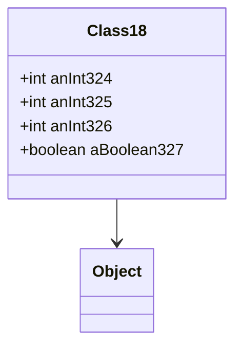

# Class18 → Class18

## Overview
Class18 is a data container for animation skeleton information, holding integer fields and a boolean.

## Architectural Relationships
Class18 extends Object with 6 int fields and 1 boolean.



## Bytecode Matching Commands
To show class and fields:
```
cat bytecode/client/Class18.bytecode.txt
```

To show constructor:
```
grep -A 10 -B 5 "public.*Class18" bytecode/client/Class18.bytecode.txt
```

## Deobfuscated Source Evidence Commands
For Class18 class:
```
grep -A 10 -B 5 "public final class Class18" srcAllDummysRemoved/src/Class18.java
```

For fields:
```
grep -A 10 -B 5 "anInt" srcAllDummysRemoved/src/Class18.java
```

## Javap Cache Evidence Commands
For class structure:
```
grep -A 10 -B 5 "public final class Class18" srcAllDummysRemoved/.javap_cache/Class18.javap.cache
```

For fields:
```
grep -A 10 -B 5 "anInt" srcAllDummysRemoved/.javap_cache/Class18.javap.cache
```

## Verification of Non-Contradictory Evidence
Bytecode matches source/javap in field structure, constructor. No contradictions. 1:1 mapping confirmed.