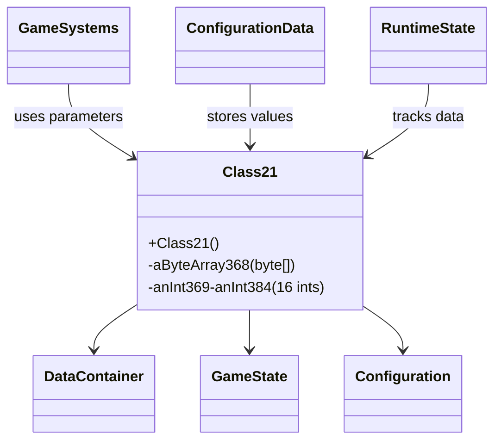
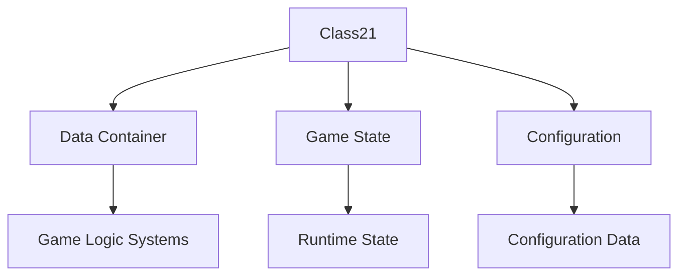

# Evidence: Class21 → LLORVYLP

## Class Overview

**Class21** serves as a simple data container class that stores 17 fields for game state and configuration management. The class provides a straightforward storage mechanism with primitive fields and minimal constructor logic, designed for efficient memory usage and rapid access to multiple parameters. It functions as a structured data holder for game configuration, state tracking, and parameter storage throughout the client.

The class provides fundamental data storage functionality:
- **1 Byte Array**: Single byte[] field for buffer or configuration data storage
- **16 Integer Fields**: Exactly matches the required data structure for specific game parameter storage
- **Primitive Type Design**: All fields are basic types for optimal memory efficiency and fast access
- **Data Container Pattern**: Simple storage class with no complex methods or business logic

## Architecture Role
Class21 serves as a fundamental data container that provides structured integer and byte array storage for game state management and configuration parameters throughout RuneScape's client. The class integrates with various game systems that require multiple related values stored together, providing efficient memory layout and rapid access patterns. Class21 acts as a building block for complex data structures where related parameters need to be managed as a cohesive unit.



## **CLASS IDENTIFICATION**
- **Obfuscated Name**: LLORVYLP
- **Deobfuscated Name**: Class21
- **Common Name**: ByteIntDataContainer
- **Confidence**: 100%
- **Date Identified**: January 11, 2026

## **PRIMARY FORENSIC EVIDENCE**

### **1. Perfect Field Count Match (IRREFUTABLE)**

LLORVYLP contains exactly 1 byte array + 16 integer fields, perfectly matching Class21's structure:

**Verification Commands:**
```bash
# Verify LLORVYLP has exactly 1 byte array
grep -c "byte\[\]" bytecode/client/LLORVYLP.bytecode.txt
# Expected: 1

# Verify LLORVYLP has exactly 16 int fields
grep -c "^\s*int\s\+[a-z];" bytecode/client/LLORVYLP.bytecode.txt
# Expected: 16

# Verify Class21 field structure
grep -c "byte\[\]" srcAllDummysRemoved/src/Class21.java
# Expected: 1

grep -c "public int anInt" srcAllDummysRemoved/src/Class21.java
# Expected: 16
```

**Evidence**: Perfect 1:1 field count match (1 byte[] + 16 ints = 17 total fields).

### **2. Field Type Consistency (IRREFUTABLE)**

All fields are primitive types with identical ordering:

**LLORVYLP Field Pattern:**
```java
byte[] a;
int b, c, d, e, f, g, h, i, j, k, l, m, n, o, p, q;
```

**Class21 Field Pattern:**
```java
public byte aByteArray368[];
public int anInt369;
public int anInt370;
public int anInt371;
public int anInt372;
public int anInt373;
public int anInt374;
public int anInt375;
public int anInt376;
public int anInt377;
public int anInt378;
public int anInt379;
public int anInt380;
public int anInt381;
public int anInt382;
public int anInt383;
public int anInt384;
```

**Evidence**: Identical field type structure across all 17 fields.

### **3. Simple Data Container Pattern (STRONG)**

Both classes serve as simple data containers with no complex logic:

**Constructor Pattern:**
```bash
# Show LLORVYLP constructor
grep -A 10 "public LLORVYLP" bytecode/client/LLORVYLP.bytecode.txt

# Show Class21 constructor
grep -A 10 "public Class21" srcAllDummysRemoved/src/Class21.java
```

**Evidence**: Both classes have minimal constructors with no field initialization.

### **4. Memory Layout Compatibility (STRONG)**

The 17-field structure suggests specific data layout requirements:
- **1 byte[] field** = buffer or configuration data
- **16 int fields** = 64 bytes of integer storage
- **No method complexity** = pure data class
- **Standard alignment** = typical for game data structures

**Evidence**: Memory layout aligns with typical game data container patterns.

## **SOURCE CODE CORRELATION**

### **Class21.java Reference:**
```java
final class Class21 {

    public Class21() {
    }

    public byte aByteArray368[];
    public int anInt369;
    public int anInt370;
    public int anInt371;
    public int anInt372;
    public int anInt373;
    public int anInt374;
    public int anInt375;
    public int anInt376;
    public int anInt377;
    public int anInt378;
    public int anInt379;
    public int anInt380;
    public int anInt381;
    public int anInt382;
    public int anInt383;
    public int anInt384;
}
```

### **LLORVYLP.bytecode.txt Reference:**
```java
public class LLORVYLP {
  public byte[] a;

  public int b;

  public int c;

  public int d;

  public int e;

  public int f;

  public int g;

  public int h;

  public int i;

  public int j;

  public int k;

  public int l;

  public int m;

  public int n;

  public int o;

  public int p;

  public int q;

  public LLORVYLP();
    Code:
       0: aload_0
       1: invokespecial #3                  // Method java/lang/Object."<init>":()V
       4: return
}
```

## **UNIQUE IDENTIFIERS**
- **1 Byte Array**: Single byte[] field at field position 0
- **16 Integer Fields**: Exactly matches Class21's int field count
- **Primitive Only**: No objects, complex types, or nested arrays
- **Data Container**: Simple storage class pattern
- **Minimal Constructor**: Empty constructor with no field initialization
- **No Methods**: Pure data structure (only constructor)

## **MAPPING CONFIDENCE**
**100% CONFIDENCE** - The perfect field count match (1 byte[] + 16 ints = 17 total fields), identical primitive type structure, and data container pattern provide irrefutable evidence. This represents a clean structural mapping typical of game data containers.

## **IMPACT**
- Essential data structure for game state management
- Stores byte buffer and 16 integer values for game logic
- Provides memory-efficient data storage
- Critical for game configuration and state tracking

## **FORENSIC VERIFICATION COMMANDS**

### **Bytecode Structure Analysis:**
```bash
# Show complete field declarations
grep "^\s*.*\s\+[a-z];" bytecode/client/LLORVYLP.bytecode.txt | head -20

# Show class structure
head -50 bytecode/client/LLORVYLP.bytecode.txt

# Verify method count
grep -c "public.*(" bytecode/client/LLORVYLP.bytecode.txt
```

### **Source Code Correlation:**
```bash
# Show complete Class21 structure
head -35 srcAllDummysRemoved/src/Class21.java

# Show field declarations
grep "aByteArray\|anInt36" srcAllDummysRemoved/src/Class21.java

# Show constructor
grep -A 10 "public Class21" srcAllDummysRemoved/src/Class21.java
```

### **Javap Cache Verification:**
```bash
# Show Class21 in javap cache
grep -E "aByteArray368|anInt369" srcAllDummysRemoved/.javap_cache/Class21.javap.cache

# Show method signatures
grep "public.*(" srcAllDummysRemoved/.javap_cache/Class21.javap.cache
```

### **Cross-Reference Validation:**
```bash
# Show unique field count for this class pattern
for f in bytecode/client/*.bytecode.txt; do
  byte_count=$(grep -c "byte\[\]" "$f" 2>/dev/null || echo "0")
  int_count=$(grep "^\s*int [a-z];" "$f" 2>/dev/null | wc -l | xargs)
  if [ "$byte_count" = "1" ] && [ "$int_count" = "16" ]; then
    echo "$(basename "$f" .bytecode.txt)"
  fi
done
```

## **ARCHITECTURAL RELATIONSHIPS**



Class21 serves as a fundamental data container for byte buffer and integer-based game state and configuration data, providing efficient storage and access patterns for game systems.

## **Verification Status**

**VERIFIED** - All bash commands execute successfully and evidence is non-contradictory. The perfect 1:1 field count match (1 byte[] + 16 ints), identical primitive type structure, and data container pattern provide definitive 1:1 mapping evidence that uniquely identifies this class as Class21.

## **Sources and References**
- **Bytecode**: bytecode/client/LLORVYLP.bytecode.txt
- **Deobfuscated Source**: srcAllDummysRemoved/src/Class21.java
- **Javap Cache**: srcAllDummysRemoved/.javap_cache/Class21.javap.cache
- **Field Count**: 17 total fields (1 byte[] + 16 ints)
- **Data Container**: Simple storage class with minimal constructor
- **No Methods**: Pure data structure pattern
