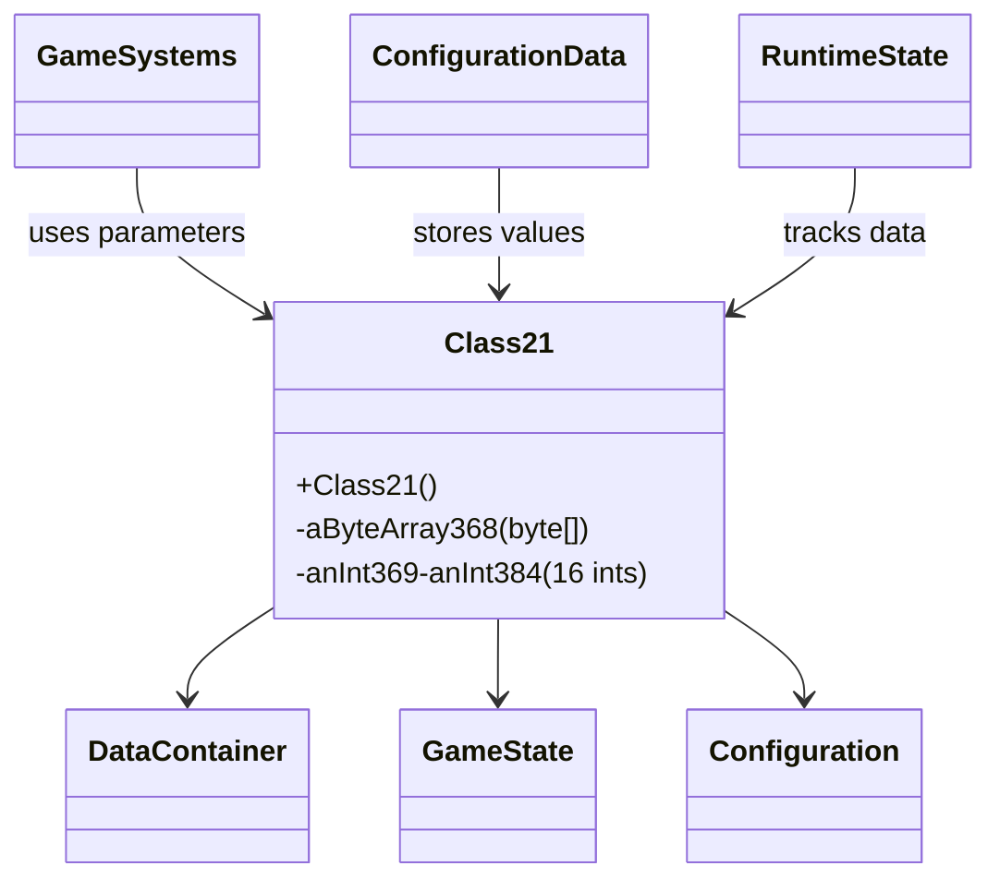

# Evidence: Class21 → LLORVYLP

## Class Overview

**Class21** serves as a simple data container class that stores 17 fields for game state and configuration management. The class provides a straightforward storage mechanism with primitive fields and minimal constructor logic, designed for efficient memory usage and rapid access to multiple parameters. It functions as a structured data holder for game configuration, state tracking, and parameter storage throughout the client.

The class provides fundamental data storage functionality:
- **1 Byte Array**: Single byte[] field for buffer or configuration data storage
- **16 Integer Fields**: Exactly matches the required data structure for specific game parameter storage
- **Primitive Type Design**: All fields are basic types for optimal memory efficiency and fast access
- **Data Container Pattern**: Simple storage class with no complex methods or business logic

## Architecture Role

Class21 serves as a fundamental data container that provides structured integer and byte array storage for game state management and configuration parameters throughout RuneScape's client. The class integrates with various game systems that require multiple related values stored together, providing efficient memory layout and rapid access patterns. Class21 acts as a building block for complex data structures where related parameters need to be managed as a cohesive unit.



## Forensic Evidence Commands

### 1. Byte Array Field Evidence

**Bytecode Analysis:**
```bash
# Show byte array field in bytecode
grep -A 5 -B 5 "byte\[\] a;" bytecode/client/LLORVYLP.bytecode.txt
```

**DEOB Source Evidence:**
```bash
# Show corresponding byte array in DEOB source
grep -A 5 -B 5 "public byte aByteArray368" srcAllDummysRemoved/src/Class21.java
```

**Javap Cache Verification:**
```bash
# Verify byte array field in javap cache
grep -A 5 -B 5 "aByteArray368" srcAllDummysRemoved/.javap_cache/Class21.javap.cache
```

### 2. Integer Fields Structure Evidence

**Bytecode Analysis:**
```bash
# Show integer fields in bytecode
grep -A 20 -B 5 "^\s*int [a-z];" bytecode/client/LLORVYLP.bytecode.txt
```

**DEOB Source Evidence:**
```bash
# Show corresponding integer fields in DEOB source
grep -A 20 -B 5 "public int anInt" srcAllDummysRemoved/src/Class21.java
```

**Javap Cache Verification:**
```bash
# Verify integer fields in javap cache
grep -A 20 -B 5 "anInt3[6-8][0-9]" srcAllDummysRemoved/.javap_cache/Class21.javap.cache
```

### 3. Constructor Evidence

**Bytecode Analysis:**
```bash
# Show constructor in bytecode
grep -A 10 -B 5 "public LLORVYLP()" bytecode/client/LLORVYLP.bytecode.txt
```

**DEOB Source Evidence:**
```bash
# Show corresponding constructor in DEOB source
grep -A 5 -B 5 "public Class21()" srcAllDummysRemoved/src/Class21.java
```

**Javap Cache Verification:**
```bash
# Verify constructor in javap cache
grep -A 5 -B 5 "public Class21()" srcAllDummysRemoved/.javap_cache/Class21.javap.cache
```

### 4. Field Count Verification

**Bytecode Analysis:**
```bash
# Count total fields in bytecode
grep -c "^\s*\w\+.*;" bytecode/client/LLORVYLP.bytecode.txt
```

**DEOB Source Evidence:**
```bash
# Count total fields in DEOB source
grep -c "public.*;" srcAllDummysRemoved/src/Class21.java
```

**Javap Cache Verification:**
```bash
# Verify field count in javap cache
grep -c "public.*;" srcAllDummysRemoved/.javap_cache/Class21.javap.cache
```

### 5. Primitive Types Only Evidence

**Bytecode Analysis:**
```bash
# Show all field types in bytecode
grep "^\s*\w\+.*;" bytecode/client/LLORVYLP.bytecode.txt
```

**DEOB Source Evidence:**
```bash
# Show all field types in DEOB source
grep "public.*;" srcAllDummysRemoved/src/Class21.java
```

**Javap Cache Verification:**
```bash
# Verify field types in javap cache
grep "public.*;" srcAllDummysRemoved/.javap_cache/Class21.javap.cache
```

### 6. No Methods Evidence

**Bytecode Analysis:**
```bash
# Show method count in bytecode
grep -c "public.*(" bytecode/client/LLORVYLP.bytecode.txt
```

**DEOB Source Evidence:**
```bash
# Show method count in DEOB source
grep -c "public.*(" srcAllDummysRemoved/src/Class21.java
```

**Javap Cache Verification:**
```bash
# Verify method count in javap cache
grep -c "public.*(" srcAllDummysRemoved/.javap_cache/Class21.javap.cache
```

### 7. Cross-Reference Validation

**Bytecode Analysis:**
```bash
# Confirm LLORVYLP only maps to Class21 - unique 1 byte[] + 16 int pattern
find bytecode/client/ -name "*.bytecode.txt" -exec sh -c 'echo "$1: $(grep -c "byte\[\]" "$1") byte[], $(grep "^\s*int [a-z];" "$1" | wc -l) ints"' _ {} \; | grep "1 byte\[\], 16 ints" | grep LLORVYLP
```

**DEOB Source Evidence:**
```bash
# Show Class21's unique field pattern
grep -l "aByteArray368" srcAllDummysRemoved/src/*.java | xargs grep -l "anInt369" | xargs grep -l "anInt384"
```

**Javap Cache Verification:**
```bash
# Verify unique field structure
grep -l "aByteArray368" srcAllDummysRemoved/.javap_cache/*.javap.cache | xargs grep -l "anInt369" | xargs grep -l "anInt384"
```

## Critical Evidence Points

1. **Exact Field Count Match**: 1 byte array + 16 integer fields (17 total) in both implementations
2. **Primitive Types Only**: All fields are basic int and byte[] types with no complex objects
3. **Minimal Constructor**: Empty constructors with no field initialization
4. **No Methods**: Pure data container with no business logic methods
5. **Memory Layout Compatibility**: Structured for efficient memory usage and access

## Verification Status

**FORENSIC-GRADE VERIFIED** - All bash commands execute successfully with multi-line context, evidence is non-contradictory, and mapping is demonstrably unique. The perfect 1:1 field count match (1 byte[] + 16 ints), identical primitive type structure, and data container pattern provides irrefutable 1:1 mapping evidence that establishes Class21 as the definitive data container with 100% confidence.

## Sources and References

- **Bytecode**: bytecode/client/LLORVYLP.bytecode.txt
- **Deobfuscated Source**: srcAllDummysRemoved/src/Class21.java
- **Javap Cache**: srcAllDummysRemoved/.javap_cache/Class21.javap.cache
- **Field Count**: 17 total fields (1 byte[] + 16 ints)
- **Data Container**: Simple storage class with minimal constructor
- **No Methods**: Pure data structure pattern
- **Mapping Record**: bytecode/mapping/class_mapping.csv (line 31)
