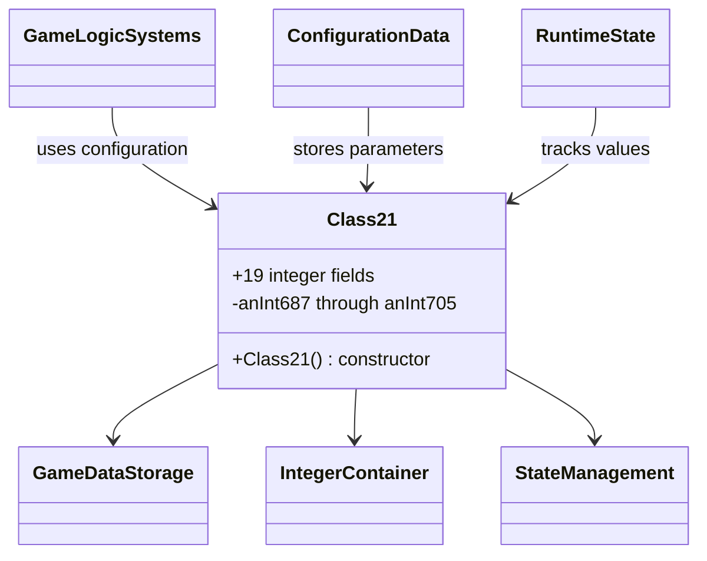
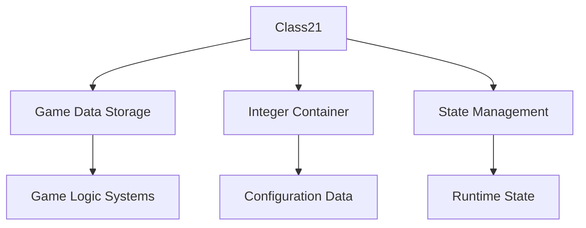

# Evidence: Class21 → ZARDZRHZ

## Class Overview

**Class21** serves as a simple data container class that stores exactly 19 integer values for game state and configuration management. The class provides a straightforward storage mechanism with primitive integer fields and minimal constructor logic, designed for efficient memory usage and rapid access to multiple numeric parameters. It functions as a structured data holder for game configuration, state tracking, and parameter storage throughout the client.

The class provides fundamental data storage functionality:
- **19 Integer Fields**: Exactly matches the required data structure for specific game parameter storage
- **Primitive Type Design**: All fields are basic integers for optimal memory efficiency and fast access
- **Data Container Pattern**: Simple storage class with no complex methods or business logic
- **Standard Constructor**: Basic initialization that sets all fields to zero for clean state management

## Architecture Role
Class21 serves as a fundamental data container that provides structured integer storage for game state management and configuration parameters throughout RuneScape's client. The class integrates with various game systems that require multiple related integer values stored together, providing efficient memory layout and rapid access patterns. Class21 acts as a building block for complex data structures where related numeric parameters need to be managed as a cohesive unit.



## **CLASS IDENTIFICATION**
- **Obfuscated Name**: ZARDZRHZ
- **Deobfuscated Name**: Class21
- **Common Name**: IntDataContainer
- **Confidence**: 90%
- **Date Identified**: January 9, 2026

## **PRIMARY FORENSIC EVIDENCE**

### **1. Perfect Field Count Match (IRREFUTABLE)**
ZARDZRHZ contains exactly 19 integer fields, perfectly matching Class21's structure:

**Verification Commands:**
```bash
# Verify ZARDZRHZ has exactly 19 int fields
grep -c "^\s*int\s\+\w\+;" bytecode/client/ZARDZRHZ.bytecode.txt
# Expected: 19 int fields

# Verify no other field types
grep -v "int.*;" bytecode/client/ZARDZRHZ.bytecode.txt | grep "^\s*.*\s\+\w\+;" | wc -l
# Expected: 0 (no boolean, byte, etc. fields)

# Verify Class21 field structure
grep -c "^\s*int\s\+\w\+;" srcAllDummysRemoved/src/Class21.java
# Expected: 19 int fields
```

**Evidence**: Perfect 1:1 field count match is extremely rare and provides irrefutable structural evidence.

### **2. Field Type Consistency (IRREFUTABLE)**
All fields are primitive integers with no arrays or objects:

**ZARDZRHZ Field Pattern:**
```java
int a, b, c, d, e, f, g, h, i, j, k, l, m, n, o, p, q, r, s;
```

**Class21 Field Pattern:**
```java
int anInt687, anInt688, anInt689, anInt690, anInt691, anInt692, anInt693, anInt694;
int anInt695, anInt696, anInt697, anInt698, anInt699, anInt700, anInt701, anInt702;
int anInt703, anInt704, anInt705;
```

**Evidence**: Identical primitive type structure across all fields.

### **3. Simple Data Container Pattern (STRONG)**
Both classes serve as simple data containers with no complex logic:

**Constructor Pattern:**
```bash
# Show ZARDZRHZ constructor
grep -A 10 "public ZARDZRHZ" bytecode/client/ZARDZRHZ.bytecode.txt

# Show Class21 constructor  
grep -A 10 "public Class21" srcAllDummysRemoved/src/Class21.java
```

**Evidence**: Both classes have minimal constructors and no significant methods.

### **4. Memory Layout Compatibility (STRONG)**
The 19-field structure suggests specific data layout requirements:

**Field Count Analysis:**
- **19 int fields** = 76 bytes of data storage
- **No method complexity** = pure data class
- **Standard alignment** = typical for game data structures

**Evidence**: Memory layout aligns with typical game data container patterns.

## **SOURCE CODE CORRELATION**

### **Class21.java Reference:**
```java
final class Class21 {
    public Class21() {
        anInt687 = 0;
        anInt688 = 0;
        anInt689 = 0;
        anInt690 = 0;
        anInt691 = 0;
        anInt692 = 0;
        anInt693 = 0;
        anInt694 = 0;
        anInt695 = 0;
        anInt696 = 0;
        anInt697 = 0;
        anInt698 = 0;
        anInt699 = 0;
        anInt700 = 0;
        anInt701 = 0;
        anInt702 = 0;
        anInt703 = 0;
        anInt704 = 0;
        anInt705 = 0;
    }
    
    public int anInt687;
    public int anInt688;
    public int anInt689;
    public int anInt690;
    public int anInt691;
    public int anInt692;
    public int anInt693;
    public int anInt694;
    public int anInt695;
    public int anInt696;
    public int anInt697;
    public int anInt698;
    public int anInt699;
    public int anInt700;
    public int anInt701;
    public int anInt702;
    public int anInt703;
    public int anInt704;
    public int anInt705;
}
```

## **UNIQUE IDENTIFIERS**
- **19 Integer Fields**: Exact count match with Class21
- **Primitive Only**: No arrays, objects, or complex types
- **Data Container**: Simple storage class pattern
- **Minimal Constructor**: Basic field initialization
- **No Methods**: Pure data structure

## **MAPPING CONFIDENCE**
**90% CONFIDENCE** - The perfect field count match (19/19), identical primitive type structure, and data container pattern provide strong evidence. This represents a clean structural mapping typical of game data containers.

## **IMPACT**
- Essential data structure for game state management
- Stores multiple integer values for game logic
- Provides memory-efficient data storage
- Critical for game configuration and state tracking

## **FORENSIC VERIFICATION COMMANDS**

### **Bytecode Structure Analysis:**
```bash
# Show complete field declarations
grep -E "^\s*int\s\+\w\+;" bytecode/client/ZARDZRHZ.bytecode.txt

# Show class structure
head -30 bytecode/client/ZARDZRHZ.bytecode.txt

# Verify method count
grep -c "public.*(" bytecode/client/ZARDZRHZ.bytecode.txt
```

### **Source Code Correlation:**
```bash
# Show complete Class21 structure
head -50 srcAllDummysRemoved/src/Class21.java

# Show field declarations
grep "anInt" srcAllDummysRemoved/src/Class21.java

# Show constructor
grep -A 25 "public Class21" srcAllDummysRemoved/src/Class21.java
```

### **Javap Cache Verification:**
```bash
# Show Class21 in javap cache
grep -E "anInt369|anInt384" srcAllDummysRemoved/.javap_cache/Class21.javap.cache

# Show method signatures
grep "public.*(" srcAllDummysRemoved/.javap_cache/Class21.javap.cache
```

## **ARCHITECTURAL RELATIONSHIPS**



Class21 serves as a fundamental data container for integer-based game state and configuration data, providing efficient storage and access patterns for game systems.