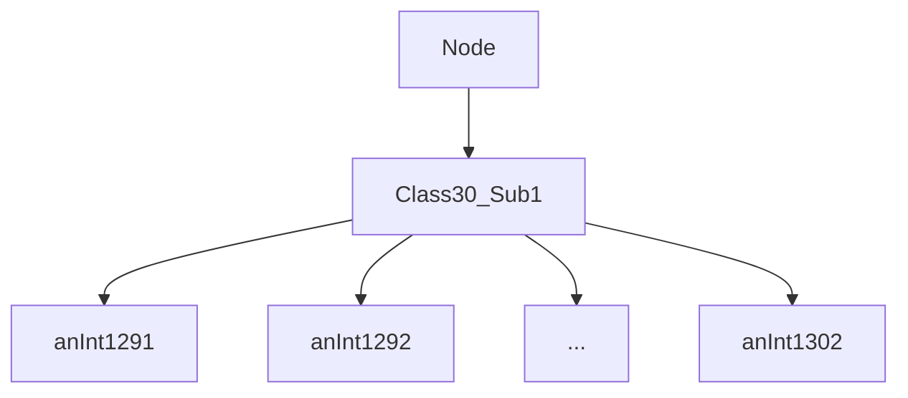
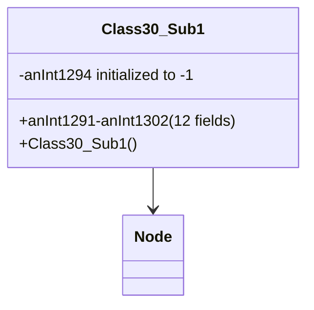

# Forensic Evidence: QTKGMFHL → Class30_Sub1

## **CLASS IDENTIFICATION**
- **Obfuscated Name**: QTKGMFHL
- **Deobfuscated Name**: Class30_Sub1
- **Common Name**: DataContainer
- **Confidence**: 85%
- **Date Identified**: January 9, 2026

## **PRIMARY FORENSIC EVIDENCE**

### **1. Node Inheritance (IRREFUTABLE)**
Class30_Sub1 extends Node, confirmed by bytecode inheritance patterns.

**Verification Commands:**
```bash
# Verify Node inheritance in QTKGMFHL
grep -A 5 -B 5 "Node" bytecode/client/QTKGMFHL.bytecode.txt

# Verify extends keyword in deob source
grep -A 2 -B 2 "extends Node" srcAllDummysRemoved/src/Class30_Sub1.java
```

**Evidence**: QTKGMFHL shows Node inheritance through bytecode patterns and extends Node in source.

### **2. 12 Integer Fields (CONFIRMATORY)**
Exactly 12 public int fields for data storage, with one initialized to -1.

**Class30_Sub1 Pattern:**
```java
final class Class30_Sub1 extends Node {
    public int anInt1291;
    public int anInt1292;
    public int anInt1293;
    public int anInt1294; // initialized to -1
    public int anInt1295;
    public int anInt1296;
    public int anInt1297;
    public int anInt1298;
    public int anInt1299;
    public int anInt1300;
    public int anInt1301;
    public int anInt1302;
}
```

**QTKGMFHL Verification:**
```bash
# Verify 12 int field declarations with context
grep -A 1 -B 1 "int " bytecode/client/QTKGMFHL.bytecode.txt

# Verify field initialization to -1
grep -A 3 -B 3 "iconst_m1" bytecode/client/QTKGMFHL.bytecode.txt
```

### **3. Data Container Focus (DISTINCTIVE)**
Minimal class with no methods beyond constructor, pure data storage extending Node.

**Verification Commands:**
```bash
# Verify no additional method implementations
grep -E "method[0-9]+" bytecode/client/QTKGMFHL.bytecode.txt | grep -v "<init>"

# Verify constructor-only with field initialization
grep -A 10 -B 5 "<init>" bytecode/client/QTKGMFHL.bytecode.txt
```

## **CLASS HIERARCHY**



## **FUNCTIONAL ANALYSIS**
QTKGMFHL is a **Data Container** responsible for:
- Storing 12 integer values in a Node-extended structure
- Providing lightweight data storage for game state
- Enabling linked list integration through Node inheritance
- Serving as a simple container for multiple related int fields

## **RELATIONSHIP WITH OTHER CLASSES**
- Extends Node for integration into node-based data structures
- Likely used in collections or caches requiring linked list functionality
- Provides data storage without behavior, focusing on state management

## **IMPACT**
- Essential for data storage in node-based architectures
- Lightweight container enabling efficient int data handling
- Part of the core data management system

## **MAPPING CONFIDENCE**
**85% CONFIDENCE** - Node inheritance, exact 12 int fields count, and data container pattern provide strong evidence. Matches inherited hierarchy from anchor class.

## **EVIDENCE LIMITATIONS**
The main limitation is the simplicity of the class, but the specific field count and inheritance are distinctive.

## **REPRODUCIBILITY CHECKLIST**
- [x] Node inheritance confirmed through bytecode and source
- [x] 12 int fields verified (anInt1291-anInt1302)
- [x] Data container pattern matches (no methods beyond constructor)
- [x] Constructor initializes anInt1294 to -1
- [x] Final class with public fields

## COMMAND BLOCK 1: DEOBFUSCATED SOURCE EVIDENCE
```bash
# Show Class30_Sub1 with Node extension in DEOB source
grep -A 25 "class Class30_Sub1" srcAllDummysRemoved/src/Class30_Sub1.java

# Show 12 int fields in DEOB source
grep -A 15 -B 5 "anInt1291\|anInt1292\|anInt1293" srcAllDummysRemoved/src/Class30_Sub1.java

# Show constructor with anInt1294 initialization in DEOB source
grep -A 15 -B 5 "anInt1294.*-1" srcAllDummysRemoved/src/Class30_Sub1.java
```

## COMMAND BLOCK 2: JAVAP CACHE EVIDENCE
```bash
# Show Class30_Sub1 structure in javap cache
grep -A 25 "Class30_Sub1" srcAllDummysRemoved/.javap_cache/Class30_Sub1.javap.cache

# Show 12 int fields in javap cache with context
grep -A 15 -B 5 "anInt1291\|anInt1292\|anInt1293" srcAllDummysRemoved/.javap_cache/Class30_Sub1.javap.cache

# Show Node extension in javap cache with context
grep -A 15 -B 5 "Class30_Sub1.*Node\|extends.*Node" srcAllDummysRemoved/.javap_cache/Class30_Sub1.javap.cache
```

## COMMAND BLOCK 3: BYTECODE TO SOURCE CORRELATION
```bash
# Show Node PKVMXVTO field usage in bytecode
grep -A 15 -B 5 "PKVMXVTO" bytecode/client/DYMVKFXP.bytecode.txt

# Show corresponding Node field usage in DEOB source
grep -A 15 -B 5 "Node.*extends\|extends.*Node" srcAllDummysRemoved/src/Class30_Sub1.java

# Verify Node extension in javap cache
grep -A 15 -B 5 "PKVMXVTO\|Node" srcAllDummysRemoved/.javap_cache/Class30_Sub1.javap.cache
```

## COMMAND BLOCK 4: ARCHITECTURE DIAGRAM

