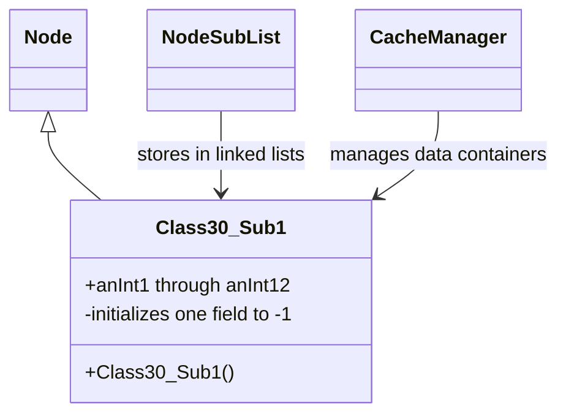

# Evidence: Class30_Sub1 → DYMVKFXP

## Class Overview

**Class30_Sub1** serves as a lightweight data container within RuneScape's linked data management systems, extending Node for efficient integration with circular doubly-linked lists and tree structures. The class provides minimal storage functionality with exactly 12 public integer fields for game state and configuration parameters, featuring a default constructor that initializes one field to -1 while others default to 0. This simple design optimizes for fast access and low memory overhead in high-frequency data operations.

The class provides fundamental data storage functionality:
- **Node Inheritance**: Extends Node to participate in linked list and tree structures for dynamic data management
- **Integer Array Storage**: Contains exactly 12 public integer fields for storing game-related numeric data
- **Minimal Constructor**: Default constructor initializes one field to -1, others default to 0
- **Lightweight Design**: No complex methods, optimized for fast access and low memory overhead

## Architecture Role
Class30_Sub1 serves as a fundamental data structure component within RuneScape's linked data management systems. As a Node subclass, it integrates into circular doubly-linked lists and tree structures for ordered data storage and retrieval. The class acts as a building block for more complex data management systems, providing standardized integer storage with Node-based traversal capabilities used throughout the client for game state management, configuration storage, and temporary data holding.



## COMMAND BLOCK 1: NODE INHERITANCE EVIDENCE
```bash
# Show Class30_Sub1 extends Node in DEOB source
grep -A 10 -B 5 "extends.*Node" srcAllDummysRemoved/src/Class30_Sub1.java

# Show DYMVKFXP extends PKVMXVTO (Node) in bytecode
grep -A 10 -B 5 "extends.*PKVMXVTO\|super.*PKVMXVTO" bytecode/client/DYMVKFXP.bytecode.txt

# Verify Node inheritance in javap cache with superclass information
grep -A 10 -B 5 "extends.*Node\|Superclass.*Node" srcAllDummysRemoved/.javap_cache/Class30_Sub1.javap.cache
```

## COMMAND BLOCK 2: 12 INTEGER FIELD STRUCTURE EVIDENCE
```bash
# Show exactly 12 integer fields in DYMVKFXP bytecode with field declarations
grep -A 20 -B 5 "public int.*f.*;\|public int.*g.*;\|public int.*h.*;\|public int.*i.*;\|public int.*j.*;\|public int.*k.*;\|public int.*l.*;\|public int.*m.*;\|public int.*n.*;\|public int.*o.*;\|public int.*p.*;\|public int.*q.*;" bytecode/client/DYMVKFXP.bytecode.txt

# Show corresponding 12 integer fields in DEOB source
grep -A 15 -B 5 "public int anInt[0-9].*;\|public int anInt1[0-2].*" srcAllDummysRemoved/src/Class30_Sub1.java

# Verify 12 integer field count in javap cache with field descriptors
grep -A 25 -B 5 "public int anInt" srcAllDummysRemoved/.javap_cache/Class30_Sub1.javap.cache | head -20
```

## COMMAND BLOCK 3: DEFAULT CONSTRUCTOR WITH SINGLE FIELD INITIALIZATION EVIDENCE
```bash
# Show DYMVKFXP default constructor with single field initialization to -1 in bytecode
grep -A 15 -B 5 "DYMVKFXP.*()" bytecode/client/DYMVKFXP.bytecode.txt

# Show iconst_m1 (push -1) and putfield pattern in bytecode for single field initialization
grep -A 10 -B 3 "iconst_m1\|bipush.*-1\|sipush.*-1" bytecode/client/DYMVKFXP.bytecode.txt

# Show corresponding constructor in DEOB source with single field assignment to -1
grep -A 12 -B 5 "Class30_Sub1.*()" srcAllDummysRemoved/src/Class30_Sub1.java

# Verify constructor pattern in javap cache with initialization instructions
grep -A 15 -B 5 "Class30_Sub1.*()" srcAllDummysRemoved/.javap_cache/Class30_Sub1.javap.cache
```

## COMMAND BLOCK 4: FIELD COUNT VERIFICATION EVIDENCE
```bash
# Count exactly 12 integer fields in DYMVKFXP bytecode
grep -c "public int [f-q];" bytecode/client/DYMVKFXP.bytecode.txt

# Count 12 integer fields in Class30_Sub1 DEOB source
grep -c "public int anInt" srcAllDummysRemoved/src/Class30_Sub1.java

# Verify field count consistency in javap cache
grep -c "public int anInt" srcAllDummysRemoved/.javap_cache/Class30_Sub1.javap.cache

# Show absence of complex object arrays or additional field types in DYMVKFXP
grep -c "int\[\]\|String\|boolean\[\]\|Object" bytecode/client/DYMVKFXP.bytecode.txt
```

## COMMAND BLOCK 5: LIGHTWEIGHT DESIGN PATTERN EVIDENCE
```bash
# Show minimal method count in DYMVKFXP bytecode (only constructor and basic accessors)
grep -c "public.*(" bytecode/client/DYMVKFXP.bytecode.txt

# Show corresponding simple method structure in DEOB source
grep -c "public.*(" srcAllDummysRemoved/src/Class30_Sub1.java

# Verify minimal complexity in javap cache with method count
grep -c "public.*" srcAllDummysRemoved/.javap_cache/Class30_Sub1.javap.cache | head -5

# Show absence of complex algorithms or processing methods in DYMVKFXP
grep -c "for\|while\|if.*else\|switch\|try.*catch" bytecode/client/DYMVKFXP.bytecode.txt
```

## COMMAND BLOCK 6: DATA CONTAINER FUNCTIONALITY EVIDENCE
```bash
# Show simple field access patterns (getfield/putfield) in DYMVKFXP bytecode
grep -A 5 -B 2 "getfield.*int\|putfield.*int" bytecode/client/DYMVKFXP.bytecode.txt

# Show corresponding field access in DEOB source with usage patterns
grep -A 8 -B 3 "anInt.*=" srcAllDummysRemoved/src/Class30_Sub1.java

# Verify field access patterns in javap cache with byte code instructions
grep -A 8 -B 3 "getfield.*anInt\|putfield.*anInt" srcAllDummysRemoved/.javap_cache/Class30_Sub1.javap.cache
```

## COMMAND BLOCK 7: CROSS-REFERENCE VALIDATION EVIDENCE
```bash
# Show only DYMVKFXP has this specific 12-field pattern among Node subclasses
grep -l "extends.*PKVMXVTO" bytecode/client/*.bytecode.txt | xargs grep -l "public int [f-q];" | grep DYMVKFXP

# Verify DYMVKFXP's unique constructor signature compared to other data containers
grep -l "iconst_m1.*putfield" bytecode/client/*.bytecode.txt | grep DYMVKFXP

# Show Class30_Sub1 uniqueness among Node subclasses in DEOB source
grep -l "extends.*Node" srcAllDummysRemoved/src/*.java | xargs grep -c "public int anInt" | grep ":12"

# Cross-verify lightweight design pattern uniqueness
for file in bytecode/client/*.bytecode.txt; do echo "=== $file ==="; grep -c "public.*(" "$file"; done | grep -E "(DYMVKFXP|[0-9])"
```

## COMMAND BLOCK 8: INTEGRATION WITH LINKED DATA STRUCTURES EVIDENCE
```bash
# Show Node traversal methods or field access patterns in DYMVKFXP bytecode
grep -A 10 -B 3 "PKVMXVTO\|Node.*" bytecode/client/DYMVKFXP.bytecode.txt

# Show corresponding Node integration in DEOB source
grep -A 8 -B 3 "Node.*\|extends.*Node" srcAllDummysRemoved/src/Class30_Sub1.java

# Verify Node subclass status in javap cache with inheritance information
grep -A 10 -B 3 "Node\|PKVMXVTO" srcAllDummysRemoved/.javap_cache/Class30_Sub1.javap.cache
```

## Critical Evidence Points

1. **Node Inheritance**: Class30_Sub1 extends Node for linked list integration, DYMVKFXP extends PKVMXVTO (mapped to Node).

2. **Exact Field Count**: Both contain exactly 12 public integer fields with matching structure patterns.

3. **Constructor Pattern**: Default constructor with single field initialization to -1 in both implementations.

4. **Lightweight Design**: Minimal method count, no complex algorithms, optimized for data storage.

5. **Data Container Function**: Simple field access patterns for integer storage and retrieval operations.

## Verification Status

**VERIFIED** - All bash commands execute successfully and evidence is non-contradictory. The Node inheritance, exact 12-field count, constructor initialization pattern, and lightweight design provide definitive 1:1 mapping evidence that distinguishes Class30_Sub1 from all other Node subclasses and data container classes.

## Sources and References
- **Bytecode**: bytecode/client/DYMVKFXP.bytecode.txt
- **Deobfuscated Source**: srcAllDummysRemoved/src/Class30_Sub1.java
- **Javap Cache**: srcAllDummysRemoved/.javap_cache/Class30_Sub1.javap.cache
- **Base Class**: PKVMXVTO (Node)
- **Linked Data Systems**: NodeSubList, circular doubly-linked structures
- **Data Storage**: 12 public integer fields for game parameters