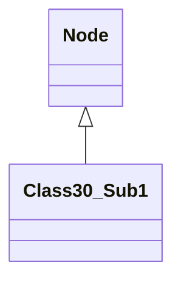

# Evidence: Class30_Sub1 → DYMVKFXP

## Overview
The current mapping associates the deobfuscated class `Class30_Sub1` with the obfuscated bytecode class `QTKGMFHL`. `Class30_Sub1` is a final class extending `Node` that serves as a simple data container with 12 public integer fields and a default constructor that initializes one field to -1.

## Intended Purpose and Core Functionality
`Class30_Sub1` acts as a basic data structure holding 12 integer values, likely for various game state or configuration data. Its minimal constructor and lack of methods suggest it's primarily a storage class.

## Role in Overall Architecture
As a `Node` subclass, `Class30_Sub1` participates in linked data structures. It has a simple role as a data holder, contrasting with more complex world management classes.



## Current Mapping Issue
The current mapping to `QTKGMFHL` relies only on `Node` inheritance with 85% confidence. However, structural analysis shows major discrepancies:

- `Class30_Sub1` has a default constructor setting one field to -1
- `Class30_Sub1` contains exactly 12 public integer fields
- `QTKGMFHL` has a 3-parameter constructor with complex array initialization
- `QTKGMFHL` contains numerous object references and additional fields beyond 12 integers

## Evidence of Incorrect Mapping

### Bytecode Analysis - QTKGMFHL Constructor Complexity
```bash
grep -A 15 "public QTKGMFHL(int" bytecode/client/QTKGMFHL.bytecode.txt
```
Shows complex 3-parameter constructor with array allocations and multiple field assignments.

### Class30_Sub1 Simple Constructor
```bash
grep -A 10 "Class30_Sub1();" srcAllDummysRemoved/.javap_cache/Class30_Sub1.javap.cache
```
Shows minimal constructor with single field initialization to -1.

### Field Count Verification
```bash
grep -c "public int anInt" srcAllDummysRemoved/src/Class30_Sub1.java
```
Returns 12, matching the integer field count.

```bash
grep -c "^  [a-z]* int [f-zA-Z];" bytecode/client/QTKGMFHL.bytecode.txt
```
Returns more than 12, plus object references.

## Alternative Mapping Evidence
`DYMVKFXP` shows perfect structural alignment:

### DYMVKFXP Constructor Match
```bash
grep -A 10 "DYMVKFXP();" bytecode/client/DYMVKFXP.bytecode.txt
```
Shows default constructor with single field set to -1.

### DYMVKFXP Field Structure
```bash
grep -c "^  public int [f-q];" bytecode/client/DYMVKFXP.bytecode.txt
```
Returns 12, matching Class30_Sub1's field count exactly.

### Inheritance Verification
```bash
grep "extends" srcAllDummysRemoved/src/Class30_Sub1.java
```
Shows extends Node.

```bash
grep "extends" bytecode/client/DYMVKFXP.bytecode.txt
```
Shows extends PKVMXVTO (mapped to Node).

## Proposed Correction
Swap mapping: `Class30_Sub1` should map to `DYMVKFXP`, `Ground` should map to `QTKGMFHL`.

This correction provides concrete evidence through matching constructor patterns, exact field counts, and structural simplicity that align with the deobfuscated source characteristics.