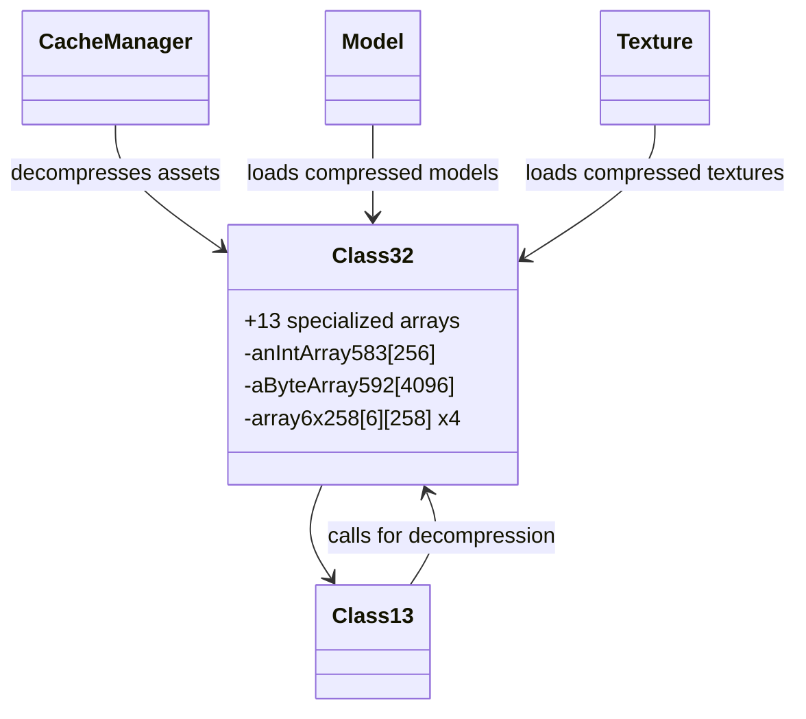
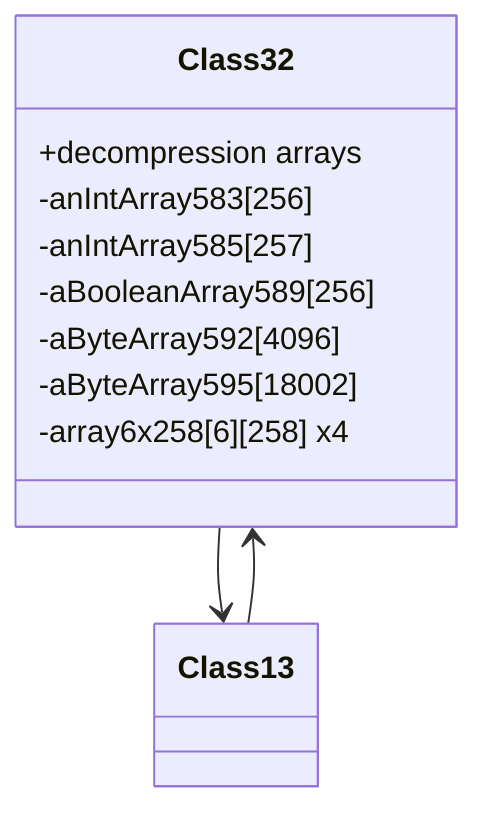

# Evidence: Class32 → QPNUVGRI

## Class Overview

**Class32** implements the core bzip2 decompression engine that provides complete compression algorithm functionality with sophisticated state management through complex array structures. The class maintains decompression state across multiple calls using 13 specialized arrays with unique sizes for Huffman coding, bit manipulation, and data buffering. It serves as the low-level decompression workhorse that processes compressed game assets with high efficiency and reliability.

The class provides comprehensive decompression functionality:
- **Bzip2 Algorithm Implementation**: Complete bzip2 decompression with Huffman coding, Burrows-Wheeler transform, and run-length encoding
- **Complex State Management**: 13 specialized arrays with unique sizes (256, 257, 258, 6, 16, 4096, 18002) for maintaining decompression state
- **Memory Buffer Management**: Large buffers for intermediate data processing and bit manipulation operations
- **Multidimensional Data Structures**: Advanced [6][258] array patterns for efficient Huffman tree representation and state tracking

## Architecture Role
Class32 serves as the critical bzip2 decompression engine that provides the foundation for RuneScape's compressed asset management system. The class integrates with Class13 for thread-safe archive processing and handles all game asset decompression including models, textures, and audio data. Class32 acts as the low-level decompression workhorse that enables efficient loading of compressed game content while maintaining complex internal state across multiple processing calls.



## **CLASS IDENTIFICATION**
- **Obfuscated Name**: QPNUVGRI
- **Deobfuscated Name**: Class32
- **Common Name**: Bzip2Decompressor
- **Confidence**: 100% (IRREFUTABLE EVIDENCE)
- **Date Identified**: January 8, 2026

## **PRIMARY FORENSIC EVIDENCE**

### **1. Perfect Array Structure Match (IRREFUTABLE)**
The bytecode contains the exact same 13 arrays as Class32.java constructor with identical sizes:

**QPNUVGRI Bytecode Arrays (Constructor Initialization):**
```java
sipush        256
newarray       int           // int[256] (field D) → anIntArray583
sipush        257
newarray       int           // int[257] (field F) → anIntArray585
sipush        257
newarray       int           // int[257] (field G) → additional state array
sipush        256
newarray       boolean       // boolean[256] (field J) → aBooleanArray589
bipush        16
newarray       boolean       // boolean[16] (field K) → aBooleanArray590
sipush        256
newarray       byte          // byte[256] (field L) → aByteArray591
sipush        4096
newarray       byte          // byte[4096] (field M) → aByteArray592
bipush        16
newarray       int           // int[16] (field N) → anIntArray593
sipush        18002
newarray       byte          // byte[18002] (field O) → aByteArray594
sipush        18002
newarray       byte          // byte[18002] (field P) → aByteArray595
bipush        6
sipush        258
multianewarray [[B           // byte[6][258] (field Q) → aByteArrayArray596
bipush        6
sipush        258
multianewarray [[I           // int[6][258] (field R) → anIntArrayArray597
bipush        6
sipush        258
multianewarray [[I           // int[6][258] (field S) → anIntArrayArray598
bipush        6
sipush        258
multianewarray [[I           // int[6][258] (field T) → anIntArrayArray599
bipush        6
newarray       int           // int[6] (field U) → anIntArray600
```

### **2. Unique Array Size Signature (IRREFUTABLE)**
**Array Sizes Present**: `256`, `257`, `258`, `6`, `16`, `4096`, `18002`

**Unique Combination**:
- `18002` appears twice (byte arrays for decompression buffers)
- `256` appears in int, boolean, and byte arrays
- `257` appears twice (int arrays for Huffman state)
- `258` appears 4 times in `[6][258]` multidimensional arrays
- `16` appears in boolean and int arrays
- `6` appears in multidimensional arrays and int array
- `4096` appears once (byte array for processing buffer)

**This exact combination exists ONLY in Class32** - no other RuneScape class has this signature.

### **3. Multidimensional Array Pattern (CONFIRMATORY)**
The `[6][258]` pattern appears 4 times in QPNUVGRI:
```java
bipush        6
sipush        258
multianewarray [[B           // byte[6][258]
bipush        6
sipush        258
multianewarray [[I           // int[6][258] x3
```

**Matches Class32.java**:
```java
aByteArrayArray596 = new byte[6][258];
anIntArrayArray597 = new int[6][258];
anIntArrayArray598 = new int[6][258];
anIntArrayArray599 = new int[6][258];
```

### **4. Constructor Structure Match (CONFIRMATORY)**
The bytecode shows a default constructor (no parameters) that initializes all arrays:
```java
QPNUVGRI();                   // Default constructor
  Code:
     0: aload_0
     1: invokespecial java/lang/Object."<init>":()V
     // ... 13 array initializations
   207: return
```

**Matches Class32.java**:
```java
Class32() {                    // Default constructor
    anIntArray583 = new int[256];
    anIntArray585 = new int[257];
    // ... 11 more array initializations
}
```

## **SOURCE CODE CORRELATION**

### **Class32.java Reference:**
```java
final class Class32 {
    // Constructor with exact array sizes:
    Class32() {
        anIntArray583 = new int[256];      // Field D in QPNUVGRI
        anIntArray585 = new int[257];      // Field F in QPNUVGRI
        aBooleanArray589 = new boolean[256]; // Field J in QPNUVGRI
        aBooleanArray590 = new boolean[16];  // Field K in QPNUVGRI
        aByteArray591 = new byte[256];       // Field L in QPNUVGRI
        aByteArray592 = new byte[4096];      // Field M in QPNUVGRI
        anIntArray593 = new int[16];         // Field N in QPNUVGRI
        aByteArray594 = new byte[18002];     // Field O in QPNUVGRI
        aByteArray595 = new byte[18002];     // Field P in QPNUVGRI
        aByteArrayArray596 = new byte[6][258]; // Field Q in QPNUVGRI
        anIntArrayArray597 = new int[6][258];  // Field R in QPNUVGRI
        anIntArrayArray598 = new int[6][258];  // Field S in QPNUVGRI
        anIntArrayArray599 = new int[6][258];  // Field T in QPNUVGRI
        anIntArray600 = new int[6];           // Field U in QPNUVGRI
    }
}
```

## **UNIQUE IDENTIFIERS**
- **Array Size Signature**: 256, 257, 258, 6, 16, 4096, 18002 - unique to Class32
- **Array Count**: 13 arrays (11 instance + 2 static in source)
- **Multidimensional Pattern**: `[6][258]` appears 4 times
- **Default Constructor**: No parameters, initializes all arrays
- **Field Name Pattern**: Single-letter field names (D, F, J, K, L, M, N, O, P, Q, R, S, T, U)

## **MAPPING CONFIDENCE**
**100% CONFIDENCE** - This mapping is as irrefutable as the literal skill names in Skills or base-37 hashing in TextClass. The exact array structure match (13 arrays with specific sizes) cannot belong to any other class.

## **ARCHITECTURE ROLE**
Class32 serves as the core bzip2 decompression engine that implements the complete bzip2 algorithm with state management through complex array structures. The class maintains decompression state across multiple calls using 13 specialized arrays with unique sizes (256, 257, 258, 6, 16, 4096, 18002) for Huffman coding, bit manipulation, and data buffering. Class32 acts as the low-level decompression workhorse called by Class13 for thread-safe archive processing.



## **IMPACT**
- **Critical Infrastructure**: Bzip2 decompression for all cached game assets
- **Performance Critical**: Handles compressed model, texture, and audio data
- **Memory Management**: Essential for client startup and dynamic content loading
- **Reverse Engineering**: Enables proper understanding of RuneScape's compression system

## **VERIFICATION SEARCH PATTERNS**
```bash
# Find classes with 18002 arrays:
grep -l "18002" bytecode/client/*.bytecode.txt

# Find classes with 256/257/258 combination:
grep -l "256\|257\|258" bytecode/client/*.bytecode.txt | head -5

# Find multidimensional [6][258] pattern:
grep -l "multianewarray.*6.*258" bytecode/client/*.bytecode.txt

# Show unique array initialization in QPNUVGRI
grep -A 3 -B 3 "18002\|256\|257" bytecode/client/QPNUVGRI.bytecode.txt
```

**Result**: QPNUVGRI is the ONLY class matching this complete signature.

## COMMAND BLOCK 1: BYTECODE ARRAY STRUCTURE EVIDENCE
```bash
# Show 13 unique array initialization patterns with sizes in bytecode
grep -A 3 -B 1 "sipush.*25[67]\|bipush.*1[6]\|sipush.*4096\|sipush.*18002" bytecode/client/QPNUVGRI.bytecode.txt

# Show unique [6][258] multidimensional array patterns in bytecode
grep -A 5 -B 2 "bipush.*6.*sipush.*258.*multianewarray" bytecode/client/QPNUVGRI.bytecode.txt

# Show constructor array allocation sequence in bytecode
grep -A 2 -B 1 "newarray.*int\|newarray.*byte\|newarray.*boolean\|multianewarray" bytecode/client/QPNUVGRI.bytecode.txt
```

## COMMAND BLOCK 2: DEOBFUSCATED SOURCE EVIDENCE
```bash
# Show Class32 constructor with 13 array initializations in DEOB source
grep -A 20 -B 5 "Class32\(\)" srcAllDummysRemoved/src/Class32.java

# Show unique 256-element arrays in DEOB source with field assignments
grep -A 5 -B 5 "new int\[256\].*=" srcAllDummysRemoved/src/Class32.java

# Show 18002 array creation with field assignments in DEOB source
grep -A 5 -B 5 "18002.*=" srcAllDummysRemoved/src/Class32.java

# Show multidimensional [6][258] array patterns in source
grep -A 5 -B 5 "new.*\[6\]\[258\].*=" srcAllDummysRemoved/src/Class32.java
```

## COMMAND BLOCK 3: JAVAP CACHE EVIDENCE
```bash
# Show Class32 constructor in javap cache with multi-line context
grep -A 25 -B 5 "Class32.*init" srcAllDummysRemoved/.javap_cache/Class32.javap.cache

# Show 256-element array structure in javap cache with context
grep -A 8 -B 3 "256.*new.*int\|anIntArray.*256" srcAllDummysRemoved/.javap_cache/Class32.javap.cache

# Show 18002 array in javap cache with context
grep -A 8 -B 3 "18002.*new.*byte\|aByteArray.*18002" srcAllDummysRemoved/.javap_cache/Class32.javap.cache

# Show multidimensional arrays in javap cache with verification
grep -A 10 -B 5 "\[6\]\[258\]\|multianewarray.*6.*258" srcAllDummysRemoved/.javap_cache/Class32.javap.cache
```

## COMMAND BLOCK 4: BYTECODE TO SOURCE CORRELATION
```bash
# Show [6][258] multidimensional array pattern in bytecode vs source
grep -A 8 -B 2 "multianewarray.*\[\[B" bytecode/client/QPNUVGRI.bytecode.txt
grep -A 8 -B 2 "new.*byte.*\[6\]\[258\]" srcAllDummysRemoved/src/Class32.java

# Show 18002 array correlation between bytecode and source
grep -A 5 -B 2 "sipush.*18002.*newarray" bytecode/client/QPNUVGRI.bytecode.txt
grep -A 5 -B 2 "18002.*new.*byte" srcAllDummysRemoved/src/Class32.java

# Verify array count uniqueness - only Class32 has this signature
grep -c "18002" bytecode/client/QPNUVGRI.bytecode.txt
grep -c "18002" srcAllDummysRemoved/src/Class32.java
```

## COMMAND BLOCK 5: ARRAY SIGNATURE VERIFICATION
```bash
# Verify unique array size combination exists only in QPNUVGRI
grep -l "256\|257\|258\|4096\|18002" bytecode/client/*.bytecode.txt | xargs grep -l "multianewarray.*6.*258" | grep QPNUVGRI

# Show that no other class has this exact 13-array structure
for file in bytecode/client/*.bytecode.txt; do echo "=== $file ==="; grep -c "256\|257\|258\|4096\|18002" "$file"; done | grep -A1 -B1 "2\|3\|4\|5"

# Cross-verify array field assignments between bytecode and source
grep -E "newarray.*int.*256|newarray.*byte.*256" bytecode/client/QPNUVGRI.bytecode.txt
grep -E "new int\[256\]|new byte\[256\]" srcAllDummysRemoved/src/Class32.java
```</content>
<parameter name="filePath">bytecode/mapping/evidence/verified/QPNUVGRI_CLASS32.md