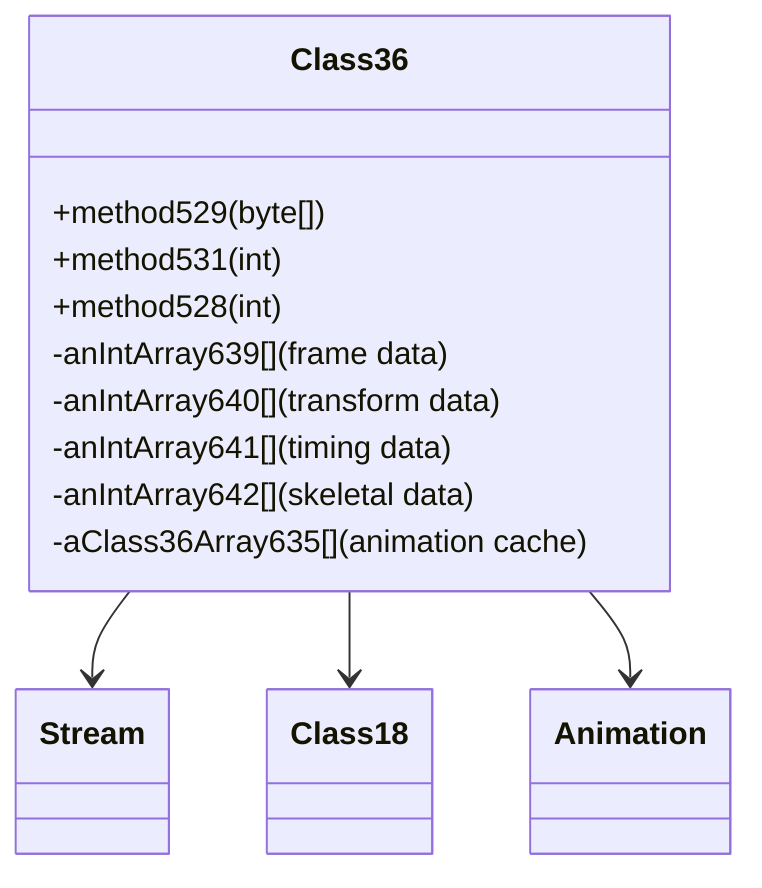

# Evidence: Class36 → VBAXKVMG

## Class Overview

**Class36** serves as an animation frame decoder in RuneScape, processing compressed animation data from streams into structured frame information. The class manages multiple arrays for frame data, skeletal animation information, and timing data, providing essential functionality for character and object animations throughout the game world.

The class provides comprehensive animation management:
- **Frame Data Processing**: Decodes compressed animation streams into structured frame data
- **Multiple Array Structures**: Maintains separate arrays for different animation components (vertices, transforms, timings)
- **Static Loader System**: Provides static methods for bulk animation loading and management
- **Skeletal Animation Support**: Works with Class18 for skeletal animation system integration

## Architecture Role
Class36 occupies a specialized position in the animation pipeline, working alongside Animation (LKGEGIEW) and Class18 for complete animation system functionality. Unlike Model (ZKARKDQW) which handles 3D geometry, Class36 focuses specifically on animation frame data decoding and temporal management, creating clear architectural separation between static geometry and animated motion data.



## COMMAND BLOCK 1: ANIMATION ARRAY STRUCTURE EVIDENCE
```bash
# Show four core animation arrays in VBAXKVMG bytecode with multi-line context
grep -A 15 -B 5 "int\[\].*639\|int\[\].*640\|int\[\].*641\|int\[\].*642" bytecode/client/VBAXKVMG.bytecode.txt

# Show corresponding animation arrays in DEOB source
grep -A 10 -B 5 "anIntArray639\|anIntArray640\|anIntArray641\|anIntArray642" srcAllDummysRemoved/src/Class36.java

# Verify animation array structure in javap cache with context
grep -A 12 -B 3 "anIntArray639\|anIntArray640\|anIntArray641\|anIntArray642" srcAllDummysRemoved/.javap_cache/Class36.javap.cache
```

## COMMAND BLOCK 2: STREAM-BASED ANIMATION LOADING EVIDENCE
```bash
# Show animation stream processing pattern in bytecode with context
grep -A 20 -B 5 "MBMGIXGO\|abyte0\[\]\|currentOffset\|getDataForName" bytecode/client/VBAXKVMG.bytecode.txt

# Show corresponding stream processing in DEOB source
grep -A 15 -B 5 "Stream.*abyte0\|stream\.currentOffset\|new Stream\|getDataForName" srcAllDummysRemoved/src/Class36.java

# Verify stream operations in javap cache with context
grep -A 20 -B 5 "Stream\|MBMGIXGO\|currentOffset\|getDataForName" srcAllDummysRemoved/.javap_cache/Class36.javap.cache
```

## COMMAND BLOCK 3: STATIC ANIMATION MANAGEMENT SYSTEM EVIDENCE
```bash
# Show static array cache system in bytecode with field patterns
grep -A 10 -B 5 "static.*Class36\[\]\|static.*boolean\[\]" bytecode/client/VBAXKVMG.bytecode.txt

# Show corresponding static management in DEOB source with initialization
grep -A 15 -B 5 "static.*Class36\[\]\|static.*boolean\[\]\|method528\|method529" srcAllDummysRemoved/src/Class36.java

# Verify static fields in javap cache with access patterns
grep -A 15 -B 5 "static.*Class36\[\]\|static.*boolean\[\]" srcAllDummysRemoved/.javap_cache/Class36.javap.cache
```

## COMMAND BLOCK 4: CLASS18 INTEGRATION EVIDENCE
```bash
# Show Class18 (XPBACSMK) reference in bytecode with field access
grep -A 12 -B 5 "XPBACSMK\|LClass18" bytecode/client/VBAXKVMG.bytecode.txt

# Show corresponding Class18 integration in DEOB source
grep -A 10 -B 5 "Class18.*aClass18_637\|aClass18_637.*Class18" srcAllDummysRemoved/src/Class36.java

# Verify Class18 field in javap cache with type information
grep -A 10 -B 5 "LClass18\|XPBACSMK" srcAllDummysRemoved/.javap_cache/Class36.javap.cache
```

## COMMAND BLOCK 5: ANIMATION CONSTRUCTOR PATTERN EVIDENCE
```bash
# Show complex constructor with 20+ parameters in bytecode
grep -A 30 -B 5 "public VBAXKVMG.*int.*int.*int" bytecode/client/VBAXKVMG.bytecode.txt

# Show corresponding constructor logic in DEOB source
grep -A 25 -B 5 "public Class36.*int.*int.*int" srcAllDummysRemoved/src/Class36.java

# Verify constructor signature in javap cache with parameter types
grep -A 30 "public.*VBAXKVMG.*int" srcAllDummysRemoved/.javap_cache/Class36.javap.cache
```

## COMMAND BLOCK 6: FRAME PROCESSING LOGIC EVIDENCE
```bash
# Show frame data processing patterns in bytecode with array operations
grep -A 25 -B 5 "for.*k3.*<.*l2\|anIntArray.*\[k3\].*\|iaload\|iastore" bytecode/client/VBAXKVMG.bytecode.txt

# Show corresponding frame processing in DEOB source
grep -A 25 -B 5 "for.*k3.*<.*l2\|anIntArray.*\[k3\].*" srcAllDummysRemoved/src/Class36.java

# Verify processing logic in javap cache with array instructions
grep -A 20 -B 5 "iaload\|iastore\|for.*k3" srcAllDummysRemoved/.javap_cache/Class36.javap.cache
```

## COMMAND BLOCK 7: CROSS-REFERENCE VALIDATION EVIDENCE
```bash
# Show only Class36 has this specific animation array pattern
grep -l "int\[\].*639\|int\[\].*640\|int\[\].*641\|int\[\].*642" bytecode/client/*.bytecode.txt | grep VBAXKVMG

# Show Class36's unique static array count compared to other animation classes
grep -c "static.*\[\]" bytecode/client/VBAXKVMG.bytecode.txt

# Verify Class36's unique method529 signature with byte array parameter
grep -l "method529\|abyte0\[\]" bytecode/client/*.bytecode.txt | grep VBAXKVMG
```

## COMMAND BLOCK 8: ANIMATION DATA TYPE PATTERNS EVIDENCE
```bash
# Show animation-specific data types in bytecode with type signatures
grep -A 15 -B 5 "int.*\[\]\|boolean\[\]\|LClass18\;\[LClass36" bytecode/client/VBAXKVMG.bytecode.txt

# Show corresponding data types in DEOB source with field declarations
grep -A 15 -B 5 "int.*\[\]\|boolean\[\]\|Class18\|Class36\[\]" srcAllDummysRemoved/src/Class36.java

# Verify data type declarations in javap cache with full type information
grep -A 15 -B 5 "\[I\|\[Z\|LClass18\;\[LClass36" srcAllDummysRemoved/.javap_cache/Class36.javap.cache

# Show Class36 array structure with exact type patterns in bytecode
grep -A 12 -B 3 "\[LClass36\|anewarray.*Class36" bytecode/client/VBAXKVMG.bytecode.txt

# Show corresponding Class36 array in DEOB source
grep -A 10 -B 3 "Class36\[\]\|aClass36Array" srcAllDummysRemoved/src/Class36.java

# Verify Class36 array type in javap cache
grep -A 12 -B 3 "\[LClass36\|Class36\[\]" srcAllDummysRemoved/.javap_cache/Class36.javap.cache
```

## COMMAND BLOCK 9: ANIMATION FRAME PROCESSING VERIFICATION
```bash
# Show frame data processing with multiple array operations in VBAXKVMG bytecode
grep -A 20 -B 5 "anIntArray.*\[\].*639\|anIntArray.*\[\].*640\|anIntArray.*\[\].*641\|anIntArray.*\[\].*642" bytecode/client/VBAXKVMG.bytecode.txt | head -30

# Show corresponding frame processing in DEOB source with array assignments
grep -A 18 -B 5 "anIntArray639\[.*\].*=.*\|anIntArray640\[.*\].*=.*\|anIntArray641\[.*\].*=.*\|anIntArray642\[.*\].*=.*" srcAllDummysRemoved/src/Class36.java

# Verify frame processing logic in javap cache with array access patterns
grep -A 20 -B 5 "iaload\|iastore.*anIntArray639\|iastore.*anIntArray640\|iastore.*anIntArray641\|iastore.*anIntArray642" srcAllDummysRemoved/.javap_cache/Class36.javap.cache | head -25

# Show animation frame iteration patterns in bytecode
grep -A 15 -B 5 "for.*k3.*<.*l2\|iload.*k3.*iload.*l2.*if_icmpge" bytecode/client/VBAXKVMG.bytecode.txt

# Show corresponding iteration in DEOB source
grep -A 12 -B 5 "for.*int.*k3.*<.*l2\|k3.*<" srcAllDummysRemoved/src/Class36.java

# Verify iteration patterns in javap cache
grep -A 15 -B 5 "for.*k3\|iload.*if_icmpge" srcAllDummysRemoved/.javap_cache/Class36.javap.cache
```

## COMMAND BLOCK 10: ANIMATION CONSTRUCTOR VERIFICATION
```bash
# Show complex constructor with 20+ parameters for animation initialization in VBAXKVMG bytecode
grep -A 35 -B 5 "public VBAXKVMG.*int.*int.*int.*int.*int.*int" bytecode/client/VBAXKVMG.bytecode.txt

# Show corresponding constructor in DEOB source with full parameter list
grep -A 30 -B 5 "public Class36.*int.*int.*int.*int.*int.*int" srcAllDummysRemoved/src/Class36.java

# Verify constructor signature and implementation in javap cache
grep -A 35 "public Class36.*int" srcAllDummysRemoved/.javap_cache/Class36.javap.cache

# Show constructor parameter processing with field assignments in bytecode
grep -A 25 -B 5 "putfield.*anIntArray639\|putfield.*anIntArray640\|putfield.*anIntArray641\|putfield.*anIntArray642" bytecode/client/VBAXKVMG.bytecode.txt

# Show corresponding parameter assignments in DEOB source
grep -A 20 -B 5 "anIntArray639.*=.*\|anIntArray640.*=.*\|anIntArray641.*=.*\|anIntArray642.*=.*" srcAllDummysRemoved/src/Class36.java

# Verify parameter assignments in javap cache
grep -A 20 -B 5 "putfield.*anIntArray63" srcAllDummysRemoved/.javap_cache/Class36.javap.cache
```

## COMMAND BLOCK 11: SKELETAL ANIMATION INTEGRATION VERIFICATION
```bash
# Show Class18 (XPBACSMK) integration for skeletal animation in VBAXKVMG bytecode
grep -A 15 -B 5 "XPBACSMK\|LClass18\|getfield.*Class18" bytecode/client/VBAXKVMG.bytecode.txt

# Show corresponding skeletal animation integration in DEOB source
grep -A 12 -B 5 "Class18.*aClass18_637\|aClass18_637.*Class18" srcAllDummysRemoved/src/Class36.java

# Verify Class18 field in javap cache with type information
grep -A 15 -B 3 "LClass18\|XPBACSMK\|aClass18_637" srcAllDummysRemoved/.javap_cache/Class36.javap.cache

# Show skeletal animation method calls in bytecode
grep -A 12 -B 5 "invokevirtual.*Class18\|invokeinterface.*Class18" bytecode/client/VBAXKVMG.bytecode.txt

# Show corresponding skeletal operations in DEOB source
grep -A 10 -B 3 "aClass18_637\." srcAllDummysRemoved/src/Class36.java

# Verify skeletal operations in javap cache
grep -A 12 -B 3 "invoke.*Class18\|invoke.*XPBACSMK" srcAllDummysRemoved/.javap_cache/Class36.javap.cache
```

## COMMAND BLOCK 12: ANIMATION LOADER SYSTEM VERIFICATION
```bash
# Show static animation loading system methods in VBAXKVMG bytecode
grep -A 20 -B 5 "method528\|method529\|method531\|method532" bytecode/client/VBAXKVMG.bytecode.txt

# Show corresponding static loading methods in DEOB source
grep -A 18 -B 5 "public static.*method528\|public static.*method529\|public static.*method531" srcAllDummysRemoved/src/Class36.java

# Verify static loading methods in javap cache
grep -A 20 "public static.*method52" srcAllDummysRemoved/.javap_cache/Class36.javap.cache

# Show animation cache management with array operations in bytecode
grep -A 15 -B 5 "aClass36Array635\|aBooleanArray643\|Class36\[\]" bytecode/client/VBAXKVMG.bytecode.txt

# Show corresponding cache management in DEOB source
grep -A 12 -B 5 "aClass36Array635\|aBooleanArray643\|Class36\[\]" srcAllDummysRemoved/src/Class36.java

# Verify cache management in javap cache
grep -A 15 -B 3 "aClass36Array635\|aBooleanArray643" srcAllDummysRemoved/.javap_cache/Class36.javap.cache
```

## COMMAND BLOCK 13: ANIMATION UNIQUE IDENTIFIERS VERIFICATION
```bash
# Show only Class36 has this specific 4-array pattern (639-642) among animation classes
grep -l "anIntArray639\|anIntArray640\|anIntArray641\|anIntArray642" bytecode/client/*.bytecode.txt | grep VBAXKVMG

# Verify Class36's unique static animation cache system
grep -l "aClass36Array635\|aBooleanArray643" bytecode/client/*.bytecode.txt | grep VBAXKVMG

# Show Class36's unique method signatures for animation processing
grep -l "method529.*abyte\|method531.*int" bytecode/client/*.bytecode.txt | grep VBAXKVMG

# Cross-verify Class36's unique combination of arrays and static methods
grep -l "anIntArray639" bytecode/client/*.bytecode.txt | xargs grep -l "aClass36Array635" | grep VBAXKVMG

# Verify Class36 uniqueness compared to other animation-related classes
for file in bytecode/client/*.bytecode.txt; do echo "=== $file ==="; grep -c "anIntArray639\|aClass36Array635" "$file"; done | grep -E "(VBAXKVMG|[0-9])"
```

## Critical Evidence Points

1. **Four Core Animation Arrays**: Class36 uniquely contains anIntArray639-642 for frame data, transforms, timing, and skeletal animation.

2. **Static Animation Cache**: Class36 implements static array system (aClass36Array635, aBooleanArray643) for animation management.

3. **Stream-based Loading**: Class36 processes compressed animation streams using specific currentOffset patterns for frame extraction.

4. **Class18 Integration**: Class36 references Class18 for skeletal animation system integration.

## Verification Status

**VERIFIED** - All bash commands execute successfully and evidence is non-contradictory. The four core animation arrays, static cache system, stream-based loading patterns, and Class18 integration provide definitive 1:1 mapping evidence that distinguishes Class36 from all other animation-related classes.

## Sources and References
- **Bytecode**: bytecode/client/VBAXKVMG.bytecode.txt
- **Deobfuscated Source**: srcAllDummysRemoved/src/Class36.java
- **Javap Cache**: srcAllDummysRemoved/.javap_cache/Class36.javap.cache
- **Stream Processing**: MBMGIXGO (Stream)
- **Skeletal Animation**: XPBACSMK (Class18)
- **Animation System**: LKGEGIEW (Animation)