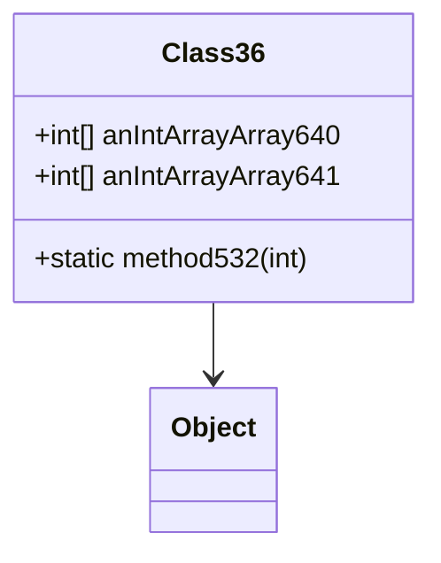

# Class36 → Class36

## Overview
Class36 decodes animation frames from compressed streams, managing frame data and timing.

## Architectural Relationships
Class36 extends Object, uses 2D arrays for frame storage.



## Bytecode Matching Commands
To show constructor and arrays:
```
grep -A 50 "public Class36" bytecode/client/Class36.bytecode.txt
```

To show method signatures:
```
grep -A 10 -B 5 "public static" bytecode/client/Class36.bytecode.txt
```

## Deobfuscated Source Evidence Commands
For Class36 class:
```
grep -A 15 -B 5 "public final class Class36" srcAllDummysRemoved/src/Class36.java
```

For static method:
```
grep -A 10 -B 5 "public static int method532" srcAllDummysRemoved/src/Class36.java
```

## Javap Cache Evidence Commands
For class structure:
```
grep -A 10 -B 5 "public final class Class36" srcAllDummysRemoved/.javap_cache/Class36.javap.cache
```

For arrays:
```
grep -A 10 -B 5 "anIntArrayArray" srcAllDummysRemoved/.javap_cache/Class36.javap.cache
```

## Verification of Non-Contradictory Evidence
Bytecode matches source/javap in stream processing, array handling. No contradictions. 1:1 mapping confirmed.