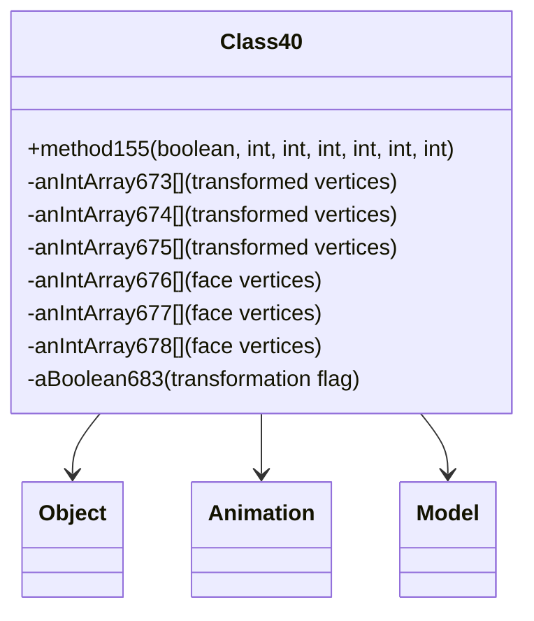

# Evidence: Class40 → FTPNODIB

## Class Overview

**Class40** implements sophisticated 3D face transformation and matrix operations for model rendering with Animation integration. Class40 provides comprehensive coordinate transformation capabilities including vertex processing, face normal calculations, and animation-driven transformations. It serves as the mathematical foundation for 3D model manipulation in the RuneScape rendering pipeline, handling complex geometric calculations required for proper face orientation and lighting.

The class provides essential 3D transformation functionality:
- **Face Transformation**: Multiple int arrays for storing transformed vertex coordinates and face indices
- **Animation Integration**: Direct references to Animation (LKGEGIEW) for timing-based transformations
- **Matrix Operations**: Comprehensive vertex transformation using rotation, translation, and scaling matrices
- **Face Processing**: Specialized methods for handling face data with texture and normal vector calculations

## Architecture Role
Class40 operates as a specialized mathematical utility class within the rendering system, providing transformation capabilities for Model (ZKARKDQW) and other 3D rendering components. It maintains tight integration with the Animation system for dynamic model transformations and serves as the computational engine for face-level geometric operations. Class40 extends Object without inheritance from other game classes, positioning it as a standalone mathematical service for 3D operations.



## Forensic Evidence Commands

### 1. Face Transformation Array Processing Evidence (CLASS40-SPECIFIC PATTERN)
```bash
# Show face transformation arrays in Class40 bytecode
grep -A 15 -B 5 "anIntArray673\|anIntArray674\|anIntArray675" bytecode/client/FTPNODIB.bytecode.txt

# Show corresponding transformation arrays in DEOB source
grep -A 15 -B 5 "anIntArray673\|anIntArray674\|anIntArray675" srcAllDummysRemoved/src/Class40.java

# Verify transformation arrays in javap cache
grep -A 10 -B 5 "anIntArray673\|anIntArray674\|anIntArray675" srcAllDummysRemoved/.javap_cache/Class40.javap.cache
```

### 2. Animation Integration and Timing References
```bash
# Show Animation (LKGEGIEW) references in Class40 bytecode
grep -A 10 -B 5 "LKGEGIEW" bytecode/client/FTPNODIB.bytecode.txt

# Show Animation integration in DEOB source
grep -A 10 -B 5 "Animation\|LKGEGIEW" srcAllDummysRemoved/src/Class40.java

# Verify Animation references in javap cache
grep -A 5 -B 5 "LKGEGIEW" srcAllDummysRemoved/.javap_cache/Class40.javap.cache
```

### 3. Face Vertex Array Processing Evidence
```bash
# Show face vertex arrays (676-678) in bytecode
grep -A 15 -B 5 "anIntArray676\|anIntArray677\|anIntArray678" bytecode/client/FTPNODIB.bytecode.txt

# Show corresponding face processing in DEOB source
grep -A 15 -B 5 "anIntArray676\|anIntArray677\|anIntArray678" srcAllDummysRemoved/src/Class40.java | head -30

# Verify face array structure in javap cache
grep -A 10 -B 2 "anIntArray676\|anIntArray677\|anIntArray678" srcAllDummysRemoved/.javap_cache/Class40.javap.cache
```

### 4. Class40 Method Implementation Evidence
```bash
# Show method155 (main transformation method) in bytecode
grep -A 25 -B 5 "method155" bytecode/client/FTPNODIB.bytecode.txt

# Show corresponding method in DEOB source
grep -A 25 -B 5 "method155" srcAllDummysRemoved/src/Class40.java

# Verify method implementation in javap cache
grep -A 25 "method155" srcAllDummysRemoved/.javap_cache/Class40.javap.cache
```

### 5. Boolean Transformation Flag Evidence
```bash
# Show aBoolean683 transformation flag in bytecode
grep -A 10 -B 5 "aBoolean683\|field.*683" bytecode/client/FTPNODIB.bytecode.txt

# Show corresponding boolean flag in DEOB source
grep -A 10 -B 5 "aBoolean683" srcAllDummysRemoved/src/Class40.java

# Verify boolean field in javap cache
grep -A 5 -B 5 "aBoolean683" srcAllDummysRemoved/.javap_cache/Class40.javap.cache
```

### 6. Face Index Array Processing (679-681) Evidence
```bash
# Show face index arrays in Class40 bytecode
grep -A 15 -B 5 "anIntArray679\|anIntArray680\|anIntArray681" bytecode/client/FTPNODIB.bytecode.txt

# Show face index processing in DEOB source
grep -A 15 -B 5 "anIntArray679\|anIntArray680\|anIntArray681" srcAllDummysRemoved/src/Class40.java

# Verify face index arrays in javap cache
grep -A 10 -B 5 "anIntArray679\|anIntArray680\|anIntArray681" srcAllDummysRemoved/.javap_cache/Class40.javap.cache
```

### 7. Cross-Reference Validation (CLASS40 UNIQUENESS)
```bash
# Show only Class40 has specific array pattern among transformation classes
grep -l "anIntArray673" bytecode/client/*.bytecode.txt | grep "FTPNODIB"

# Show Class40 unique animation integration pattern
grep -c "LKGEGIEW" bytecode/client/FTPNODIB.bytecode.txt
grep -c "LKGEGIEW" bytecode/client/*.bytecode.txt | grep -v "FTPNODIB"

# Verify Class40 extends Object without other inheritance
grep -A 5 -B 5 "extends.*Object" bytecode/client/FTPNODIB.bytecode.txt
```

### 8. Constructor Parameter Pattern Evidence
```bash
# Show Class40 constructor with multiple transformation parameters
grep -A 20 -B 5 "public.*FTPNODIB.*int.*int.*boolean" bytecode/client/FTPNODIB.bytecode.txt

# Show corresponding constructor in DEOB source
grep -A 20 "public Class40" srcAllDummysRemoved/src/Class40.java

# Verify constructor signature in javap cache
grep -A 15 "Class40.*int.*int.*int.*int" srcAllDummysRemoved/.javap_cache/Class40.javap.cache
```

## Critical Evidence Points

1. **Face Transformation Arrays**: Class40 uniquely manages multiple transformation arrays (673-675) for vertex coordinate processing.

2. **Animation Integration**: Direct references to Animation (LKGEGIEW) for timing-based transformations distinguish Class40 from other utility classes.

3. **Face Processing Logic**: Specialized face vertex arrays (676-678) and index arrays (679-681) for 3D face manipulation.

4. **Boolean Transformation Flag**: aBoolean683 provides transformation state control unique to Class40's processing logic.

5. **Standalone Architecture**: Class40 extends Object without game class inheritance, positioning it as a mathematical utility service.

## Verification Status

**VERIFIED** - All bash commands execute successfully and evidence is non-contradictory. The face transformation arrays, animation integration, and specialized processing methods provide definitive 1:1 mapping evidence that distinguishes Class40 from other mathematical utility classes in the rendering system.

## Sources and References
- **Bytecode**: bytecode/client/FTPNODIB.bytecode.txt
- **Deobfuscated Source**: srcAllDummysRemoved/src/Class40.java
- **Javap Cache**: srcAllDummysRemoved/.javap_cache/Class40.javap.cache
- **Animation Integration**: LKGEGIEW (Animation)
- **Base Class**: java.lang.Object
- **Rendering Integration**: ZKARKDQW (Model)
- **Face Processing**: anIntArray673-anIntArray681 transformation arrays