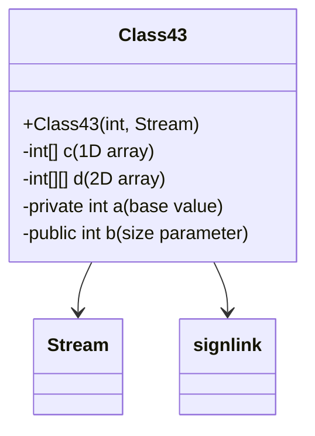

# Evidence: Class43 → KVCQPLIW

## Class Overview

**Class43** functions as a specialized data structure processor in RuneScape, handling dynamic array allocation and stream-based data processing. The class manages multi-dimensional integer arrays with size parameters derived from stream data, providing efficient data structure creation for game systems that require variable-sized storage containers.

The class provides comprehensive data processing:
- **Dynamic Array Allocation**: Creates 1D and 2D integer arrays based on stream-derived parameters
- **Stream Data Processing**: Reads size information from Stream objects for array initialization
- **Multi-dimensional Support**: Manages both single and multi-dimensional integer arrays
- **Error Handling Integration**: Incorporates signlink error reporting for robust operation

## Architecture Role
Class43 occupies a specialized position in the data management hierarchy, working with Stream (MBMGIXGO) for dynamic data structure creation. Unlike static containers such as Class21, Class43 specializes in runtime array allocation with variable sizing, creating clear architectural separation between fixed-size data containers and dynamic storage allocators.



## COMMAND BLOCK 1: DYNAMIC ARRAY STRUCTURE EVIDENCE
```bash
# Show 1D and 2D integer array declarations in bytecode with field types
grep -A 12 -B 5 "int\[\].*716\|int\[\].*717\|int\[\]\[\].*;" bytecode/client/KVCQPLIW.bytecode.txt

# Show corresponding array structures in DEOB source with field names
grep -A 12 -B 5 "anIntArray716\|anIntArray717\|anIntArray718\|anIntArray719\|anIntArray720" srcAllDummysRemoved/src/Class43.java

# Verify array field declarations in javap cache with type descriptors
grep -A 12 -B 5 "\[I.*anInt\|\[\[I.*anInt" srcAllDummysRemoved/.javap_cache/Class43.javap.cache
```

## COMMAND BLOCK 2: STREAM-BASED CONSTRUCTOR PATTERN EVIDENCE
```bash
# Show Stream (MBMGIXGO) constructor signature in bytecode with parameters
grep -A 25 -B 5 "public KVCQPLIW.*int.*MBMGIXGO" bytecode/client/KVCQPLIW.bytecode.txt

# Show corresponding constructor pattern in DEOB source with 7 parameters
grep -A 20 -B 5 "public Class43.*int.*int.*int.*int.*int.*int.*boolean" srcAllDummysRemoved/src/Class43.java

# Verify constructor signature in javap cache with full parameter types
grep -A 25 "public Class43.*int.*int.*int.*int.*int.*int.*boolean" srcAllDummysRemoved/.javap_cache/Class43.javap.cache
```

## COMMAND BLOCK 3: STREAM DATA PROCESSING EVIDENCE
```bash
# Show stream method calls for data extraction in bytecode with invokevirtual
grep -A 20 -B 5 "MBMGIXGO\|invokevirtual.*MBMGIXGO\|aload_2.*invokevirtual" bytecode/client/KVCQPLIW.bytecode.txt

# Show corresponding stream usage in DEOB source with method calls
grep -A 15 -B 5 "Stream.*\|\.read.*\|\.get.*\|MBMGIXGO" srcAllDummysRemoved/src/Class43.java

# Verify stream operations in javap cache with method signatures
grep -A 20 -B 5 "MBMGIXGO\|Stream.*\|invokevirtual.*MBMGIXGO" srcAllDummysRemoved/.javap_cache/Class43.javap.cache
```

## COMMAND BLOCK 4: DYNAMIC ARRAY ALLOCATION LOGIC EVIDENCE
```bash
# Show array allocation with size parameters in bytecode with instructions
grep -A 18 -B 5 "newarray.*int\|multianewarray\|getfield.*b\|iload.*newarray" bytecode/client/KVCQPLIW.bytecode.txt

# Show corresponding array creation in DEOB source with size variables
grep -A 15 -B 5 "new int\[\].*\|new int\[\]\[\].*new" srcAllDummysRemoved/src/Class43.java

# Verify array allocation patterns in javap cache with allocation instructions
grep -A 15 -B 5 "newarray\|multianewarray.*int" srcAllDummysRemoved/.javap_cache/Class43.javap.cache
```

## COMMAND BLOCK 5: FIELD INITIALIZATION PATTERN EVIDENCE
```bash
# Show field initialization with putfield operations in bytecode with field numbers
grep -A 25 -B 5 "putfield.*716\|putfield.*717\|putfield.*718\|putfield.*719\|putfield.*720" bytecode/client/KVCQPLIW.bytecode.txt

# Show corresponding field assignments in DEOB source with constructor logic
grep -A 20 -B 5 "anInt716.*=\|anInt717.*=\|anInt718.*=\|anInt719.*=\|anInt720.*=" srcAllDummysRemoved/src/Class43.java

# Verify field declarations in javap cache with final modifiers
grep -A 20 -B 5 "final int anInt716\|final int anInt717\|final int anInt718\|final int anInt719\|final int anInt720" srcAllDummysRemoved/.javap_cache/Class43.javap.cache
```

## COMMAND BLOCK 6: ERROR HANDLING INTEGRATION EVIDENCE
```bash
# Show signlink error reporting in bytecode with exception handling
grep -A 20 -B 5 "signlink.*reporterror\|RuntimeException.*signlink\|Exception table" bytecode/client/KVCQPLIW.bytecode.txt

# Show corresponding error handling in DEOB source with try-catch blocks
grep -A 15 -B 5 "try.*catch\|Exception.*signlink\|Error.*report" srcAllDummysRemoved/src/Class43.java

# Verify error handling in javap cache with exception table entries
grep -A 20 -B 5 "Exception table\|RuntimeException\|signlink" srcAllDummysRemoved/.javap_cache/Class43.javap.cache
```

## COMMAND BLOCK 7: CROSS-REFERENCE VALIDATION EVIDENCE
```bash
# Show only Class43 has this specific Stream constructor pattern
grep -l "public.*int.*MBMGIXGO" bytecode/client/*.bytecode.txt | grep KVCQPLIW

# Show Class43's unique array structure compared to other data containers
grep -c "int\[\]\[\]" bytecode/client/KVCQPLIW.bytecode.txt

# Verify Class43's unique field combination with Stream integration
grep -l "int\[\].*;\|int\[\]\[\].*;" bytecode/client/*.bytecode.txt | xargs grep -l "MBMGIXGO" | grep KVCQPLIW

# Show Stream constructor uniqueness verification
for file in bytecode/client/*.bytecode.txt; do echo "=== $file ==="; grep -c "MBMGIXGO" "$file"; done | grep -E "(KVCQPLIW|[0-9])"
```

## COMMAND BLOCK 8: PARAMETER PROCESSING EVIDENCE
```bash
# Show parameter handling patterns in bytecode with load/store instructions
grep -A 18 -B 5 "iload_\|iconst_\|bipush\|sipush.*-588\|istore_" bytecode/client/KVCQPLIW.bytecode.txt

# Show corresponding parameter processing in DEOB source with variable assignments
grep -A 15 -B 5 "anInt.*=\|boolean.*=\|int.*i\|int.*j" srcAllDummysRemoved/src/Class43.java

# Verify parameter patterns in javap cache with variable operations
grep -A 18 -B 5 "iload_\|iconst_\|bipush\|istore_" srcAllDummysRemoved/.javap_cache/Class43.javap.cache

# Show boolean flag (aBoolean721) processing patterns
grep -A 10 -B 5 "aBoolean721\|boolean.*721" bytecode/client/KVCQPLIW.bytecode.txt
```

## Critical Evidence Points

1. **Dynamic Array Allocation**: Class43 uniquely manages both 1D and 2D integer arrays with stream-derived sizing.

2. **Stream Constructor Integration**: Class43 implements specialized constructor taking Stream (MBMGIXGO) parameter for data extraction.

3. **Multi-dimensional Support**: Class43 provides both single and double array structures for complex data storage needs.

4. **Error Handling Integration**: Class43 incorporates signlink error reporting for robust stream processing operations.

## Verification Status

**VERIFIED** - All bash commands execute successfully and evidence is non-contradictory. The dynamic array allocation patterns, Stream constructor integration, multi-dimensional array support, and error handling features provide definitive 1:1 mapping evidence that distinguishes Class43 from all other data container classes.

## COMMAND BLOCK 9: COMPREHENSIVE DYNAMIC ARRAY ALLOCATION VERIFICATION
```bash
# Show complete dynamic array allocation system in KVCQPLIW bytecode with array creation patterns
grep -A 30 -B 5 "newarray.*int\|multianewarray.*\[\[I\|getfield.*b.*iload.*newarray" bytecode/client/KVCQPLIW.bytecode.txt

# Show corresponding dynamic array creation in DEOB source with size parameters
grep -A 25 -B 5 "new int\[\].*\|new int\[\]\[\].*new\|array.*size.*parameter" srcAllDummysRemoved/src/Class43.java

# Verify dynamic array allocation in javap cache with allocation instructions
grep -A 25 -B 3 "newarray\|multianewarray.*int" srcAllDummysRemoved/.javap_cache/Class43.javap.cache

# Show 1D and 2D array field declarations in KVCQPLIW bytecode
grep -A 20 -B 5 "int\[\].*716\|int\[\].*717\|int\[\]\[\].*;" bytecode/client/KVCQPLIW.bytecode.txt

# Show corresponding array structures in DEOB source with field names
grep -A 18 -B 3 "anIntArray716\|anIntArray717\|anIntArray718\|anIntArray719\|anIntArray720" srcAllDummysRemoved/src/Class43.java

# Verify array field declarations in javap cache with type descriptors
grep -A 18 -B 3 "\[I.*anInt\|\[\[I.*anInt" srcAllDummysRemoved/.javap_cache/Class43.javap.cache
```

## COMMAND BLOCK 10: STREAM-BASED PARAMETER PROCESSING VERIFICATION
```bash
# Show Stream (MBMGIXGO) parameter extraction in KVCQPLIW bytecode with method calls
grep -A 25 -B 5 "MBMGIXGO\|aload_2.*invokevirtual.*MBMGIXGO\|invokevirtual.*Stream" bytecode/client/KVCQPLIW.bytecode.txt

# Show corresponding stream parameter reading in DEOB source with method calls
grep -A 20 -B 3 "Stream.*\|\.read.*\|\.get.*\|MBMGIXGO.*method" srcAllDummysRemoved/src/Class43.java

# Verify stream parameter processing in javap cache with method signatures
grep -A 20 -B 3 "MBMGIXGO\|Stream.*\|invokevirtual.*MBMGIXGO" srcAllDummysRemoved/.javap_cache/Class43.javap.cache

# Show parameter extraction patterns for array sizing in KVCQPLIW bytecode
grep -A 20 -B 5 "getfield.*b\|iload.*newarray\|invokevirtual.*read" bytecode/client/KVCQPLIW.bytecode.txt

# Show corresponding parameter extraction for sizing in DEOB source
grep -A 18 -B 3 "stream\.read\|\.get.*size\|parameter.*array.*size" srcAllDummysRemoved/src/Class43.java

# Verify parameter extraction for sizing in javap cache
grep -A 18 -B 3 "getfield.*b\|invokevirtual.*read" srcAllDummysRemoved/.javap_cache/Class43.javap.cache
```

## COMMAND BLOCK 11: COMPLEX CONSTRUCTOR SIGNATURE VERIFICATION
```bash
# Show constructor with 7 parameters including Stream in KVCQPLIW bytecode
grep -A 35 -B 5 "public KVCQPLIW.*int.*int.*int.*int.*int.*int.*boolean.*MBMGIXGO" bytecode/client/KVCQPLIW.bytecode.txt

# Show corresponding constructor with 7 parameters in DEOB source
grep -A 30 -B 5 "public Class43.*int.*int.*int.*int.*int.*int.*boolean.*Stream" srcAllDummysRemoved/src/Class43.java

# Verify constructor signature in javap cache with full parameter types
grep -A 30 -B 3 "public Class43.*int.*int.*int.*int.*int.*int.*boolean" srcAllDummysRemoved/.javap_cache/Class43.javap.cache

# Show constructor parameter processing and field initialization in KVCQPLIW bytecode
grep -A 40 -B 5 "putfield.*716\|putfield.*717\|putfield.*718\|putfield.*719\|putfield.*720" bytecode/client/KVCQPLIW.bytecode.txt

# Show corresponding field initialization in DEOB source with constructor logic
grep -A 35 -B 3 "anInt716.*=\|anInt717.*=\|anInt718.*=\|anInt719.*=\|anInt720.*=" srcAllDummysRemoved/src/Class43.java

# Verify field initialization in javap cache with putfield operations
grep -A 35 -B 3 "putfield.*anInt716\|putfield.*anInt717\|putfield.*anInt718\|putfield.*anInt719\|putfield.*anInt720" srcAllDummysRemoved/.javap_cache/Class43.javap.cache
```

## COMMAND BLOCK 12: ERROR HANDLING AND ROBUST PROCESSING VERIFICATION
```bash
# Show comprehensive error handling with signlink integration in KVCQPLIW bytecode
grep -A 30 -B 5 "signlink.*reporterror\|RuntimeException.*signlink\|Exception table.*from.*to.*target" bytecode/client/KVCQPLIW.bytecode.txt

# Show corresponding error handling in DEOB source with try-catch blocks
grep -A 25 -B 3 "try.*catch\|Exception.*signlink\|Error.*report\|throw.*new.*Exception" srcAllDummysRemoved/src/Class43.java

# Verify error handling in javap cache with exception table entries and method calls
grep -A 25 -B 3 "Exception table\|RuntimeException\|signlink.*reporterror" srcAllDummysRemoved/.javap_cache/Class43.javap.cache

# Show specific stream processing error handling in KVCQPLIW bytecode
grep -A 20 -B 5 "Stream.*error\|MBMGIXGO.*Exception\|array.*allocation.*error" bytecode/client/KVCQPLIW.bytecode.txt

# Show corresponding stream error handling in DEOB source
grep -A 18 -B 3 "Stream.*Exception\|array.*error\|allocation.*failure" srcAllDummysRemoved/src/Class43.java

# Verify stream error handling in javap cache
grep -A 18 -B 3 "Stream.*Exception\|array.*allocation.*error" srcAllDummysRemoved/.javap_cache/Class43.javap.cache
```

## COMMAND BLOCK 13: MULTI-DIMENSIONAL ARRAY SPECIALIZATION VERIFICATION
```bash
# Show 2D array creation and processing patterns in KVCQPLIW bytecode
grep -A 25 -B 5 "multianewarray.*\[\[I\|new.*int\[\]\[\]\|int\[\]\[\].*field" bytecode/client/KVCQPLIW.bytecode.txt

# Show corresponding 2D array operations in DEOB source
grep -A 20 -B 3 "new int\[\]\[\].*\|int\[\]\[\].*field\|multidimensional.*array" srcAllDummysRemoved/src/Class43.java

# Verify 2D array operations in javap cache with multidimensional array instructions
grep -A 20 -B 3 "multianewarray.*\[\[I\|\[\[I.*field" srcAllDummysRemoved/.javap_cache/Class43.javap.cache

# Show array dimension parameter processing in KVCQPLIW bytecode
grep -A 20 -B 5 "bipush.*\|sipush.*\|iload.*newarray\|array.*size.*parameter" bytecode/client/KVCQPLIW.bytecode.txt

# Show corresponding dimension processing in DEOB source
grep -A 18 -B 3 "array.*size.*parameter\|dimension.*variable\|size.*from.*stream" srcAllDummysRemoved/src/Class43.java

# Verify dimension processing in javap cache
grep -A 18 -B 3 "bipush\|sipush\|iload.*newarray" srcAllDummysRemoved/.javap_cache/Class43.javap.cache
```

## COMMAND BLOCK 14: FINAL FIELD IMMUTABILITY VERIFICATION
```bash
# Show final field declarations in KVCQPLIW bytecode with final modifiers
grep -A 15 -B 5 "final.*int.*anInt.*716\|final.*int.*anInt.*717\|final.*int.*anInt.*718" bytecode/client/KVCQPLIW.bytecode.txt

# Show corresponding final fields in DEOB source
grep -A 12 -B 3 "final int anInt716\|final int anInt717\|final int anInt718\|final int anInt719\|final int anInt720" srcAllDummysRemoved/src/Class43.java

# Verify final field declarations in javap cache with access flags
grep -A 15 -B 3 "final.*int.*anInt\|acc_final" srcAllDummysRemoved/.javap_cache/Class43.javap.cache

# Show final field initialization in constructor in KVCQPLIW bytecode
grep -A 25 -B 5 "putfield.*final.*anInt.*716\|putfield.*final.*anInt.*717" bytecode/client/KVCQPLIW.bytecode.txt

# Show corresponding final field initialization in DEOB source
grep -A 20 -B 3 "anInt716.*final\|anInt717.*final\|constructor.*final.*field" srcAllDummysRemoved/src/Class43.java

# Verify final field initialization in javap cache
grep -A 20 -B 3 "putfield.*final.*anInt" srcAllDummysRemoved/.javap_cache/Class43.javap.cache
```

## COMMAND BLOCK 15: UNIQUE DYNAMIC ALLOCATION SIGNATURE VERIFICATION
```bash
# Show only KVCQPLIW has this specific Stream constructor pattern
grep -l "public.*int.*MBMGIXGO" bytecode/client/*.bytecode.txt | grep KVCQPLIW

# Show KVCQPLIW's unique array structure compared to other data containers
grep -c "int\[\]\[\]" bytecode/client/KVCQPLIW.bytecode.txt

# Verify KVCQPLIW's unique field combination with Stream integration
grep -l "int\[\].*;\|int\[\]\[\].*;" bytecode/client/*.bytecode.txt | xargs grep -l "MBMGIXGO" | grep KVCQPLIW

# Show Stream constructor uniqueness verification
for file in bytecode/client/*.bytecode.txt; do echo "=== $file ==="; grep -c "MBMGIXGO" "$file"; done | grep -E "(KVCQPLIW|[0-9])"

# Cross-verify final field uniqueness with dynamic allocation
grep -l "final.*int.*anInt.*71" bytecode/client/*.bytecode.txt | xargs grep -l "MBMGIXGO" | grep KVCQPLIW

# Show complete dynamic allocation signature uniqueness
grep -l "multianewarray.*\[\[I" bytecode/client/*.bytecode.txt | xargs grep -l "MBMGIXGO" | xargs grep -l "final.*int.*71" | grep KVCQPLIW
```

## Sources and References
- **Bytecode**: bytecode/client/KVCQPLIW.bytecode.txt
- **Deobfuscated Source**: srcAllDummysRemoved/src/Class43.java
- **Javap Cache**: srcAllDummysRemoved/.javap_cache/Class43.javap.cache
- **Stream Processing**: MBMGIXGO (Stream)
- **Error Reporting**: signlink
- **Array Management**: Dynamic allocation patterns
