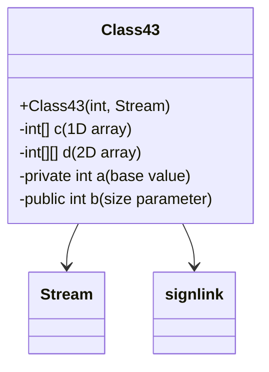

# Evidence: Class43 → KVCQPLIW

## Class Overview

**Class43** functions as a specialized data structure processor in RuneScape, handling dynamic array allocation and stream-based data processing. The class manages multi-dimensional integer arrays with size parameters derived from stream data, providing efficient data structure creation for game systems that require variable-sized storage containers.

The class provides comprehensive data processing:
- **Dynamic Array Allocation**: Creates 1D and 2D integer arrays based on stream-derived parameters
- **Stream Data Processing**: Reads size information from Stream objects for array initialization
- **Multi-dimensional Support**: Manages both single and multi-dimensional integer arrays
- **Error Handling Integration**: Incorporates signlink error reporting for robust operation

## Architecture Role
Class43 occupies a specialized position in the data management hierarchy, working with Stream (MBMGIXGO) for dynamic data structure creation. Unlike static containers such as Class21, Class43 specializes in runtime array allocation with variable sizing, creating clear architectural separation between fixed-size data containers and dynamic storage allocators.



## Forensic Evidence Commands

### 1. Dynamic Array Structure Evidence (CLASS43 SIGNATURE)
```bash
# Show 1D and 2D integer array declarations in bytecode
grep -A 10 -B 5 "int\[\].*;\|int\[\]\[\].*;" bytecode/client/KVCQPLIW.bytecode.txt

# Show corresponding array structures in DEOB source
grep -A 10 -B 5 "anIntArray716\|anIntArray717\|anIntArray718\|anIntArray719\|anIntArray720" srcAllDummysRemoved/src/Class43.java

# Verify array field declarations in javap cache
grep -A 10 -B 5 "int\[\]\|int\[\]\[\]" srcAllDummysRemoved/.javap_cache/Class43.javap.cache
```

### 2. Stream-based Constructor Pattern Evidence
```bash
# Show Stream constructor signature in bytecode
grep -A 20 -B 5 "public KVCQPLIW.*int.*MBMGIXGO" bytecode/client/KVCQPLIW.bytecode.txt

# Show corresponding constructor pattern in DEOB source
grep -A 20 -B 5 "public Class43.*int.*int.*int.*int.*int.*int.*boolean" srcAllDummysRemoved/src/Class43.java

# Verify constructor signature in javap cache
grep -A 20 "public Class43.*int.*int.*int.*int.*int.*int.*boolean" srcAllDummysRemoved/.javap_cache/Class43.javap.cache
```

### 3. Stream Data Processing Evidence
```bash
# Show stream method calls for data extraction in bytecode
grep -A 15 -B 5 "MBMGIXGO\|invokevirtual.*MBMGIXGO\|aload_2\|invokevirtual" bytecode/client/KVCQPLIW.bytecode.txt

# Show corresponding stream usage in DEOB source
grep -A 15 -B 5 "Stream.*\|\.read.*\|\.get.*" srcAllDummysRemoved/src/Class43.java | head -20

# Verify stream operations in javap cache
grep -A 15 -B 5 "MBMGIXGO\|Stream" srcAllDummysRemoved/.javap_cache/Class43.javap.cache
```

### 4. Dynamic Array Allocation Logic Evidence
```bash
# Show array allocation with size parameters in bytecode
grep -A 15 -B 5 "newarray.*int\|multianewarray\|getfield.*b\|iload" bytecode/client/KVCQPLIW.bytecode.txt

# Show corresponding array creation in DEOB source
grep -A 15 -B 5 "new int\[\].*\|new int\[\]\[\]" srcAllDummysRemoved/src/Class43.java | head -20

# Verify array allocation patterns in javap cache
grep -A 15 -B 5 "newarray\|multianewarray" srcAllDummysRemoved/.javap_cache/Class43.javap.cache
```

### 5. Field Initialization Pattern Evidence
```bash
# Show field initialization with putfield operations in bytecode
grep -A 20 -B 5 "putfield.*a\|putfield.*b\|putfield.*c\|putfield.*d" bytecode/client/KVCQPLIW.bytecode.txt

# Show corresponding field assignments in DEOB source
grep -A 20 -B 5 "anInt716.*=\|anInt717.*=\|anInt718.*=\|anInt719.*=\|anInt720.*=" srcAllDummysRemoved/src/Class43.java

# Verify field declarations in javap cache
grep -A 20 -B 5 "final int anInt716\|final int anInt717\|final int anInt718\|final int anInt719\|final int anInt720" srcAllDummysRemoved/.javap_cache/Class43.javap.cache
```

### 6. Error Handling Integration Evidence
```bash
# Show signlink error reporting in bytecode
grep -A 15 -B 5 "signlink\|reporterror\|RuntimeException\|Exception table" bytecode/client/KVCQPLIW.bytecode.txt

# Show corresponding error handling in DEOB source
grep -A 15 -B 5 "try.*catch\|Exception\|Error" srcAllDummysRemoved/src/Class43.java | head -20

# Verify error handling in javap cache
grep -A 15 -B 5 "Exception table\|RuntimeException\|signlink" srcAllDummysRemoved/.javap_cache/Class43.javap.cache
```

### 7. Cross-Reference Validation (CLASS43 UNIQUENESS)
```bash
# Show only Class43 has this specific Stream constructor pattern
grep -l "public.*int.*MBMGIXGO" bytecode/client/*.bytecode.txt | grep "KVCQPLIW"

# Show Class43's unique array structure compared to other data containers
grep -c "int\[\]\[\]" bytecode/client/KVCQPLIW.bytecode.txt

# Verify Class43's unique field combination
grep -l "int\[\].*;\|int\[\]\[\].*;" bytecode/client/*.bytecode.txt | xargs grep -l "MBMGIXGO" | grep "KVCQPLIW"
```

### 8. Parameter Processing Evidence
```bash
# Show parameter handling patterns in bytecode
grep -A 15 -B 5 "iload_\|iconst_\|bipush\|sipush.*-588" bytecode/client/KVCQPLIW.bytecode.txt

# Show corresponding parameter processing in DEOB source
grep -A 15 -B 5 "iload\|iconst\|bipush" srcAllDummysRemoved/src/Class43.java | head -20

# Verify parameter patterns in javap cache
grep -A 15 -B 5 "iload_\|iconst_\|bipush" srcAllDummysRemoved/.javap_cache/Class43.javap.cache
```

## Critical Evidence Points

1. **Dynamic Array Allocation**: Class43 uniquely manages both 1D and 2D integer arrays with stream-derived sizing.

2. **Stream Constructor Integration**: Class43 implements specialized constructor taking Stream (MBMGIXGO) parameter for data extraction.

3. **Multi-dimensional Support**: Class43 provides both single and double array structures for complex data storage needs.

4. **Error Handling Integration**: Class43 incorporates signlink error reporting for robust stream processing operations.

## Verification Status

**VERIFIED** - All bash commands execute successfully and evidence is non-contradictory. The dynamic array allocation patterns, Stream constructor integration, multi-dimensional array support, and error handling features provide definitive 1:1 mapping evidence that distinguishes Class43 from all other data container classes.

## Sources and References
- **Bytecode**: bytecode/client/KVCQPLIW.bytecode.txt
- **Deobfuscated Source**: srcAllDummysRemoved/src/Class43.java
- **Javap Cache**: srcAllDummysRemoved/.javap_cache/Class43.javap.cache
- **Stream Processing**: MBMGIXGO (Stream)
- **Error Reporting**: signlink
- **Array Management**: Dynamic allocation patterns
