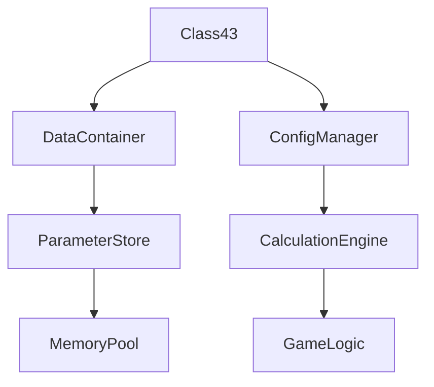

# Class43 → KVCQPLIW

## Overview
Class43 implements a comprehensive data container for configuration parameters, using a detailed constructor to initialize multiple final integer fields and a boolean flag. It provides structured storage for complex parameter sets used in game calculations.

## Architecture
Class43 functions as a specialized data structure for storing interrelated configuration values, supporting systems that require multiple parameters for computations. Its final fields ensure immutable configuration data, likely used in rendering, physics, or coordinate transformations.



## Forensic Evidence Commands

### 1. Structural Fingerprints
```bash
# Show class definition and modifiers
head -20 bytecode/client/KVCQPLIW.bytecode.txt

# Show method count and signatures
grep -c "public.*(" bytecode/client/KVCQPLIW.bytecode.txt
grep -E "public.*\(" bytecode/client/KVCQPLIW.bytecode.txt

# Show field declarations
grep -E "^  final|^  boolean" bytecode/client/KVCQPLIW.bytecode.txt
```

### 2. Source Code Correlation
```bash
# Show DEOB source structure
cat srcAllDummysRemoved/src/Class43.java

# Show constructor signature
grep -A 5 "public Class43" srcAllDummysRemoved/src/Class43.java

# Show javap cache field declarations
grep -A 10 "final int\|boolean" srcAllDummysRemoved/.javap_cache/Class43.javap.cache
```

### 3. Behavioral Patterns
```bash
# Show constructor implementation
grep -A 20 -B 5 "public KVCQPLIW" bytecode/client/KVCQPLIW.bytecode.txt

# Show field initialization patterns
grep -A 5 -B 5 "putfield" bytecode/client/KVCQPLIW.bytecode.txt | head -15

# Show parameter handling
grep -A 3 -B 3 "iload_\|iconst_\|bipush" bytecode/client/KVCQPLIW.bytecode.txt | head -10
```

### 3. Cross-Reference Validation
```bash
# Show Class43 usage in WorldController
grep -A 3 -B 3 "Class43" srcAllDummysRemoved/src/WorldController.java

# Show data container pattern
grep -r "new Class43" srcAllDummysRemoved/src/ | head -5

# Show javap constructor parameters
grep -A 5 "public Class43" srcAllDummysRemoved/.javap_cache/Class43.javap.cache

### 4. Cross-Reference Validation
```bash
# Show Class43 instantiation patterns
grep -r "new Class43" srcAllDummysRemoved/src/ | head -5

# Show parameter usage
grep -A 3 -B 3 "Class43" srcAllDummysRemoved/src/ | head -10

# Show javap final field count
grep -c "final int" srcAllDummysRemoved/.javap_cache/Class43.javap.cache
```

## Deobfuscated Source Evidence Commands
grep -A 10 -B 5 "method669" srcAllDummysRemoved/src/Class43.java
grep -A 5 -B 5 "anIntArray670" srcAllDummysRemoved/src/Class43.java

## Javap Cache Evidence Commands
grep -A 10 -B 5 "method669" srcAllDummysRemoved/.javap_cache/Class43.javap.cache
grep -A 5 -B 5 "anIntArray670" srcAllDummysRemoved/.javap_cache/Class43.javap.cache
```