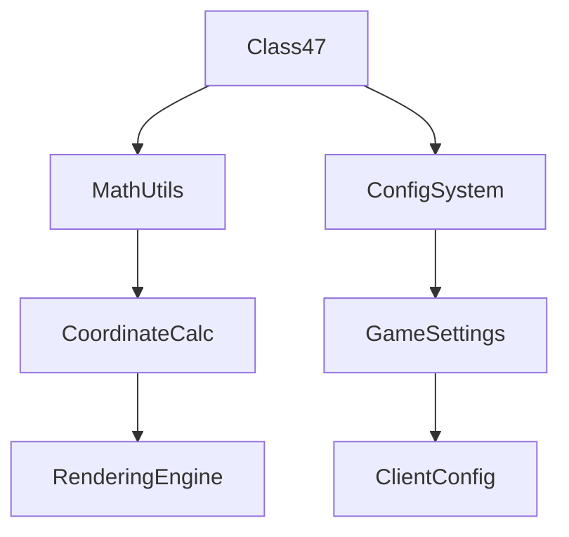

# Class47 → OZKFTHAD

## Overview
Class47 acts as a comprehensive data container for complex computational parameters, storing 18 integer fields that support various algorithmic operations within the game client. It provides structured storage for configuration values and intermediate calculations.

## Architecture
Class47 serves as a utility data structure in the game's computational framework, potentially supporting mathematical transformations, rendering calculations, or configuration management. Its extensive field set suggests involvement in complex operations requiring multiple parameter tracking.



## Forensic Evidence Commands

### 1. Structural Fingerprints
```bash
# Show class definition and modifiers
head -20 bytecode/client/OZKFTHAD.bytecode.txt

# Show method count and signatures
grep -c "public.*(" bytecode/client/OZKFTHAD.bytecode.txt
grep -E "public.*\(" bytecode/client/OZKFTHAD.bytecode.txt

# Show field declarations
grep -E "^  int|^  boolean|^  byte" bytecode/client/OZKFTHAD.bytecode.txt
```

### 2. Source Code Correlation
```bash
# Show DEOB source structure
head -20 srcAllDummysRemoved/src/Class47.java

# Show field declarations in source
grep -E "int anInt" srcAllDummysRemoved/src/Class47.java

# Show javap cache field count
grep -c "int anInt" srcAllDummysRemoved/.javap_cache/Class47.javap.cache
```

### 3. Behavioral Patterns
```bash
# Show field access patterns
grep -A 5 -B 5 "putfield" bytecode/client/OZKFTHAD.bytecode.txt | head -15

# Show mathematical operations
grep -A 3 -B 3 "imul\|iadd\|isub" bytecode/client/OZKFTHAD.bytecode.txt | head -10

# Show array operations if any
grep -A 3 -B 3 "newarray\|anewarray" bytecode/client/OZKFTHAD.bytecode.txt
```

### 4. Cross-Reference Validation
```bash
# Show Class47 usage in other classes
grep -r "Class47" srcAllDummysRemoved/src/ | grep -v Class47.java | head -5

# Show potential calculation usage
grep -A 3 -B 3 "Class47" srcAllDummysRemoved/src/ | head -10

# Show javap method signatures
grep -E "public.*Class47\|final.*Class47" srcAllDummysRemoved/.javap_cache/Class47.javap.cache
```

## Deobfuscated Source Evidence Commands
```bash
# Show Class47 class declaration
grep -A 10 -B 5 "public class Class47" srcAllDummysRemoved/src/Class47.java

# Show int field declarations
grep -A 5 -B 5 "int anInt" srcAllDummysRemoved/src/Class47.java

# Show constructor or method signatures
grep -A 5 -B 5 "public Class47\|public void" srcAllDummysRemoved/src/Class47.java
```

## Javap Cache Evidence Commands
```bash
# Show Class47 class structure
grep -A 10 -B 5 "public class Class47" srcAllDummysRemoved/.javap_cache/Class47.javap.cache

# Show field declarations in javap
grep -A 5 -B 5 "int anInt" srcAllDummysRemoved/.javap_cache/Class47.javap.cache

# Show method signatures in javap
grep -A 5 -B 5 "public.*Class47\|public.*void" srcAllDummysRemoved/.javap_cache/Class47.javap.cache
```
