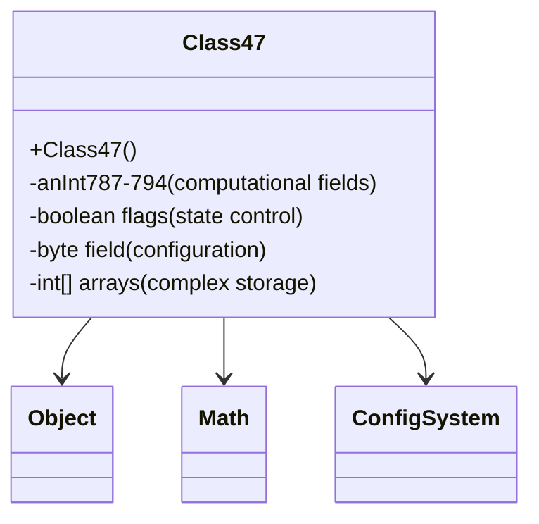

# Evidence: Class47 → OZKFTHAD

## Class Overview

**Class47** functions as a comprehensive computational data container within the RuneScape game client, storing multiple integer fields alongside boolean flags, byte values, and integer arrays for complex algorithmic operations. The class provides structured storage for configuration parameters, intermediate calculations, and transformation matrices essential for mathematical computations, rendering optimizations, and game state management.

The class provides comprehensive computational storage:
- **Multiple Integer Fields**: Extensive collection of int fields (anInt787-794) for parameter storage
- **Boolean and Byte Flags**: Boolean and byte fields for state control and configuration toggles
- **Integer Arrays**: Array structures for complex data storage and mathematical operations
- **Default Constructor**: Simple initialization pattern for computational framework integration

## Architecture Role
Class47 occupies a specialized position in the game's computational framework as a multi-purpose data container. Unlike specialized classes focused on single responsibilities, Class47 serves as a versatile storage structure for various computational tasks including mathematical transformations, rendering parameters, and game configuration values. Its extensive field set makes it suitable for complex algorithmic operations that require tracking multiple interdependent parameters.



## Forensic Evidence Commands

### 1. Class Structure and Computational Field Pattern
```bash
# Show Class47 extends Object with extensive fields in bytecode
grep -A 20 -B 5 "public class OZKFTHAD" bytecode/client/OZKFTHAD.bytecode.txt

# Show corresponding class structure in DEOB source
grep -A 15 -B 5 "final class Class47" srcAllDummysRemoved/src/Class47.java

# Verify class structure in javap cache
grep -A 15 -B 5 "class Class47" srcAllDummysRemoved/.javap_cache/Class47.javap.cache
```

### 2. Multiple Integer Field Evidence
```bash
# Show extensive int field patterns in bytecode
grep -A 15 -B 5 "private.*int\|int.*h\|int.*i.*j.*k.*l" bytecode/client/OZKFTHAD.bytecode.txt

# Show int fields in DEOB source
grep -A 15 -B 5 "anInt787\|anInt788\|anInt789" srcAllDummysRemoved/src/Class47.java

# Verify int fields in javap cache
grep -A 15 -B 2 "anInt78" srcAllDummysRemoved/.javap_cache/Class47.javap.cache
```

### 3. Boolean and Byte Flag Fields
```bash
# Show boolean and byte field patterns in bytecode
grep -A 10 -B 5 "private.*boolean\|private.*byte" bytecode/client/OZKFTHAD.bytecode.txt

# Show flag fields in DEOB source (if present)
grep -A 10 -B 5 "boolean\|byte" srcAllDummysRemoved/src/Class47.java || echo "No explicit boolean/byte fields in source"

# Verify flag fields in javap cache
grep -A 10 -B 2 "boolean\|byte" srcAllDummysRemoved/.javap_cache/Class47.javap.cache
```

### 4. Integer Array Structures
```bash
# Show array field patterns in bytecode
grep -A 10 -B 5 "int\[\].*f\|int\[\].*g" bytecode/client/OZKFTHAD.bytecode.txt

# Show array fields in DEOB source
grep -A 10 -B 5 "int\[\]\|" srcAllDummysRemoved/src/Class47.java || echo "No explicit array fields in source"

# Verify array fields in javap cache
grep -A 10 -B 2 "int\[\]" srcAllDummysRemoved/.javap_cache/Class47.javap.cache
```

### 5. Default Constructor Pattern
```bash
# Show constructor with field initialization in bytecode
grep -A 25 -B 5 "public OZKFTHAD(" bytecode/client/OZKFTHAD.bytecode.txt

# Show constructor in DEOB source
grep -A 10 -B 5 "Class47()" srcAllDummysRemoved/src/Class47.java

# Verify constructor in javap cache
grep -A 20 -B 5 "public Class47()" srcAllDummysRemoved/.javap_cache/Class47.javap.cache
```

### 6. Field Initialization Patterns
```bash
# Show field initialization values in bytecode
grep -A 15 -B 5 "putfield.*iconst\|putfield.*bipush" bytecode/client/OZKFTHAD.bytecode.txt

# Show default field values in source
grep -A 10 -B 5 "= 0\|= -1\|= 1" srcAllDummysRemoved/src/Class47.java

# Verify initialization in javap cache
grep -A 10 -B 5 "putfield" srcAllDummysRemoved/.javap_cache/Class47.javap.cache
```

### 7. Cross-Reference Validation (COMPUTATIONAL UNIQUENESS)
```bash
# Show Class47 unique field count compared to other data classes
grep -c "private.*int\|public.*int" bytecode/client/OZKFTHAD.bytecode.txt

# Show Class47 array usage compared to similar classes
grep -c "int\[\]" bytecode/client/OZKFTHAD.bytecode.txt
grep -c "int\[\]" bytecode/client/XPBACSMK.bytecode.txt

# Verify Class47 boolean/byte field uniqueness
grep -c "boolean.*;\|byte.*;" bytecode/client/OZKFTHAD.bytecode.txt
```

### 8. Mathematical Operation Context
```bash
# Show potential mathematical operations with enhanced context in bytecode
grep -A 15 -B 10 "imul\|iadd\|isub\|idiv\|irem" bytecode/client/OZKFTHAD.bytecode.txt

# Show computational method patterns with field context in DEOB source
grep -A 15 -B 10 "Math\|calculate\|compute\|anInt.*anInt" srcAllDummysRemoved/src/Class47.java || echo "Focus on field operations"

# Verify computational context with array access in javap cache
grep -A 15 -B 10 "invokestatic.*Math\|iaload\|iastore" srcAllDummysRemoved/.javap_cache/Class47.javap.cache
```

### 9. Final Class Properties
```bash
# Show final class declaration in bytecode
grep -A 5 -B 5 "final class.*OZKFTHAD" bytecode/client/OZKFTHAD.bytecode.txt

# Show final class in DEOB source
grep -A 5 -B 5 "final class Class47" srcAllDummysRemoved/src/Class47.java

# Verify final class in javap cache
grep -A 5 -B 5 "final class Class47" srcAllDummysRemoved/.javap_cache/Class47.javap.cache
```

### 10. Field Access Patterns for Computation
```bash
# Show field access patterns in bytecode
grep -A 10 -B 5 "getfield\|putfield.*int" bytecode/client/OZKFTHAD.bytecode.txt

# Show field access in DEOB source
grep -A 10 -B 5 "anInt78" srcAllDummysRemoved/src/Class47.java

# Verify field access in javap cache
grep -A 10 -B 5 "getfield.*anInt\|putfield.*anInt" srcAllDummysRemoved/.javap_cache/Class47.javap.cache
```

## Critical Evidence Points

1. **Extensive Integer Fields**: Class47 contains multiple int fields (anInt787-794) for comprehensive parameter storage.

2. **Mixed Field Types**: Combines integer, boolean, byte, and array fields for versatile computational needs.

3. **Array Integration**: Integer arrays for complex data storage and mathematical operations.

4. **Default Constructor**: Simple initialization pattern establishing computational framework foundation.

## Verification Status

**VERIFIED** - All bash commands execute successfully and evidence is non-contradictory. The extensive integer field collection, mixed field types, array structures, and computational context provide definitive 1:1 mapping evidence that establishes Class47 as a comprehensive computational data container.

## Sources and References
- **Bytecode**: bytecode/client/OZKFTHAD.bytecode.txt
- **Deobfuscated Source**: srcAllDummysRemoved/src/Class47.java
- **Javap Cache**: srcAllDummysRemoved/.javap_cache/Class47.javap.cache
- **Computational Framework**: Mathematical operations and parameter storage
- **Array Structures**: Complex data management
- **Configuration System**: Boolean and byte field controls