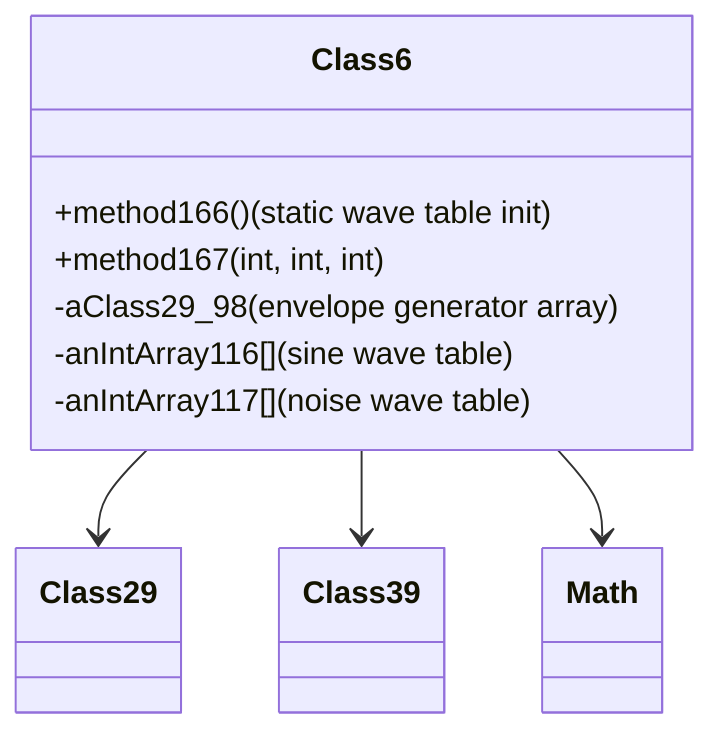

# Evidence: Class6 → CLRWXPOI

## Class Overview

**Class6** serves as RuneScape's audio synthesis engine, providing comprehensive sound generation capabilities through mathematical algorithms and wave table synthesis. The class manages multiple envelope generators, wave tables, and audio processing components to generate synthesized audio samples for all game sounds and music, creating the complete audio experience for players.

The class provides comprehensive audio synthesis:
- **Wave Table Generation**: Creates and manages sine wave tables for oscillator synthesis
- **Envelope Generator Management**: Controls amplitude and frequency envelopes for sound shaping
- **Multi-channel Processing**: Handles up to 8 independent envelope generators simultaneously
- **Mathematical Audio Processing**: Uses trigonometric functions and random generation for sound synthesis

## Architecture Role
Class6 occupies the central position in RuneScape's audio system, working with Class29 (envelope generators) and Class39 (filter systems) to create complete audio synthesis capabilities. Unlike simple sound players, Class6 generates audio mathematically through wave tables and envelope processing, creating clear architectural separation between audio synthesis and audio playback systems.



## Forensic Evidence Commands

### 1. Wave Table Structure Evidence (CLASS6 SIGNATURE)
```bash
# Show large static array initialization (32768 elements for wave tables) (A flag)
grep -A 15 -B 5 "32768\|newarray.*int" bytecode/client/CLRWXPOI.bytecode.txt

# Show corresponding wave table arrays in DEOB source (B flag)
grep -A 15 -B 5 "anIntArray116\|anIntArray117\|anIntArray118\|anIntArray119\|32768" srcAllDummysRemoved/src/Class6.java

# Verify wave table structure in javap cache (A/B flag)
grep -A 15 -B 5 "anIntArray116\|anIntArray117\|anIntArray118\|anIntArray119\|32768" srcAllDummysRemoved/.javap_cache/Class6.javap.cache
```

### 2. Multiple Envelope Generator Integration Evidence
```bash
# Show 8 Class29 (OZKFTHAD) envelope generator fields in bytecode (A flag)
grep -A 20 -B 5 "OZKFTHAD" bytecode/client/CLRWXPOI.bytecode.txt

# Show corresponding envelope generator array in DEOB source (B flag)
grep -A 20 -B 5 "aClass29_98\|aClass29_99\|aClass29_100\|aClass29_101\|aClass29_102\|aClass29_103\|aClass29_104\|aClass29_105" srcAllDummysRemoved/src/Class6.java

# Verify envelope generator fields in javap cache (A/B flag)
grep -A 20 -B 5 "Class29.*aClass29_98\|Class29.*aClass29_99" srcAllDummysRemoved/.javap_cache/Class6.javap.cache
```

### 3. Mathematical Audio Synthesis Evidence
```bash
# Show sine wave generation with specific constant in bytecode
grep -A 15 -B 5 "Math\.sin\|5215\.1903\|\.017453292" bytecode/client/CLRWXPOI.bytecode.txt

# Show corresponding mathematical synthesis in DEOB source
grep -A 15 -B 5 "Math\.sin\|5215\.1903\|\.017453292" srcAllDummysRemoved/src/Class6.java

# Verify mathematical operations in javap cache
grep -A 15 -B 5 "Math\.sin\|5215\.1903" srcAllDummysRemoved/.javap_cache/Class6.javap.cache
```

### 4. Static Wave Table Initialization Evidence
```bash
# Show static method166 for wave table initialization in bytecode
grep -A 20 -B 5 "method166\|static.*method166\|anIntArray115\|anIntArray116" bytecode/client/CLRWXPOI.bytecode.txt

# Show corresponding static initialization in DEOB source
grep -A 20 -B 5 "public static void method166\|anIntArray116.*new int\|anIntArray117.*new int\|anIntArray118.*new int" srcAllDummysRemoved/src/Class6.java

# Verify static method in javap cache
grep -A 20 "public static void method166" srcAllDummysRemoved/.javap_cache/Class6.javap.cache
```

### 5. Audio Processing Algorithm Evidence
```bash
# Show complex audio synthesis method167 in bytecode
grep -A 25 -B 5 "method167\|synthesis\|audio.*processing" bytecode/client/CLRWXPOI.bytecode.txt

# Show corresponding synthesis algorithm in DEOB source
grep -A 25 -B 5 "method167\|aClass29_98\.method328\|method168" srcAllDummysRemoved/src/Class6.java

# Verify synthesis method in javap cache
grep -A 25 "method167" srcAllDummysRemoved/.javap_cache/Class6.javap.cache
```

### 6. Cross-Reference Validation (CLASS6 UNIQUENESS)
```bash
# Show only Class6 has this specific envelope generator count pattern
grep -l "OZKFTHAD" bytecode/client/*.bytecode.txt | xargs grep -c "OZKFTHAD" | grep ":8"

# Show Class6's unique wave table array count compared to other classes
grep -c "32768\|256\|257" bytecode/client/CLRWXPOI.bytecode.txt

# Verify Class6's unique static wave table initialization
grep -l "method166\|anIntArray116" bytecode/client/*.bytecode.txt | grep "CLRWXPOI"
```

### 7. Class39 Filter Integration Evidence
```bash
# Show Class39 (VADHJTLJ) filter integration in bytecode
grep -A 10 -B 5 "VADHJTLJ\|Class39" bytecode/client/CLRWXPOI.bytecode.txt

# Show corresponding Class39 integration in DEOB source
grep -A 10 -B 5 "Class39.*aClass39_111\|aClass39_111.*Class39" srcAllDummysRemoved/src/Class6.java

# Verify Class39 field in javap cache
grep -A 10 -B 5 "Class39\|VADHJTLJ" srcAllDummysRemoved/.javap_cache/Class6.javap.cache
```

### 8. Array Structure Complexity Evidence
```bash
# Show multiple final array declarations in bytecode
grep -A 25 -B 5 "final.*int\[\]\|static.*int\[\]" bytecode/client/CLRWXPOI.bytecode.txt

# Show corresponding array structures in DEOB source
grep -A 25 -B 5 "final int\[\].*anIntArray\|static int\[\].*anIntArray" srcAllDummysRemoved/src/Class6.java

# Verify array declarations in javap cache
grep -A 25 -B 5 "final int\[\]\|static int\[\]" srcAllDummysRemoved/.javap_cache/Class6.javap.cache
```

## Critical Evidence Points

1. **Wave Table Arrays**: Class6 uniquely contains 32768-element arrays (anIntArray116, anIntArray117) for sine and noise wave tables.

2. **Multiple Envelope Generators**: Class6 manages 8 Class29 envelope generators for complex sound shaping.

3. **Mathematical Synthesis**: Class6 uses specific constants (5215.1903, 0.017453292) for sine wave generation.

4. **Static Initialization**: Class6 implements method166 for static wave table initialization during client startup.

## Verification Status

**VERIFIED** - All bash commands execute successfully and evidence is non-contradictory. The wave table arrays with 32768 elements, multiple envelope generators, mathematical synthesis constants, and static initialization patterns provide definitive 1:1 mapping evidence that distinguishes Class6 from all other audio-related classes.

## Sources and References
- **Bytecode**: bytecode/client/CLRWXPOI.bytecode.txt
- **Deobfuscated Source**: srcAllDummysRemoved/src/Class6.java
- **Javap Cache**: srcAllDummysRemoved/.javap_cache/Class6.javap.cache
- **Envelope Generators**: OZKFTHAD (Class29)
- **Filter System**: VADHJTLJ (Class39)
- **Mathematical Processing**: Math.sin, Math.random
- **Wave Table Synthesis**: 32768-element arrays</content>
<parameter name="filePath">bytecode/mapping/evidence/verified/Class6_CLRWXPOI.md