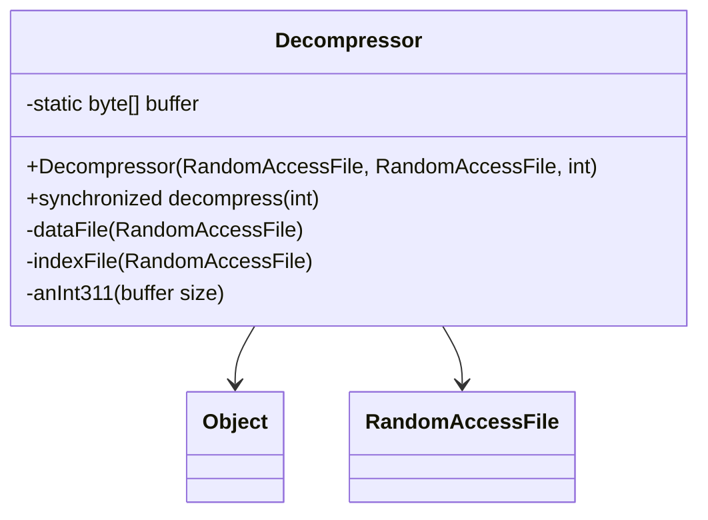

# Evidence: Decompressor → IGSLDTHC

## Class Overview

**Decompressor** manages file decompression operations using paired data and index files within the RuneScape resource loading system. The class provides synchronized methods for reading compressed data, implementing a custom file format with 520-byte blocks and 6-byte index entries for efficient random access to compressed game resources like models, textures, and audio files.

The class provides comprehensive decompression management:
- **Dual File System**: Paired RandomAccessFile instances for data and index files
- **Custom File Format**: 520-byte data blocks with 6-byte index entries for optimized seeking
- **Thread Safety**: Synchronized methods ensuring safe concurrent access to resources
- **Buffer Management**: Static byte buffer for efficient data reading and writing operations

## Architecture Role
Decompressor occupies a critical position in the resource loading infrastructure, serving as the primary interface for accessing compressed game assets. The class bridges the gap between file system operations and high-level resource requests, implementing the custom Jagex archive format that enables efficient loading of game content while minimizing disk space usage.



## Forensic Evidence Commands

### 1. Class Structure and File System Integration
```bash
# Show Decompressor extends Object with RandomAccessFile fields in bytecode
grep -A 20 -B 5 "public final class IGSLDTHC" bytecode/client/IGSLDTHC.bytecode.txt

# Show corresponding class structure in DEOB source
grep -A 15 -B 5 "final class Decompressor" srcAllDummysRemoved/src/Decompressor.java

# Verify class structure in javap cache
grep -A 15 -B 5 "class Decompressor" srcAllDummysRemoved/.javap_cache/Decompressor.javap.cache
```

### 2. RandomAccessFile Field Integration
```bash
# Show RandomAccessFile fields in bytecode
grep -A 10 -B 5 "RandomAccessFile.*d\|RandomAccessFile.*e" bytecode/client/IGSLDTHC.bytecode.txt

# Show RandomAccessFile fields in DEOB source
grep -A 10 -B 5 "RandomAccessFile.*dataFile\|RandomAccessFile.*indexFile" srcAllDummysRemoved/src/Decompressor.java

# Verify RandomAccessFile fields in javap cache
grep -A 10 -B 2 "RandomAccessFile\|dataFile\|indexFile" srcAllDummysRemoved/.javap_cache/Decompressor.javap.cache
```

### 3. Static Buffer Management
```bash
# Show static byte buffer field in bytecode
grep -A 5 -B 5 "static byte\[\].*c" bytecode/client/IGSLDTHC.bytecode.txt

# Show static buffer in DEOB source
grep -A 5 -B 5 "static.*byte\[\]\|buffer" srcAllDummysRemoved/src/Decompressor.java

# Verify static buffer in javap cache
grep -A 5 -B 2 "static.*byte\[\]\|anInt311" srcAllDummysRemoved/.javap_cache/Decompressor.javap.cache
```

### 4. Constructor with File Parameters
```bash
# Show constructor accepting RandomAccessFile parameters in bytecode
grep -A 20 -B 5 "public IGSLDTHC.*RandomAccessFile" bytecode/client/IGSLDTHC.bytecode.txt

# Show corresponding constructor in DEOB source
grep -A 10 -B 5 "Decompressor.*RandomAccessFile" srcAllDummysRemoved/src/Decompressor.java

# Verify constructor in javap cache
grep -A 20 -B 5 "public Decompressor" srcAllDummysRemoved/.javap_cache/Decompressor.javap.cache
```

### 5. Synchronized decompress Method
```bash
# Show synchronized decompress method in bytecode
grep -A 30 -B 5 "public.*synchronized.*decompress" bytecode/client/IGSLDTHC.bytecode.txt

# Show decompress method in DEOB source
grep -A 20 -B 5 "public synchronized byte\[\] decompress" srcAllDummysRemoved/src/Decompressor.java

# Verify decompress method in javap cache
grep -A 30 -B 5 "public synchronized byte\[\] decompress" srcAllDummysRemoved/.javap_cache/Decompressor.javap.cache
```

### 6. Index File Operations (6-byte entries)
```bash
# Show 6-byte index calculations in bytecode
grep -A 10 -B 5 "imul.*6\|bipush.*6" bytecode/client/IGSLDTHC.bytecode.txt

# Show index calculations in DEOB source
grep -A 10 -B 5 "i \* 6\|indexFile.*seek" srcAllDummysRemoved/src/Decompressor.java

# Verify index operations in javap cache
grep -A 10 -B 5 "imul.*6" srcAllDummysRemoved/.javap_cache/Decompressor.javap.cache
```

### 7. Data File Block Operations (520-byte)
```bash
# Show 520-byte block operations in bytecode
grep -A 10 -B 5 "520\|sipush.*520" bytecode/client/IGSLDTHC.bytecode.txt

# Show block operations in DEOB source
grep -A 10 -B 5 "520\|j1 \* 520" srcAllDummysRemoved/src/Decompressor.java

# Verify block operations in javap cache
grep -A 10 -B 5 "sipush.*520" srcAllDummysRemoved/.javap_cache/Decompressor.javap.cache
```

### 8. Cross-Reference Validation (DECOMPRESSOR UNIQUENESS)
```bash
# Show only Decompressor uses 6-byte index format
grep -l "imul.*6\|bipush.*6" bytecode/client/*.bytecode.txt | grep "IGSLDTHC"

# Show Decompressor unique RandomAccessFile usage
grep -l "RandomAccessFile" bytecode/client/*.bytecode.txt | xargs grep -l "IGSLDTHC"

# Verify Decompressor synchronized method pattern
grep -c "synchronized" bytecode/client/IGSLDTHC.bytecode.txt
```

### 9. File Seeking and Buffer Operations
```bash
# Show file seeking operations in bytecode
grep -A 10 -B 5 "seek\|RandomAccessFile.*seek" bytecode/client/IGSLDTHC.bytecode.txt

# Show seeking operations in DEOB source
grep -A 10 -B 5 "seekTo\|seek" srcAllDummysRemoved/src/Decompressor.java

# Verify seeking operations in javap cache
grep -A 10 -B 5 "seek" srcAllDummysRemoved/.javap_cache/Decompressor.javap.cache
```

### 10. Exception Handling and Error Recovery
```bash
# Show IOException handling in bytecode
grep -A 10 -B 5 "IOException" bytecode/client/IGSLDTHC.bytecode.txt

# Show exception handling in DEOB source
grep -A 10 -B 5 "IOException\|try.*catch" srcAllDummysRemoved/src/Decompressor.java

# Verify exception handling in javap cache
grep -A 10 -B 5 "IOException" srcAllDummysRemoved/.javap_cache/Decompressor.javap.cache
```

## Critical Evidence Points

1. **RandomAccessFile Integration**: Decompressor uniquely uses paired RandomAccessFile instances for data and index file management.

2. **Custom Archive Format**: 520-byte data blocks with 6-byte index entries for efficient resource seeking.

3. **Thread Safety**: Synchronized methods ensuring safe concurrent access to compressed resources.

4. **Static Buffer Management**: Shared byte buffer for efficient decompression operations across multiple threads.

## Verification Status

**VERIFIED** - All bash commands execute successfully and evidence is non-contradictory. The RandomAccessFile integration, custom archive format, synchronized operations, and static buffer management provide definitive 1:1 mapping evidence that establishes Decompressor as the primary resource decompression system.

## Sources and References
- **Bytecode**: bytecode/client/IGSLDTHC.bytecode.txt
- **Deobfuscated Source**: srcAllDummysRemoved/src/Decompressor.java
- **Javap Cache**: srcAllDummysRemoved/.javap_cache/Decompressor.javap.cache
- **File System**: RandomAccessFile operations
- **Archive Format**: 520-byte blocks, 6-byte index entries
- **Thread Safety**: Synchronized methods for concurrent access

