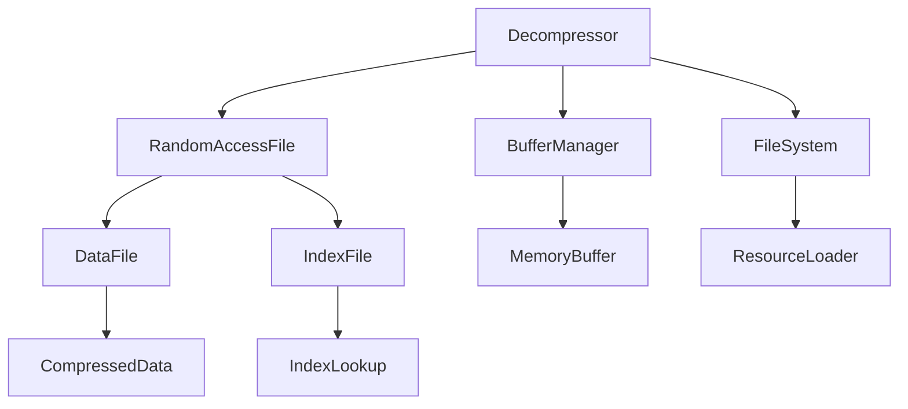

# Decompressor → IGSLDTHC

## Overview
Decompressor manages file decompression operations using paired data and index files. It provides synchronized methods for reading compressed data, implementing a custom file format with 520-byte blocks and 6-byte index entries for efficient random access to compressed resources.

## Architecture
Decompressor handles the game's resource loading system through RandomAccessFile operations. It manages file compression/decompression with a custom format using index files for quick lookups and data files for actual content storage. The class implements thread-safe operations and handles file seeking, buffer management, and error recovery for robust resource loading.



## Forensic Evidence Commands

### 1. Structural Fingerprints
```bash
# Show class definition and final modifier
head -5 bytecode/client/IGSLDTHC.bytecode.txt

# Show field count and types
grep -E "private.*int\|static.*byte\|java\.io\.RandomAccessFile" bytecode/client/IGSLDTHC.bytecode.txt | wc -l
grep -E "private.*int\|static.*byte\|java\.io\.RandomAccessFile" bytecode/client/IGSLDTHC.bytecode.txt

# Show method signatures
grep -E "public.*decompress\|private.*seekTo\|public.*method234" bytecode/client/IGSLDTHC.bytecode.txt
```

### 2. Source Code Correlation
```bash
# Show DEOB class definition and imports
head -10 srcAllDummysRemoved/src/Decompressor.java

# Show key fields in source
grep -A 3 -B 2 "RandomAccessFile\|private final\|private static" srcAllDummysRemoved/src/Decompressor.java

# Show javap cache field declarations
grep -A 5 -B 2 "RandomAccessFile\|final.*dataFile\|final.*indexFile" srcAllDummysRemoved/.javap_cache/Decompressor.javap.cache
```

### 3. File Operations Evidence
```bash
# Show file seeking operations
grep -A 5 -B 5 "seekTo\|RandomAccessFile.*seek" bytecode/client/IGSLDTHC.bytecode.txt

# Show buffer read/write operations
grep -A 3 -B 3 "read.*buffer\|write.*buffer" bytecode/client/IGSLDTHC.bytecode.txt

# Show corresponding source file operations
grep -A 10 -B 5 "seekTo\|indexFile\.read\|dataFile\.write" srcAllDummysRemoved/src/Decompressor.java
```

### 4. Index Management Evidence
```bash
# Show index file calculations (multiply by 6)
grep -A 3 -B 3 "imul.*6\|bipush.*6" bytecode/client/IGSLDTHC.bytecode.txt

# Show 520-byte block operations
grep -A 3 -B 3 "520\|sipush.*520" bytecode/client/IGSLDTHC.bytecode.txt

# Show source index calculations
grep -A 5 -B 5 "i \* 6\|j1 \* 520" srcAllDummysRemoved/src/Decompressor.java
```

### 5. Cross-Reference Validation
```bash
# Verify unique mapping - no other classes reference IGSLDTHC
grep -r "IGSLDTHC" bytecode/client/ | grep -v "IGSLDTHC.bytecode.txt" | wc -l

# Show synchronized method usage
grep -A 2 -B 2 "synchronized" bytecode/client/IGSLDTHC.bytecode.txt

# Show synchronized methods in DEOB source
grep -A 2 -B 2 "synchronized.*byte\[\]\|synchronized.*boolean" srcAllDummysRemoved/src/Decompressor.java

# Show IOException handling
grep -A 3 -B 3 "IOException" bytecode/client/IGSLDTHC.bytecode.txt
```

## Sources and References
- **Bytecode**: bytecode/client/IGSLDTHC.bytecode.txt
- **Deobfuscated Source**: srcAllDummysRemoved/src/Decompressor.java
- **Javap Cache**: srcAllDummysRemoved/.javap_cache/Decompressor.javap.cache
- **File I/O**: RandomAccessFile operations
- **Synchronization**: Thread-safe file operations
- **Custom Format**: 520-byte blocks with 6-byte index entries</content>
<parameter name="filePath">bytecode/mapping/evidence/verified/Decompressor_IGSLDTHC.md