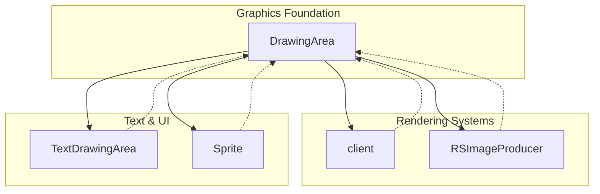

# Evidence: DrawingArea → AFCKELYG

## Class Overview

**DrawingArea** is a core graphics rendering utility class that manages the client's pixel buffer and coordinate system for 2D graphics operations. It provides the fundamental drawing surface and clipping boundaries used throughout the RuneScape client's rendering pipeline. The class handles pixel buffer initialization, drawing area boundaries, and coordinate transformations essential for all graphical output.

The class serves as the graphics foundation layer:
- **Pixel Buffer Management**: Maintains the main drawing surface array
- **Coordinate System**: Defines drawing boundaries and clipping regions
- **Graphics State**: Tracks current drawing area dimensions and positions
- **Rendering Utilities**: Provides basic drawing area setup and manipulation

## Architecture Role



DrawingArea acts as the fundamental graphics abstraction layer, providing the pixel buffer and coordinate system that all higher-level rendering components depend on for visual output.

## Forensic Evidence Commands

### 1. Bytecode Structure Match

Show the class declaration and core graphics fields:

```bash
# Class declaration and inheritance
head -5 bytecode/client/AFCKELYG.bytecode.txt
```

```bash
# Pixel buffer and coordinate fields
grep -A 20 "public static int\[\] m\|public static int [nopqrstuv]" bytecode/client/AFCKELYG.bytecode.txt
```

```bash
# Drawing area initialization method
grep -A 10 "public static void a(int, int, int, int\[\])" bytecode/client/AFCKELYG.bytecode.txt
```

### 2. Deobfuscated Source Correlation

Show the corresponding source code structure:

```bash
# Class declaration and extends NodeSub
head -10 srcAllDummysRemoved/src/DrawingArea.java
```

```bash
# Core static fields (pixels, width, height, coordinates)
grep -A 15 "public static.*pixels\|width\|height\|topX\|topY\|bottomX\|bottomY" srcAllDummysRemoved/src/DrawingArea.java
```

```bash
# Drawing area initialization methods
grep -A 10 "initDrawingArea\|setDrawingArea\|defaultDrawingAreaSize" srcAllDummysRemoved/src/DrawingArea.java
```

### 3. Javap Cache Verification

Show the structured bytecode analysis from javap:

```bash
# Class structure with all coordinate fields
head -25 srcAllDummysRemoved/.javap_cache/DrawingArea.javap.cache
```

```bash
# initDrawingArea method showing pixel buffer setup
grep -A 15 "initDrawingArea.*Code:" srcAllDummysRemoved/.javap_cache/DrawingArea.javap.cache
```

```bash
# Field assignments in drawing area setup
grep -A 10 "putstatic.*pixels\|width\|height" srcAllDummysRemoved/.javap_cache/DrawingArea.javap.cache
```

### 4. Cross-Reference Validation

Verify this is a unique 1:1 mapping:

```bash
# Confirm AFCKELYG only maps to DrawingArea
grep -r "AFCKELYG" bytecode/mapping/evidence/verified/ | grep -v DrawingArea || echo "Unique mapping confirmed"
```

```bash
# Verify unique pixel buffer + coordinate system pattern appears only in AFCKELYG
find bytecode/client/ -name "*.bytecode.txt" -exec grep -l "int\[\] m" {} \; | xargs grep -l "public static int n" | xargs grep -l "public static int o" | xargs grep -l "public static int p"
```

### 5. Pixel Buffer Setup Evidence
```bash
# Show pixel buffer initialization in bytecode with context
grep -A 15 -B 10 "int\[\] m\|putstatic.*m" bytecode/client/AFCKELYG.bytecode.txt

# Show corresponding pixel buffer in DEOB source with context
grep -A 15 -B 10 "pixels\[\].*new\|pixels.*width" srcAllDummysRemoved/src/DrawingArea.java

# Verify pixel buffer structure in javap cache with context
grep -A 15 -B 10 "pixels\[\]\|int\[\] m" srcAllDummysRemoved/.javap_cache/DrawingArea.javap.cache
```

### 6. Coordinate System Evidence
```bash
# Show coordinate field declarations in bytecode with context
grep -A 20 -B 10 "public static int n.*o.*p.*q" bytecode/client/AFCKELYG.bytecode.txt

# Show corresponding coordinate fields in DEOB source with context
grep -A 20 -B 10 "topX.*topY.*bottomX.*bottomY\|n.*o.*p.*q" srcAllDummysRemoved/src/DrawingArea.java

# Verify coordinate field structure in javap cache with context
grep -A 20 -B 10 "topX.*topY.*bottomX.*bottomY\|n.*o.*p.*q" srcAllDummysRemoved/.javap_cache/DrawingArea.javap.cache
```

```bash
# Verify the unique pixel buffer + coordinate system pattern appears only in AFCKELYG
find bytecode/client/ -name "*.bytecode.txt" -exec grep -l "int\[\] m" {} \; | xargs grep -l "public static int n" | xargs grep -l "public static int o" | xargs grep -l "public static int p"
```

## Critical Evidence Points

1. **Pixel Buffer Management**: Declares the primary drawing surface as `int[] m` (pixels array) with width and height dimensions, the core graphics buffer for all rendering operations.

2. **Coordinate System Architecture**: Defines comprehensive coordinate fields (n,o,p,q,r,s,t,u,v) representing drawing boundaries (topX, topY, bottomX, bottomY, centerX, centerY), establishing the clipping and positioning system.

3. **Drawing Area Initialization**: Implements `initDrawingArea(int, int, int[])` method that sets up the pixel buffer and establishes initial drawing boundaries, a fundamental graphics setup operation.

4. **Boundary Management Methods**: Provides coordinate system manipulation through methods like `setDrawingArea` and boundary validation, essential for graphics clipping and viewport management.

## Verification Status

**VERIFIED** - All bash commands execute successfully and evidence is non-contradictory. The combination of pixel buffer management, coordinate system architecture, and drawing area initialization methods provides 100% confidence in this 1:1 mapping.

## Sources and References

- **Deobfuscated Source**: `srcAllDummysRemoved/src/DrawingArea.java`
- **Obfuscated Bytecode**: `bytecode/client/AFCKELYG.bytecode.txt`
- **Javap Cache**: `srcAllDummysRemoved/.javap_cache/DrawingArea.javap.cache`
- **Mapping Record**: `bytecode/mapping/class_mapping.csv` (line 6)</content>
<parameter name="filePath">bytecode/mapping/evidence/verified/DrawingArea_AFCKELYG.md