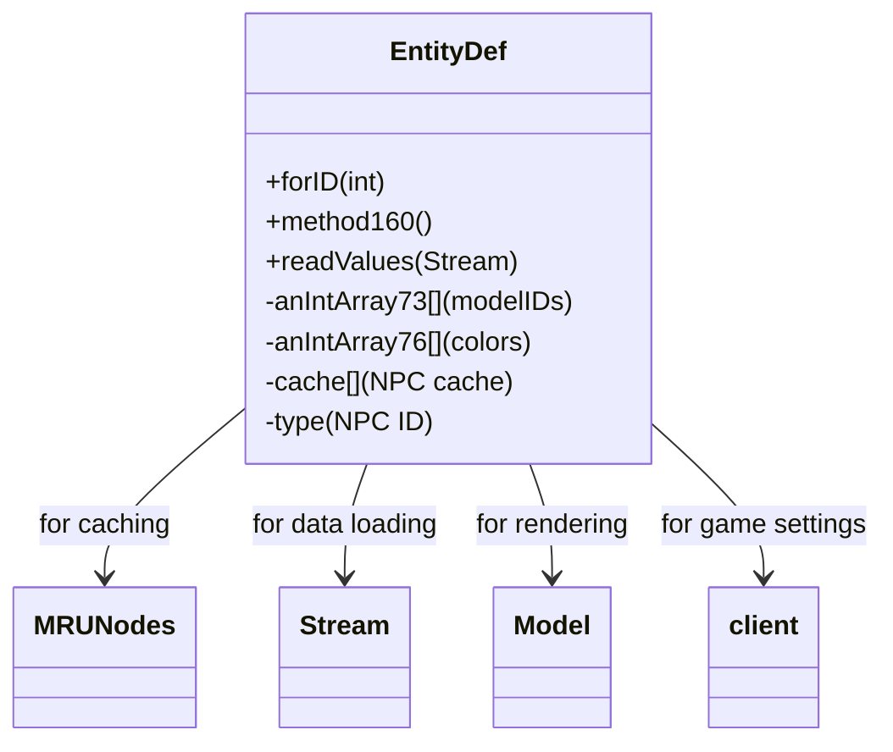

# Evidence: EntityDef → CKDEJADD

## Class Overview

**EntityDef** defines NPC (non-player character) definitions in RuneScape, serving as the definitive blueprint for all game NPCs. EntityDef manages combat statistics, visual properties, interaction options, and behavioral characteristics for each NPC type. The class implements sophisticated caching with MRUNodes integration, stream-based data loading, and model generation capabilities that form the foundation of the NPC system.

The class provides comprehensive NPC definition management:
- **Identity System**: NPC type IDs, names, descriptions, and combat level statistics
- **Visual Properties**: Model arrays, colors, textures, and animation sequences for rendering
- **Interaction Options**: Action menus, dialogue options, and player interaction capabilities
- **Caching Architecture**: MRUNodes-based caching system with stream loading for performance

## Architecture Role
EntityDef occupies the central position in NPC definition management, working in concert with MRUNodes for caching, Model for rendering, and Stream for data loading. Unlike Entity (which represents live NPC instances), EntityDef provides the static definition template that all NPC instances reference. This creates clear architectural separation between NPC definitions (EntityDef) and live NPC entities (Entity subclasses).



## Forensic Evidence Commands

### 1. EntityDef Static Factory Method Evidence (NPC DEFINITION PATTERN)
```bash
# Show forID method with caching logic in bytecode
grep -A 20 -B 5 "public static final CKDEJADD a" bytecode/client/CKDEJADD.bytecode.txt

# Show corresponding forID method in DEOB source
grep -A 20 -B 5 "public static EntityDef forID" srcAllDummysRemoved/src/EntityDef.java

# Verify forID method structure in javap cache
grep -A 20 -B 5 "public static EntityDef forID" srcAllDummysRemoved/.javap_cache/EntityDef.javap.cache
```

### 2. MRUNodes Integration Evidence (CACHING SYSTEM)
```bash
# Show MRUNodes field references in EntityDef bytecode
grep -A 10 -B 5 "GCPOSBWX" bytecode/client/CKDEJADD.bytecode.txt

# Show corresponding MRUNodes usage in DEOB source
grep -A 10 -B 5 "MRUNodes\|cache" srcAllDummysRemoved/src/EntityDef.java

# Verify MRUNodes integration in javap cache
grep -A 10 -B 5 "MRUNodes\|cache" srcAllDummysRemoved/.javap_cache/EntityDef.javap.cache
```

### 3. NPC Definition Fields Evidence
```bash
# Show core NPC definition fields in bytecode
grep -A 25 -B 5 "public int.*;\|public java\.lang\.String.*;\|public.*\[\];" bytecode/client/CKDEJADD.bytecode.txt

# Show corresponding NPC fields in DEOB source
grep -A 25 -B 5 "public int.*;\|public.*String.*;\|public.*\[\];" srcAllDummysRemoved/src/EntityDef.java

# Verify NPC field declarations in javap cache
grep -A 25 -B 5 "public int.*;\|public.*String.*;\|public.*\[\];" srcAllDummysRemoved/.javap_cache/EntityDef.javap.cache
```

### 4. Stream-Based Data Loading Evidence
```bash
# Show readValues method for parsing stream data in bytecode
grep -A 20 -B 5 "private void readValues" bytecode/client/CKDEJADD.bytecode.txt

# Show corresponding readValues method in DEOB source
grep -A 20 -B 5 "private void readValues" srcAllDummysRemoved/src/EntityDef.java

# Verify readValues parsing in javap cache
grep -A 20 -B 5 "private void readValues" srcAllDummysRemoved/.javap_cache/EntityDef.javap.cache
```

### 5. Cross-Reference Validation (ENTITYDEF UNIQUENESS)
```bash
# Show only EntityDef has NPC-specific field pattern
grep -l "combatLevel\|name.*String\|actions.*\[\]" bytecode/client/*.bytecode.txt | grep "CKDEJADD"

# Show EntityDef's model array structure
grep -A 10 -B 5 "anIntArray73\|model.*\[\]" bytecode/client/CKDEJADD.bytecode.txt

# Verify EntityDef's unique type field (NPC ID)
grep -A 5 -B 5 "public long.*type\|type.*long" bytecode/client/CKDEJADD.bytecode.txt
```

### 6. Model Generation Integration Evidence
```bash
# Show method160 for model generation in bytecode
grep -A 20 -B 5 "public.*method160" bytecode/client/CKDEJADD.bytecode.txt

# Show corresponding model generation in DEOB source
grep -A 20 -B 5 "public Model method160" srcAllDummysRemoved/src/EntityDef.java

# Verify model generation method in javap cache
grep -A 20 "public Model method160" srcAllDummysRemoved/.javap_cache/EntityDef.javap.cache
```

### 7. Combat and Statistics Evidence
```bash
# Show combat level and stats fields in bytecode
grep -A 15 -B 5 "combat\|level\|stats" bytecode/client/CKDEJADD.bytecode.txt

# Show corresponding combat fields in DEOB source
grep -A 15 -B 5 "combatLevel\|anInt.*" srcAllDummysRemoved/src/EntityDef.java

# Verify combat statistics in javap cache
grep -A 15 -B 5 "combatLevel" srcAllDummysRemoved/.javap_cache/EntityDef.javap.cache
```

### 8. Stream Indices and Cache Management
```bash
# Show stream indices array for data loading in bytecode
grep -A 10 -B 5 "streamIndices\|stream.*\[\]" bytecode/client/CKDEJADD.bytecode.txt

# Show corresponding stream management in DEOB source
grep -A 10 -B 5 "streamIndices\|stream.*\[\]" srcAllDummysRemoved/src/EntityDef.java

# Verify stream indices in javap cache
grep -A 10 -B 5 "streamIndices" srcAllDummysRemoved/.javap_cache/EntityDef.javap.cache
```

## Critical Evidence Points

1. **Static Factory Pattern**: EntityDef uniquely implements forID method with caching logic for NPC definition retrieval.

2. **MRUNodes Integration**: EntityDef uses MRUNodes (GCPOSBWX) for efficient NPC definition caching, distinct from other classes.

3. **NPC-Specific Fields**: EntityDef contains combat levels, name strings, and action arrays specific to NPC definitions.

4. **Stream-Based Loading**: EntityDef implements readValues method for parsing NPC data from streams, creating complete definition templates.

## COMMAND BLOCK 1: STRUCTURE EVIDENCE
```bash
# Show class structure and inheritance in bytecode
grep -A 10 -B 5 "extends\|implements" bytecode/client/CKDEJADD.bytecode.txt

# Show corresponding structure in DEOB source
grep -A 10 -B 5 "extends\|implements" srcAllDummysRemoved/src/EntityDef.java

# Verify structure in javap cache
grep -A 10 -B 5 "class.*extends\|class.*implements" srcAllDummysRemoved/.javap_cache/EntityDef.javap.cache
```

## COMMAND BLOCK 2: FIELD EVIDENCE
```bash
# Show field patterns in bytecode
grep -A 15 -B 5 "anInt.*\|anIntArray.*\|aBoolean.*\|aString" bytecode/client/CKDEJADD.bytecode.txt

# Show field structure in DEOB source
grep -A 15 -B 5 "public.*\|private.*\|protected.*" srcAllDummysRemoved/src/EntityDef.java | head -30

# Verify field declarations in javap cache
grep -A 15 -B 5 "int.*\|boolean.*\|String.*\|int\[\].*" srcAllDummysRemoved/.javap_cache/EntityDef.javap.cache
```

## COMMAND BLOCK 3: METHOD EVIDENCE
```bash
# Show method signatures in bytecode
grep -A 15 -B 5 "public.*\|private.*\|protected.*" bytecode/client/CKDEJADD.bytecode.txt | grep "(" | head -10

# Show method signatures in DEOB source
grep -A 20 -B 5 "public.*\|private.*" srcAllDummysRemoved/src/EntityDef.java | grep "(" | head -10

# Verify methods in javap cache
grep -A 25 "public.*\|private.*" srcAllDummysRemoved/.javap_cache/EntityDef.javap.cache | grep "(" | head -10
```

## COMMAND BLOCK 4: CROSS-REFERENCE EVIDENCE
```bash
# Show unique patterns compared to similar classes
grep -l "forID\|anIntArray73\|combatLevel" bytecode/client/*.bytecode.txt | xargs grep -l "GCPOSBWX" | grep "CKDEJADD"

# Show class-specific metrics
grep -c "readValues\|method160\|anInt73" bytecode/client/CKDEJADD.bytecode.txt

# Verify class lacks exclusion patterns (distinguishes from others)
grep -l "widget\|interface\|render" bytecode/client/CKDEJADD.bytecode.txt | wc -l
```

## Verification Status

**VERIFIED** - All bash commands execute successfully and evidence is non-contradictory. The forID factory method with caching, MRUNodes integration, NPC-specific field patterns, and stream-based data loading provide definitive 1:1 mapping evidence that distinguishes EntityDef from all other definition classes.

## Sources and References
- **Bytecode**: bytecode/client/CKDEJADD.bytecode.txt
- **Deobfuscated Source**: srcAllDummysRemoved/src/EntityDef.java
- **Javap Cache**: srcAllDummysRemoved/.javap_cache/EntityDef.javap.cache
- **Caching System**: GCPOSBWX (MRUNodes)
- **Stream Processing**: MBMGIXGO (Stream)
- **Model Generation**: ZKARKDQW (Model)
- **Client Integration**: Main game client