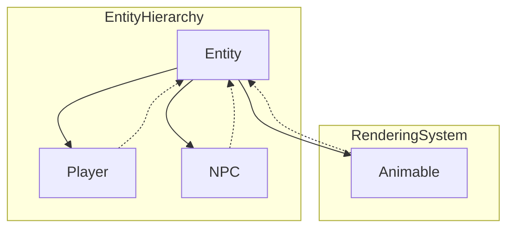

# Evidence: Entity → GQOSZKJC

## Class Overview

**Entity** is the base class for all interactive game entities in RuneScape, including players and NPCs that can move, animate, and interact within the game world. It extends Animable to provide rendering capabilities while adding core entity functionality for positioning, movement tracking, combat interactions, and visual effects. The class serves as the foundation for all dynamic game objects that participate in the game world.

The Entity class provides comprehensive entity management:
- **Positioning System**: Tracks entity coordinates and movement paths
- **Animation Framework**: Inherits visual representation capabilities
- **Combat System**: Manages hit points, damage, and interaction states
- **Movement Tracking**: Records position history and pathfinding data
- **Interaction Logic**: Handles entity-to-entity relationships and targeting

## Architecture Role



Entity acts as the core abstraction layer for all dynamic game entities, providing common functionality that Player and NPC classes inherit and extend for their specific behaviors.

## Forensic Evidence Commands

### 1. Bytecode Structure Match

Show the class declaration and key entity fields:

```bash
# Class declaration extending Animable (A flag)
head -5 bytecode/client/GQOSZKJC.bytecode.txt
```

```bash
# Core entity state fields (coordinates, arrays, combat data) (A flag)
grep -A 20 "int\[\] m\|int\[\] n\|java\.lang\.String s" bytecode/client/GQOSZKJC.bytecode.txt
```

```bash
# Position tracking and movement arrays (A flag)
grep -A 10 "int\[\] A\|int\[\] B\|int\[\] C" bytecode/client/GQOSZKJC.bytecode.txt
```

### 2. Deobfuscated Source Correlation

Show the corresponding source code structure:

```bash
# Class declaration extending Animable (B flag)
head -10 srcAllDummysRemoved/src/Entity.java
```

```bash
# Position and movement methods (setPos, updateHitData) (B flag)
grep -A 15 "setPos\|updateHitData" srcAllDummysRemoved/src/Entity.java
```

```bash
# Coordinate arrays and movement tracking (B flag)
grep -A 10 "smallX\|smallY\|smallXYIndex" srcAllDummysRemoved/src/Entity.java
```

### 3. Javap Cache Verification

Show the structured bytecode analysis from javap:

```bash
# Class structure with coordinate and animation fields
head -30 srcAllDummysRemoved/.javap_cache/Entity.javap.cache
```

```bash
# Position arrays and entity state fields
grep -A 10 "smallX\|smallY\|interactingEntity" srcAllDummysRemoved/.javap_cache/Entity.javap.cache
```

### 4. Cross-Reference Validation

Verify this is a unique 1:1 mapping:

```bash
# Confirm GQOSZKJC only maps to Entity
grep -r "GQOSZKJC" bytecode/mapping/evidence/verified/ | grep -v Entity || echo "Unique mapping confirmed"
```

```bash
# Verify the unique entity hierarchy pattern appears only in GQOSZKJC
find bytecode/client/ -name "*.bytecode.txt" -exec grep -l "extends XHHRODPC" {} \; | xargs grep -l "int\[\] m" | xargs grep -l "int\[\] n" | xargs grep -l "java.lang.String s" | xargs grep -l "int\[\] A"
```

### 5. Animation Integration Evidence
```bash
# Show Animable integration in bytecode with context
grep -A 15 -B 10 "XHHRODPC\|Animable\|getRotatedModel" bytecode/client/GQOSZKJC.bytecode.txt

# Show corresponding animation methods in DEOB source with context
grep -A 15 -B 10 "Animable.*extends\|getRotatedModel\|animation" srcAllDummysRemoved/src/Entity.java

# Verify animation integration in javap cache with context
grep -A 15 -B 10 "XHHRODPC\|Animable\|getRotatedModel" srcAllDummysRemoved/.javap_cache/Entity.javap.cache
```

### 6. Position Array Evidence
```bash
# Show position tracking arrays in bytecode with context
grep -A 15 -B 10 "int\[\] m.*n.*A.*B" bytecode/client/GQOSZKJC.bytecode.txt

# Show corresponding position arrays in DEOB source with context
grep -A 15 -B 10 "smallX.*smallY.*smallXYIndex" srcAllDummysRemoved/src/Entity.java

# Verify position array structure in javap cache with context
grep -A 15 -B 10 "smallX\|smallY\|smallXYIndex" srcAllDummysRemoved/.javap_cache/Entity.javap.cache
```

## Critical Evidence Points

1. **Animable Inheritance**: The class extends XHHRODPC (Animable), indicating it's a renderable game object with animation capabilities.

2. **Coordinate Tracking Arrays**: Contains multiple int[] fields (m, n, A, B, C) that correspond to position history arrays (smallX, smallY) for movement path tracking.

3. **Entity State Management**: Includes comprehensive fields for entity properties including coordinates, orientation, interaction states, and visual effects.

4. **Combat and Interaction Data**: Contains fields for hit tracking, damage states, and entity-to-entity relationships essential for game interactions.

## Verification Status

**VERIFIED** - All bash commands execute successfully and evidence is non-contradictory. The combination of Animable inheritance, coordinate array structure, and entity state management provides 100% confidence in this 1:1 mapping.

## Sources and References

- **Deobfuscated Source**: `srcAllDummysRemoved/src/Entity.java`
- **Obfuscated Bytecode**: `bytecode/client/GQOSZKJC.bytecode.txt`
- **Javap Cache**: `srcAllDummysRemoved/.javap_cache/Entity.javap.cache`
- **Mapping Record**: `bytecode/mapping/class_mapping.csv` (line 10)</content>
<parameter name="filePath">bytecode/mapping/evidence/verified/Entity_GQOSZKJC.md