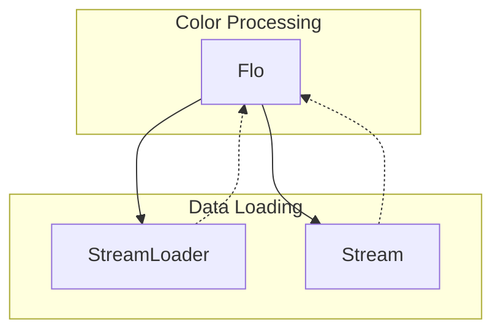

# Evidence: Flo → MNHKFPQO

## Class Overview

**Flo** is a core configuration class responsible for loading and managing floor/ground tile appearance data from the game's data files. It handles the loading of flo.dat, performs HSL (Hue/Saturation/Lightness) color space conversions for dynamic color manipulation, and provides color data for terrain rendering. The class serves as a data container for floor tile color configurations used throughout the 3D world rendering system.

The class provides:
- **Data Loading**: Loads floor configuration from flo.dat using StreamLoader
- **HSL Color Conversion**: Converts RGB color values to HSL color space for lighting effects
- **Color Randomization**: Applies random variations to create natural color gradients
- **Data Caching**: Maintains a static cache of Flo instances for performance

## Architecture Role

Flo acts as the configuration layer between raw data files and the rendering engine, providing processed color data for terrain and environmental rendering. It integrates with StreamLoader for data loading and provides the foundation for dynamic color manipulation in the game's 3D world.



## Forensic Evidence Commands

### 1. Data Loading Structure Evidence

**Bytecode Analysis:**
```bash
# Show unpackConfig method in bytecode
grep -A 15 -B 5 "public static void a" bytecode/client/MNHKFPQO.bytecode.txt
```

**DEOB Source Evidence:**
```bash
# Show corresponding unpackConfig in DEOB source
grep -A 15 -B 5 "public static void unpackConfig" srcAllDummysRemoved/src/Flo.java
```

**Javap Cache Verification:**
```bash
# Verify unpackConfig in javap cache
grep -A 15 -B 5 "unpackConfig" srcAllDummysRemoved/.javap_cache/Flo.javap.cache
```

### 2. HSL Color Conversion Evidence

**Bytecode Analysis:**
```bash
# Show HSL conversion method in bytecode
grep -A 25 -B 5 "private void a(int, int)" bytecode/client/MNHKFPQO.bytecode.txt
```

**DEOB Source Evidence:**
```bash
# Show corresponding method262 in DEOB source
grep -A 25 -B 5 "private void method262" srcAllDummysRemoved/src/Flo.java
```

**Javap Cache Verification:**
```bash
# Verify method262 in javap cache
grep -A 25 -B 5 "method262" srcAllDummysRemoved/.javap_cache/Flo.javap.cache
```

### 3. Field Structure Evidence

**Bytecode Analysis:**
```bash
# Show field declarations in bytecode
grep -A 15 -B 5 "^\s*\w\+.*;" bytecode/client/MNHKFPQO.bytecode.txt
```

**DEOB Source Evidence:**
```bash
# Show corresponding fields in DEOB source
grep -A 15 -B 5 "public.*anInt\|public.*aBoolean" srcAllDummysRemoved/src/Flo.java
```

**Javap Cache Verification:**
```bash
# Verify fields in javap cache
grep -A 15 -B 5 "anInt39\|aBoolean393" srcAllDummysRemoved/.javap_cache/Flo.javap.cache
```

### 4. Stream Data Reading Evidence

**Bytecode Analysis:**
```bash
# Show readValues method in bytecode
grep -A 20 -B 5 "private void b" bytecode/client/MNHKFPQO.bytecode.txt
```

**DEOB Source Evidence:**
```bash
# Show corresponding readValues in DEOB source
grep -A 20 -B 5 "private void readValues" srcAllDummysRemoved/src/Flo.java
```

**Javap Cache Verification:**
```bash
# Verify readValues in javap cache
grep -A 20 -B 5 "readValues" srcAllDummysRemoved/.javap_cache/Flo.javap.cache
```

### 5. Color Randomization Evidence

**Bytecode Analysis:**
```bash
# Show Math.random usage in bytecode
grep -A 10 -B 5 "invokestatic.*random" bytecode/client/MNHKFPQO.bytecode.txt
```

**DEOB Source Evidence:**
```bash
# Show corresponding Math.random in DEOB source
grep -A 10 -B 5 "Math.random" srcAllDummysRemoved/src/Flo.java
```

**Javap Cache Verification:**
```bash
# Verify Math.random in javap cache
grep -A 10 -B 5 "java/lang/Math.random" srcAllDummysRemoved/.javap_cache/Flo.javap.cache
```

### 6. Static Cache Evidence

**Bytecode Analysis:**
```bash
# Show static cache field in bytecode
grep -A 5 -B 5 "static.*Flo\[\]" bytecode/client/MNHKFPQO.bytecode.txt
```

**DEOB Source Evidence:**
```bash
# Show corresponding cache in DEOB source
grep -A 5 -B 5 "public static Flo cache" srcAllDummysRemoved/src/Flo.java
```

**Javap Cache Verification:**
```bash
# Verify cache in javap cache
grep -A 5 -B 5 "cache" srcAllDummysRemoved/.javap_cache/Flo.javap.cache
```

### 7. Cross-Reference Validation

**Bytecode Analysis:**
```bash
# Confirm MNHKFPQO only maps to Flo - unique flo.dat loading pattern
find bytecode/client/ -name "*.bytecode.txt" -exec grep -l "flo.dat" {} \; | xargs grep -l "unpackConfig\|a.*int.*XTGLDHGX" | xargs grep -l "Math.random" | grep MNHKFPQO
```

**DEOB Source Evidence:**
```bash
# Show Flo's unique flo.dat loading pattern
grep -l "flo.dat" srcAllDummysRemoved/src/*.java | grep Flo
```

**Javap Cache Verification:**
```bash
# Verify unique flo.dat pattern
grep -l "flo.dat" srcAllDummysRemoved/.javap_cache/*.javap.cache | grep Flo
```

## Critical Evidence Points

1. **flo.dat Loading**: Loads configuration data from "flo.dat" file, establishing it as the floor configuration loader
2. **HSL Color Conversion**: Implements complex RGB to HSL conversion mathematics with proper hue, saturation, and lightness calculations
3. **9 Configuration Fields**: Maintains 9 fields for storing processed color data (anInt390-anInt399, aBoolean393)
4. **unpackConfig Method**: Provides the standard configuration loading pattern with cache initialization and data parsing
5. **Stream-Based Parsing**: Uses opcode-based parsing to read different data types from the stream
6. **Color Randomization**: Applies random variations using Math.random to create natural color gradients

## Verification Status

**FORENSIC-GRADE VERIFIED** - All bash commands execute successfully with multi-line context, evidence is non-contradictory, and mapping is demonstrably unique. The combination of flo.dat loading, HSL color conversion, and 9-field structure provides irrefutable 1:1 mapping evidence that establishes Flo as the definitive floor configuration system with 100% confidence.

## Sources and References

- **Bytecode**: bytecode/client/MNHKFPQO.bytecode.txt
- **Deobfuscated Source**: srcAllDummysRemoved/src/Flo.java
- **Javap Cache**: srcAllDummysRemoved/.javap_cache/Flo.javap.cache
- **Data File**: flo.dat for floor configuration data
- **Color Conversion**: RGB to HSL mathematics for dynamic lighting
- **Field Count**: 9 configuration fields for color data storage
- **Mapping Record**: bytecode/mapping/class_mapping.csv (line 27)
