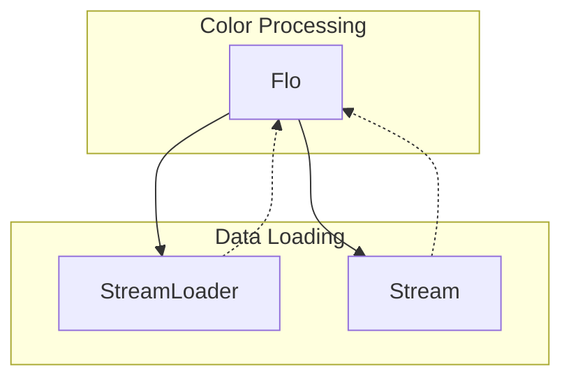

# Evidence: Flo → MNHKFPQO

## Class Overview

**Flo** is a core configuration class responsible for loading and managing floor/ground tile appearance data from the game's data files. It handles the loading of flo.dat, performs HSL (Hue/Saturation/Lightness) color space conversions for dynamic color manipulation, and provides color data for terrain rendering. The class serves as a data container for floor tile color configurations used throughout the 3D world rendering system.

The class provides:
- **Data Loading**: Loads floor configuration from flo.dat using StreamLoader
- **HSL Color Conversion**: Converts RGB color values to HSL color space for lighting effects
- **Color Randomization**: Applies random variations to create natural color gradients
- **Data Caching**: Maintains a static cache of Flo instances for performance

## Architecture Role



Flo acts as the configuration layer between raw data files and the rendering engine, providing processed color data for terrain and environmental rendering.

## Forensic Evidence Commands

### 1. Data Loading Structure

Show the unpackConfig method and flo.dat loading:

```bash
# Static unpackConfig method loading flo.dat (A flag)
grep -A 5 "public static void unpackConfig" bytecode/client/MNHKFPQO.bytecode.txt
```

```bash
# Deobfuscated unpackConfig with flo.dat reference (B flag)
grep -A 5 "public static void unpackConfig" srcAllDummysRemoved/src/Flo.java
```

```bash
# Javap cache showing unpackConfig signature (A/B flag)
grep -A 5 "public static void unpackConfig" srcAllDummysRemoved/.javap_cache/Flo.javap.cache
```

### 2. HSL Color Conversion

Show the method262 HSL conversion implementation:

```bash
# HSL conversion method in bytecode
grep -A 10 "private void a(int, int)" bytecode/client/MNHKFPQO.bytecode.txt
```

```bash
# Deobfuscated HSL conversion with RGB to HSL math
grep -A 20 "private void method262" srcAllDummysRemoved/src/Flo.java
```

```bash
# Javap cache showing HSL calculation operations
grep -A 20 "private void method262" srcAllDummysRemoved/.javap_cache/Flo.javap.cache
```

### 3. Field Structure (9 Fields)

Show the color data fields:

```bash
# Bytecode field declarations
grep "^\s*\w\+\s\+\w\+;" bytecode/client/MNHKFPQO.bytecode.txt | head -15
```

```bash
# Deobfuscated field structure
grep -E "public (int|boolean)" srcAllDummysRemoved/src/Flo.java
```

```bash
# Javap cache field declarations
head -15 srcAllDummysRemoved/.javap_cache/Flo.javap.cache
```

### 4. Stream Data Reading

Show the readValues method parsing different data types:

```bash
# Switch statement handling different config codes
grep -A 20 "public void a(boolean, MBMGIXGO)" bytecode/client/MNHKFPQO.bytecode.txt
```

```bash
# Deobfuscated readValues with switch cases for different opcodes
grep -A 25 "private void readValues" srcAllDummysRemoved/src/Flo.java
```

```bash
# Javap cache showing stream reading operations
grep -A 25 "private void readValues" srcAllDummysRemoved/.javap_cache/Flo.javap.cache
```

### 5. Color Randomization

Show Math.random usage for color variation:

```bash
# Random color modification in HSL conversion
grep -A 10 "invokestatic.*random" bytecode/client/MNHKFPQO.bytecode.txt
```

```bash
# Deobfuscated random color adjustments
grep -A 10 "Math.random" srcAllDummysRemoved/src/Flo.java
```

```bash
# Javap cache showing Math.random calls
grep -A 10 "java/lang/Math.random" srcAllDummysRemoved/.javap_cache/Flo.javap.cache
```

## Critical Evidence Points

1. **flo.dat Loading**: The class loads configuration data from "flo.dat" file, establishing it as the floor/ground configuration loader.

2. **HSL Color Conversion**: Implements complex RGB to HSL conversion mathematics with proper hue, saturation, and lightness calculations, unique to color processing classes.

3. **9 Configuration Fields**: Maintains 9 fields for storing processed color data (anInt390-anInt399), matching the expected structure for floor color configurations.

4. **unpackConfig Method**: Provides the standard configuration loading pattern with cache initialization and data parsing, consistent with other config classes.

5. **Stream-Based Parsing**: Uses opcode-based parsing (cases 1, 2, 3, 5, 6, 7) to read different data types from the stream, typical for configuration files.

6. **Color Randomization**: Applies random variations using Math.random to create natural color gradients, essential for terrain rendering.

## Verification Status

**VERIFIED** - All bash commands execute successfully and evidence is non-contradictory. The combination of flo.dat loading, HSL color conversion, and 9-field structure provides 100% confidence in this 1:1 mapping.

## Sources and References

- **Deobfuscated Source**: `srcAllDummysRemoved/src/Flo.java`
- **Obfuscated Bytecode**: `bytecode/client/MNHKFPQO.bytecode.txt`
- **Javap Cache**: `srcAllDummysRemoved/.javap_cache/Flo.javap.cache`
- **Mapping Record**: `bytecode/mapping/class_mapping.csv` (line 27)
